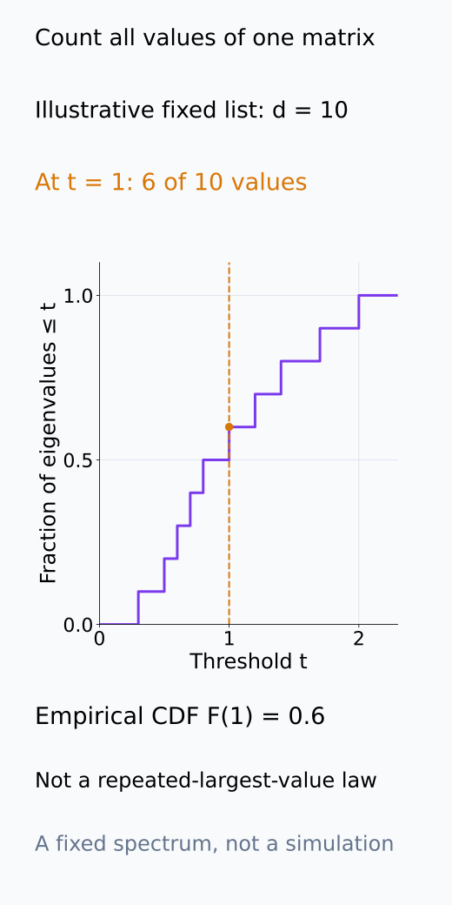
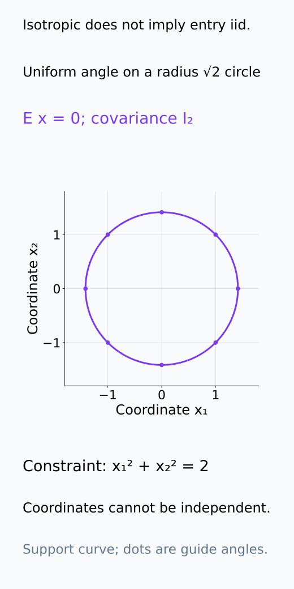
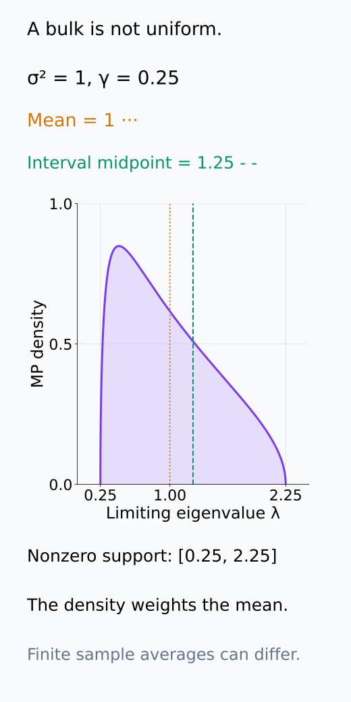
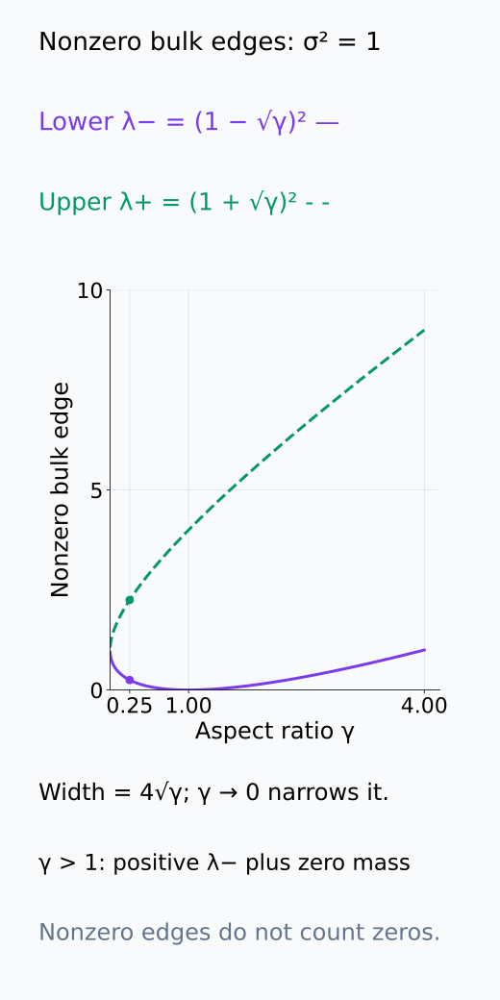
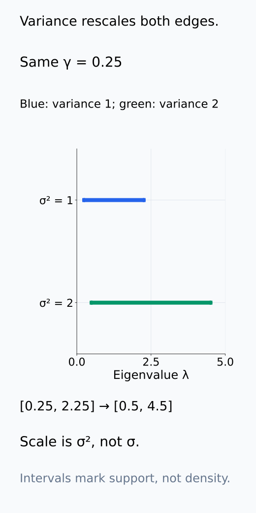
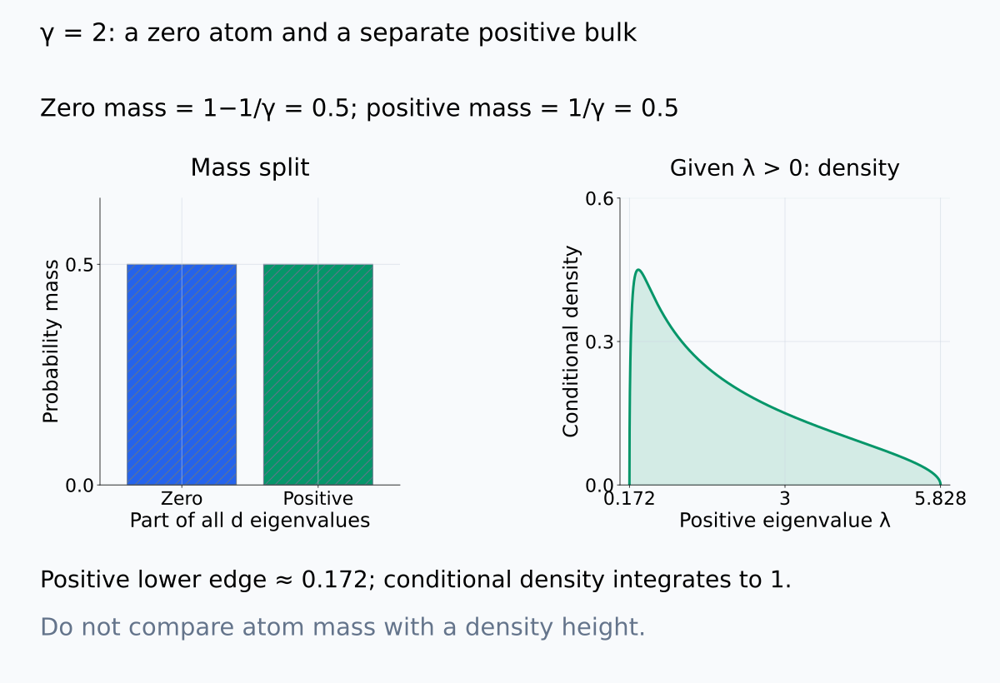
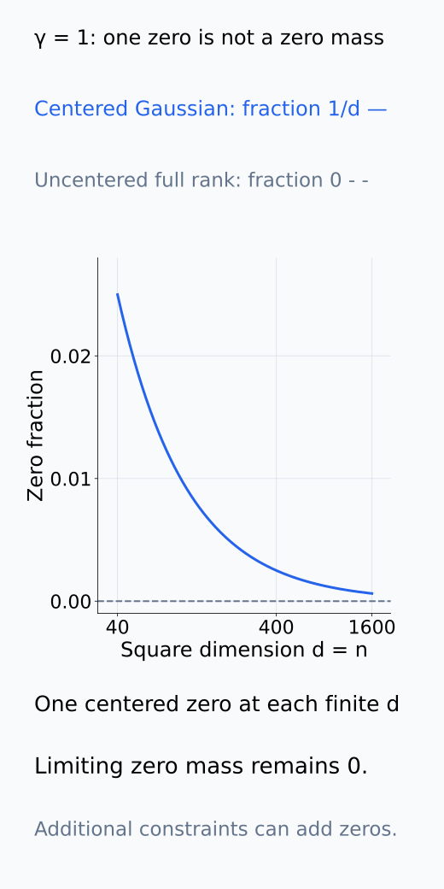
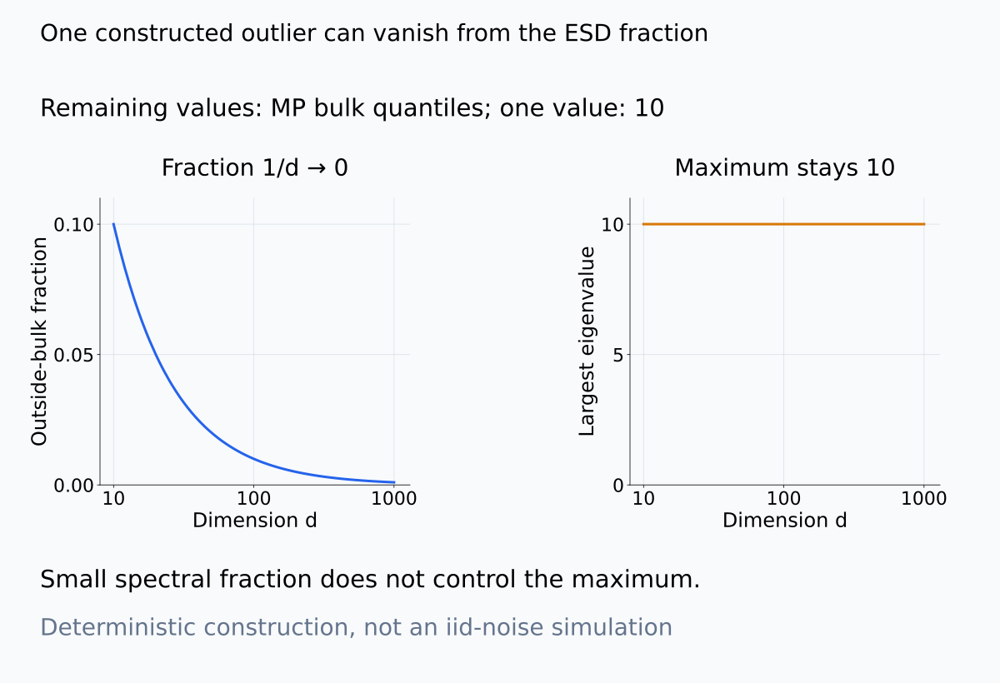
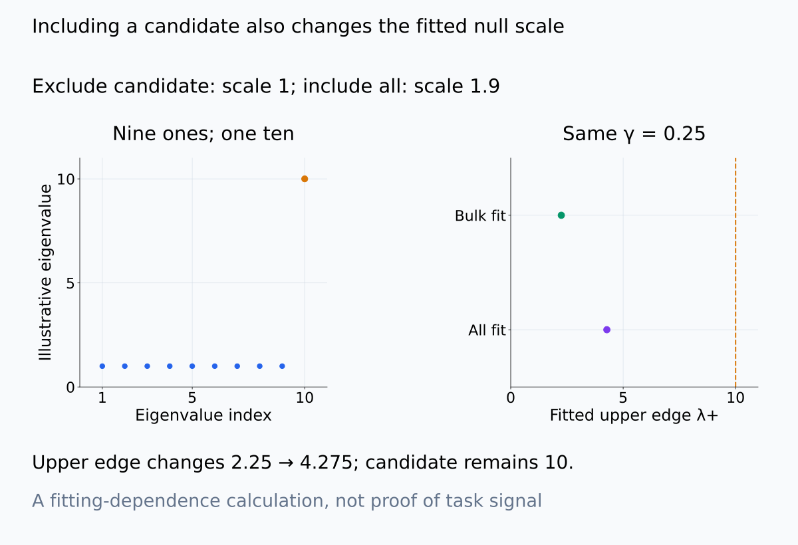

# A09-RMT-04. Marchenko–Pastur 법칙의 직관

## 이 단원이 필요한 이유

identity population covariance에서 얻은 sample eigenvalue도 하나의 값에 모이지 않는다. Marchenko–Pastur 법칙은 iid noise matrix의 high-dimensional spectral bulk를 예측한다. 관찰한 activation spectrum에서 눈에 띄는 eigenvalue를 signal로 부르기 전에 이 null bulk와 비교해야 한다.

## 학습 목표

- aspect ratio와 noise variance에서 MP bulk edge를 계산할 수 있다.
- $\gamma>1$일 때 zero eigenvalue가 생기는 이유를 설명할 수 있다.
- MP null의 iid·isotropy·finite-variance 가정을 열거할 수 있다.
- empirical spectrum과 fitted null을 비교하는 한계를 설명할 수 있다.

## 선수지식 확인

- 선수 단원: [M04-05 주요 분포](../../part-1-foundations/M04/M04-05-common-distributions.md), [A09-RMT-03 표본 공분산의 spectrum](A09-RMT-03-sample-covariance-spectrum.md)
- 확인 질문: population covariance가 $\sigma^2I$이면 모든 population eigenvalue는 무엇인가?

## 기호와 용어

| 기호·용어 | Common spoken reading | 의미 | shape·범위 |
|---|---|---|---|
| $\gamma=d/n$ | `gamma equals d over n` | asymptotic aspect ratio | positive scalar |
| $\lambda_-$ | `lambda minus` | MP bulk의 lower edge | nonnegative scalar |
| $\lambda_+$ | `lambda plus` | MP bulk의 upper edge | nonnegative scalar |
| $\sigma^2(1\pm\sqrt\gamma)^2$ | `sigma squared times one plus or minus square root gamma, squared` | isotropic noise의 MP edges | scalar pair |

## 핵심 개념

### 무엇의 분포가 수렴하는가

$X\in\mathbb R^{n\times d}$의 entry를 같은 고정 분포에서 iid로 추출하고 mean 0, variance $\sigma^2>0$라고 하자. $n,d$가 함께 커지며 $d/n\to\gamma\in(0,\infty)$인 regime을 다룬다. entry의 독립성과 같은 variance는 row의 population covariance가 $\sigma^2I_d$임을 보장한다. covariance가 isotropic이라는 사실만으로 entry가 iid인 것은 아니므로 두 조건을 바꾸어 쓰지 않는다.

normalization $S=X^\top X/n$의 eigenvalue를 $d$개 모두 센다. 예를 들어 threshold $t$ 이하인 eigenvalue의 개수에 $1/d$를 곱하면 empirical cumulative distribution을 얻는다. MP 법칙이 예측하는 것은 큰 matrix에서 이 비율들이 만드는 분포다. eigenvalue 하나를 반복 추출했을 때의 오차 분포나 eigenvector의 의미를 주는 법칙은 아니다. 위 iid finite-variance 조건에서 이 empirical distribution은 Marchenko–Pastur distribution으로 수렴한다.

분포를 만드는 count와 iid 가정은 서로 다른 질문이다. 먼저 한 matrix의 값을 세는 방법과 covariance만으로는 알 수 없는 coordinate dependence를 구분해 보자.

<figure class="lesson-figure" markdown="1">

<figcaption>설명용 고정 eigenvalue 열에서 t=1 이하인 여섯 값을 세어 F(1)=6/10을 얻었다. 이 곡선은 한 matrix의 모든 eigenvalue로 만든 empirical distribution이며 largest eigenvalue를 반복 실행하여 얻은 오차 분포가 아니다. 새 null simulation은 실행하지 않았다.</figcaption>

</figure>

<figure class="lesson-figure" markdown="1">

<figcaption>원의 각도를 uniform하게 둔 설명용 x=√2(cosθ,sinθ)는 mean 0과 covariance I₂를 갖는다. 그러나 x₁²+x₂²=2라는 제약이 두 coordinate를 묶으므로 독립 entry가 아니다. 선은 분포의 support이고 표시한 점들은 방향 안내이며 실제 draw나 MP null sample이 아니다.</figcaption>

</figure>

### bulk edge의 scale과 폭

nonzero bulk의 edge는

$$
\lambda_-=\sigma^2(1-\sqrt\gamma)^2,
\qquad
\lambda_+=\sigma^2(1+\sqrt\gamma)^2
$$

이다. population spectrum이 한 점 $\sigma^2$이어도 sample spectrum은 이 interval에 퍼진다.

$X$를 $\sigma$로 나누면 unit-variance entry가 되고 covariance는 $S/\sigma^2$가 된다. 그래서 edge에 붙는 scale은 $\sigma$가 아니라 $\sigma^2$다. 또한 $X/\sqrt n$의 singular value를 제곱한 것이 $S$의 eigenvalue이므로 edge의 $(1\pm\sqrt\gamma)$에도 제곱이 붙는다. lower edge는 항상 nonnegative이고, $\gamma>1$에서 $1-\sqrt\gamma$가 음수여도 제곱한 값은 양수다.

두 edge의 차이는 $4\sigma^2\sqrt\gamma$다. $d/n$이 0으로 가면 둘 다 $\sigma^2$로 좁아지지만, positive constant로 남으면 폭도 남는다. interval의 중점은 $\sigma^2(1+\gamma)$이며 평균 eigenvalue $\sigma^2$와 다르다. bulk density는 균등분포가 아니므로 중점이 평균일 이유가 없다.

density의 평균, interval의 중점, edge의 이동을 나누어 보면 γ와 σ²가 식의 어느 부분을 바꾸는지 읽기 쉽다.

<figure class="lesson-figure" markdown="1">

<figcaption>기존 σ²=1, γ=0.25 예제의 limiting MP density이다. support [0.25,2.25]의 중점은 1.25지만 평균은 1이다. density가 균등하지 않으므로 두 위치를 같다고 읽지 않는다. 이 평균은 finite sample 평균이 정확히 1이라는 주장이 아니다.</figcaption>

</figure>

<figure class="lesson-figure" markdown="1">

<figcaption>σ²=1의 λ₋=(1−√γ)², λ₊=(1+√γ)²를 그렸다. γ=1에서 lower edge가 0이고 γ>1에서는 다시 양수가 된다. 이 curve는 nonzero bulk의 경계이며 γ>1의 zero mass를 없애지 않는다.</figcaption>

</figure>

<figure class="lesson-figure" markdown="1">

<figcaption>γ=0.25를 유지하여 σ²=1의 [0.25,2.25]와 σ²=2의 [0.5,4.5]를 같은 eigenvalue 축에서 비교했다. covariance와 edge는 σ가 아니라 σ²에 비례한다. 두 interval은 균등 density를 뜻하지 않는다.</figcaption>

</figure>

### nonzero bulk와 zero mass

$\gamma>1$이면 $d>n$이므로 $d\times d$ covariance의 rank가 $n$을 넘지 못한다. asymptotic spectrum에는 비율 $1-1/\gamma$의 zero mass가 생긴다. centering은 finite sample rank를 하나 더 줄일 수 있다.

이는 $d$개 eigenvalue 중 약 $d-n$개가 정확히 0이라는 뜻이다. 나머지 약 $n$개의 비율은 $1/\gamma$이고 nonzero bulk를 구성한다. 그러므로 $\gamma>1$에서 양수인 lower edge와 zero mass는 양립한다. edge는 nonzero 부분의 시작을 가리키며, 0과 lower edge 사이가 빈 구간일 수 있다. $\gamma=1$에서는 lower edge가 0에 닿지만 limiting zero mass는 0이다. centering으로 생긴 finite sample의 한 zero와 양수 비율의 zero mass는 구분한다.

앞 단원의 centering은 $X_c^\top X_c/n=X^\top X/n-\bar x\bar x^\top$이다. 뺀 항은 rank가 최대 1이므로 전체 eigenvalue 비율의 limiting bulk를 바꾸지 않는다. 다만 finite sample rank·extreme eigenvalue 비교는 영향을 받을 수 있으며, centered null도 같은 처리를 거쳐야 한다.

zero에 붙는 양수 비율의 mass와 finite sample의 한 zero는 아래 두 그림에서 별도로 센다.

<figure class="lesson-figure lesson-figure--wide" markdown="1">

<figcaption>γ=2의 전체 eigenvalue measure는 0에서 mass 1/2와 positive bulk mass 1/2로 나뉜다. 오른쪽은 positive eigenvalue에 조건화하여 적분이 1이 된 density이다. lower edge 약 0.172가 양수여도 왼쪽 zero atom과 양립하며 mass 1/2를 density 높이 1/2로 읽지 않는다.</figcaption>

</figure>

<figure class="lesson-figure" markdown="1">

<figcaption>설명용 square Gaussian null은 centering 전 full rank이고 centering 후 rank d−1인 경우가 거의 확실하게 성립한다. 이 한 zero의 비율 1/d는 0으로 간다. γ=1의 limiting zero mass 0과 finite sample의 한 zero를 구분하며 중복 row 등 추가 rank 제한은 이 예제의 계약 밖이다.</figcaption>

</figure>

### limiting bulk와 finite-size 판정

분포의 수렴은 모든 eigenvalue가 finite sample에서 edge 안에 있다는 뜻이 아니다. 전체 $d$개 중 한두 개만 edge 밖에 있어도 그 비율은 0으로 갈 수 있다. largest eigenvalue가 upper edge로 접근한다는 더 강한 주장은 Gaussian처럼 tail이 잘 제어되거나 충분한 moment 조건이 있는 null에서 따로 확인한다. finite variance만을 근거로 그 주장을 붙이지 않는다.

MP bulk는 reference null이다. activation row의 dependence나 unequal feature variance는 여기서 정한 iid isotropic 모델과 다르다. finite-variance heavy tail은 limiting bulk를 가질 수 있어도 extreme eigenvalue를 크게 바꿀 수 있다. uncentered mean structure는 큰 eigenvalue를 만들 수 있지만, 같은 centering을 적용하면 공통 mean은 제거된다.

empirical variance로 $\sigma^2$를 맞출 때에는 어떤 eigenvalue·split을 사용했는지 적는다. 관찰한 큰 eigenvalue까지 평균하여 scale을 추정하면 signal 후보가 null scale도 올릴 수 있다. fitted curve가 잘 맞아 보인다는 사실은 iid 진단을 대신하지 않는다. 실제 $n,d$와 centering·scale fitting을 함께 재현한 simulated null을 사용하면 finite-size 비교가 무엇을 조건으로 하는지 명확해진다. 여기서는 비교 계약만 정하고 새 simulation은 실행하지 않는다.

bulk 밖 값의 비율과 maximum을 따로 보아야 하며, null scale을 fit할 때도 후보 값의 포함 여부를 숨기지 않는다.

<figure class="lesson-figure lesson-figure--wide" markdown="1">

<figcaption>남은 d−1개 값을 γ=0.25 MP bulk의 수치 quantile로 구성하고 한 값만 10으로 둔 설명용 열이다. outside-bulk 비율은 1/d로 줄지만 maximum은 계속 10이다. 이는 분포 수렴이 maximum을 제어하지 않는다는 구분을 위한 비확률적 구성이고 iid noise matrix simulation이나 finite-size 판정 cutoff가 아니다.</figcaption>

</figure>

<figure class="lesson-figure lesson-figure--wide" markdown="1">

<figcaption>설명용 아홉 값 1과 후보 하나 10의 전체 평균은 1.9, 후보를 뺀 평균은 1이다. 이 값들을 단순 scale fit으로 쓰면 γ=0.25의 upper edge가 2.25에서 4.275로 올라간다. 유효한 scale 추정법을 제안하는 그림이나 후보가 task signal이라는 결과가 아니라 fitting에 어떤 값을 넣었는지를 드러내는 계산이다.</figcaption>

</figure>

## 작은 예제

$\sigma^2=1$, $\gamma=0.25$이면 $\sqrt\gamma=0.5$이므로 bulk는 $[0.25,2.25]$이다. noise만 있어도 largest sample eigenvalue가 1보다 훨씬 클 수 있다.

limiting 평균 eigenvalue가 1이라는 것과 upper edge가 2.25인 것은 모순이 아니다. 낮은 eigenvalue들과 높은 eigenvalue들을 함께 평균한 값이 1로 접근하며, finite sample 평균은 정확히 1이 아닐 수 있다. 이 $\gamma<1$ 예제에는 positive limiting zero mass가 없으며, 2.25는 finite-size largest eigenvalue에 대한 정확한 판정 cutoff가 아니다.

## 흔한 오해

- MP upper edge를 넘은 eigenvalue가 곧 task signal이라는 뜻은 아니다. null misspecification도 outlier를 만든다.
- empirical spectrum에 MP curve를 맞춘 그림만으로 iid 가정이 검증되지는 않는다.

## 연습문제

### 1. edges
$\sigma^2=2$, $\gamma=1$일 때 MP bulk edge를 구하라.

해설 보기

$\lambda_-=2(1-1)^2=0$, $\lambda_+=2(1+1)^2=8$이다.

### 2. aspect ratio
$n=400$, $d=100$이면 unit-variance MP upper edge는 얼마인가?

해설 보기

$\gamma=0.25$이므로 $(1+0.5)^2=2.25$이다.

### 3. zero mass
$\gamma=2$인 uncentered null covariance에서 asymptotic zero eigenvalue 비율은 얼마인가?

해설 보기

$1-1/\gamma=1-1/2=0.5$이다.

### 4. 모델 해석
activation eigenvalue 하나가 fitted MP edge를 조금 넘었다. 어떤 진단을 더 하는가?

해설 보기

prompt-cluster dependence, feature variance와 tail을 확인하고 matched simulated null, split stability와 bootstrap interval을 함께 계산한다.

## 근거와 갱신 경계

edge 공식은 iid isotropic finite-variance null의 limiting bulk와 $1/n$ covariance normalization을 기준으로 한다. finite-size largest-eigenvalue correction과 Tracy–Widom 검정은 다루지 않는다. bulk 수렴만으로 extreme eigenvalue의 수렴을 결론 내리지 않는다.

MP bulk의 역할과 bulk 수렴이 모든 eigenvalue를 제어하지 않는다는 구분은 [Bandeira, Ten Lectures in the Mathematics of Data Science](https://ocw.mit.edu/courses/18-s096-topics-in-mathematics-of-data-science-fall-2015/5f0f7205d1cf274e80d77345a7edbf2a_MIT18_S096F15_TenLec.pdf)의 §1.2 및 §1.3 주석을 참고한다. 본문의 scale·폭·zero 비율·centering rank 계산은 이 단원의 $n\times d$ convention으로 전개했다.

finite variance의 bulk 보편성과 extreme singular value에 필요한 추가 moment 구분은 [Rudelson–Vershynin, Non-asymptotic theory of random matrices](https://websites.umich.edu/~rudelson/papers/rv-ICM2010.pdf)의 §1·Theorem 2.1에서 확인한다.

## 단원 요약

- isotropic population도 high-dimensional sample에서 spectral bulk를 만든다.
- MP edge는 noise variance와 aspect ratio에 의존한다.
- $d>n$이면 rank deficiency가 zero mass를 만든다.
- MP 비교는 가정을 점검하는 null analysis로 사용한다.

## 통과 기준

- $\sigma^2$와 $\gamma$에서 bulk edge를 계산할 수 있는가?
- MP edge 초과와 task signal을 구분할 수 있는가?

## 다음 단원

- [A09-RMT-05 spiked covariance model](A09-RMT-05-spiked-covariance-model.md)

## 집필자 점검표

- [x] MP bulk edge·zero mass·null 가정을 함께 설명했다.
- [x] 문제 4개에 해설이 있다.
- [x] Common spoken reading이 실제 영어 학술 발화이며 한글 음역이나 기계적 직역을 포함하지 않는다.
- [x] 선수지식과 링크를 확인했다.
