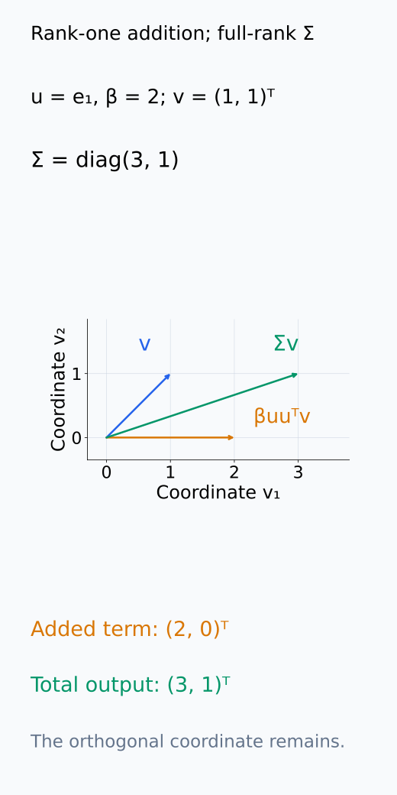
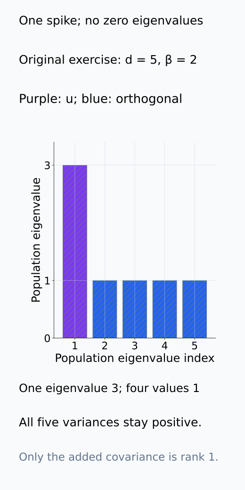
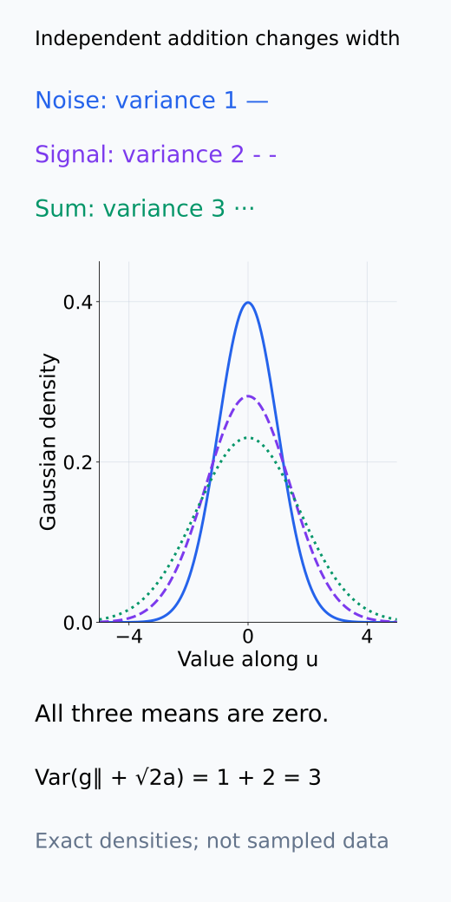
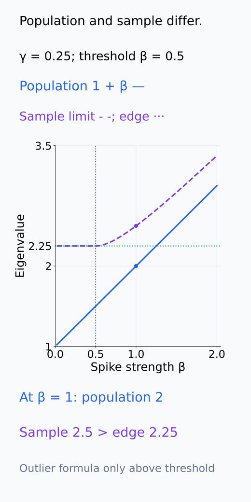
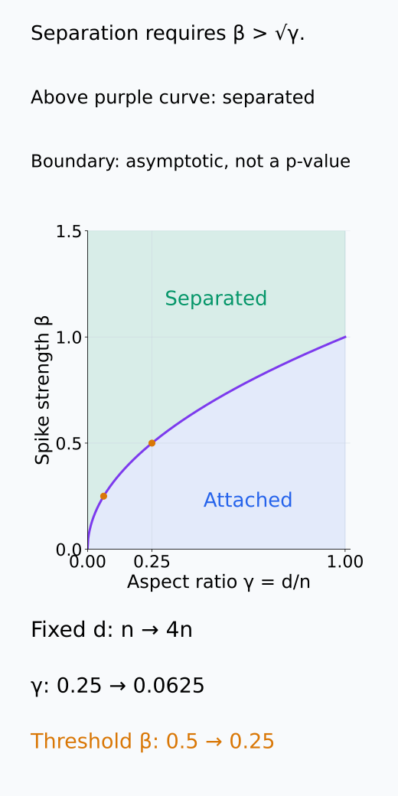
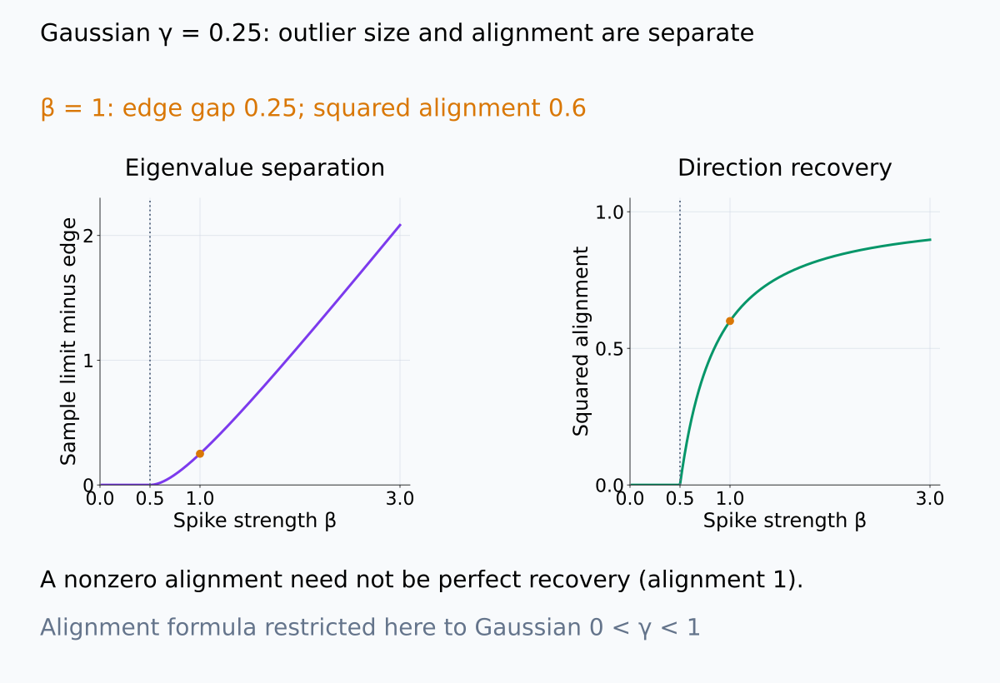
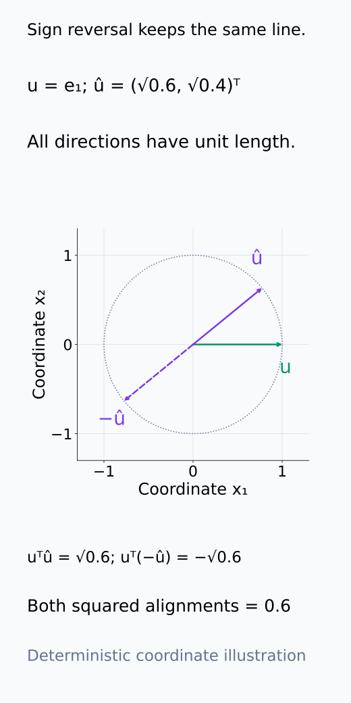
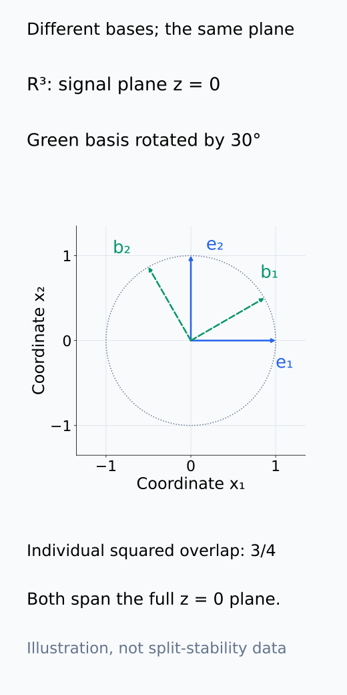

# A09-RMT-05. spiked covariance model

## 이 단원이 필요한 이유

low-rank signal이 isotropic noise에 더해져도 sample PCA가 signal direction을 항상 복원하지는 않는다. signal strength와 aspect ratio 사이에 spectral separation threshold가 있다. spiked covariance model은 큰 eigenvalue의 탐지 가능성과 eigenvector 회복을 분리해 보여준다.

## 학습 목표

- rank-one spiked covariance의 population eigenvalue를 계산할 수 있다.
- spectral separation threshold를 aspect ratio와 연결할 수 있다.
- outlier eigenvalue와 eigenvector alignment를 구분할 수 있다.
- activation PCA의 약한 component에 대한 주장 범위를 제한할 수 있다.

## 선수지식 확인

- 선수 단원: [M02-11 고유값과 고유벡터](../../part-1-foundations/M02/M02-11-eigenvalues-eigenvectors.md), [M04-04 기댓값, 분산과 공분산](../../part-1-foundations/M04/M04-04-expectation-variance-covariance.md), [A09-RMT-04 Marchenko–Pastur 법칙의 직관](A09-RMT-04-marchenko-pastur-intuition.md)
- 확인 질문: unit vector $u$에 대해 $uu^\top$는 어느 direction에 eigenvalue 1을 갖는가?

## 기호와 용어

| 기호·용어 | Common spoken reading | 의미 | shape·범위 |
|---|---|---|---|
| $\Sigma=I+\beta uu^\top$ | `Sigma equals I plus beta u u transpose` | rank-one spiked population covariance | $d\times d$ |
| $\lambda_{\mathrm{pop}}=1+\beta$ | `the population spike equals one plus beta` | signal direction의 population eigenvalue | scalar greater than 1 |
| $\beta>\sqrt\gamma$ | `beta is greater than square root gamma` | unit-noise spectral separation 조건 | asymptotic condition |
| $\lvert\hat u^\top u\rvert^2$ | `the squared alignment between u hat and u` | sample·population direction alignment | number in $[0,1]$ |

## 핵심 개념

### rank-one 항과 population spectrum

unit vector $u$와 signal strength $\beta>0$에 대해

$$
\Sigma=I+\beta uu^\top
$$

를 생각한다. $uu^\top v=u(u^\top v)$이므로 $uu^\top$는 $u$에 평행한 성분만 남긴다. $\Sigma u=(1+\beta)u$이며 $u^\top v=0$이면 $\Sigma v=v$다. 따라서 population spectrum은 $1+\beta$ 하나와 1인 eigenvalue $d-1$개다. rank가 1인 것은 추가 항 $\beta uu^\top$이지 전체 covariance가 아니다. $\Sigma$는 모든 방향에서 양의 variance를 갖는 full-rank matrix다.

mean-zero Gaussian noise $g\sim\mathcal N(0,I_d)$와 독립 scalar $a\sim\mathcal N(0,1)$를 써서 $x=g+\sqrt\beta\,a u$라고 생각할 수 있다. $a$가 sample마다 변하므로 signal은 공통 mean이 아닌 한 방향의 추가 variance다. 독립성으로 교차 covariance가 0이고 추가 항의 covariance가 $\beta uu^\top$가 된다. sample들을 iid로 추출하고 $S=X^\top X/n$을 계산하는 Gaussian rank-one 모델이 이 단원의 기준 사례다.

추가 covariance 항의 작용, 전체 spectrum, mean을 움직이지 않는 variance 증가를 차례로 비교한다.

<figure class="lesson-figure" markdown="1">

<figcaption>기존 β=2의 rank-one 조건에 설명용 u=e₁, v=(1,1)ᵀ를 넣었다. 추가 항 βuuᵀv=(2,0)ᵀ는 첫 방향에만 놓이고 전체 Σv=(3,1)ᵀ에는 둘째 성분이 남는다. 추가 항의 rank 1과 전체 covariance의 full rank를 구분한다.</figcaption>

</figure>

<figure class="lesson-figure" markdown="1">

<figcaption>기존 d=5, β=2 문제의 population eigenvalue는 3 하나와 1 네 개다. 모든 값이 양수이므로 전체 covariance는 full rank이고 rank-one이라는 말은 추가 항에만 해당한다.</figcaption>

</figure>

<figure class="lesson-figure" markdown="1">

<figcaption>u 방향의 Gaussian noise, 독립 √2a, 두 값의 합을 비교한 exact density이다. β=2에서 세 mean은 0이고 variance는 1,2,3이다. signal은 공통 mean 이동이 아니라 추가 variance이며 다른 방향에는 그 추가 항이 없다.</figcaption>

</figure>

### population threshold와 sample bulk edge

dimension과 sample이 함께 증가해 $d/n\to\gamma>0$이고 $\beta$가 고정된 상황에서, unit-noise rank-one model은 $\beta>\sqrt\gamma$일 때 sample outlier가 MP bulk와 분리된다. 이 조건을 population spike로 쓰면 $\ell=1+\beta>1+\sqrt\gamma$다. 이것을 sample upper edge $(1+\sqrt\gamma)^2$와 직접 비교하는 조건으로 바꾸면 안 된다. 하나는 population eigenvalue의 조건이고 다른 하나는 sample eigenvalue의 비교 기준이다.

threshold 위에서 population spike $\ell=1+\beta$에 대응하는 sample outlier 위치는 asymptotic하게

$$
\hat\lambda
\to
\ell\left(1+\frac{\gamma}{\ell-1}\right)
$$

이다. $\beta>\sqrt\gamma$에서만 이 outlier 식을 적용한다. $\ell$에 곱해진 factor가 1보다 크므로 separated sample eigenvalue도 population eigenvalue의 정확한 추정값은 아니다. $\beta=\sqrt\gamma$를 대입하면 $(1+\sqrt\gamma)^2$가 되어 두 branch가 edge에서 만난다.

$0<\beta\le\sqrt\gamma$에서는 largest sample eigenvalue가 bulk edge에 붙는다. 이 branch에 outlier 식을 외삽하면 틀린 예측을 얻는다. finite sample에서는 transition이 날카로운 판정선처럼 보이지 않을 수 있으며, 이 threshold 자체는 one-run p-value를 주지 않는다. 같은 dimension에서 sample을 더 모으면 $\gamma$가 줄어 약한 spike도 더 잘 구분될 수 있다.

population과 sample의 branch를 따로 그린 뒤, sample 수가 threshold를 낮추는 방향을 확인해 보자.

<figure class="lesson-figure" markdown="1">

<figcaption>γ=0.25의 population ℓ=1+β와 leading sample limit을 나눴다. β≤0.5에서는 sample branch가 edge 2.25에 붙고 β>0.5에서만 outlier 공식을 썼다. 기존 β=1은 population 2가 edge 아래여도 sample 2.5가 edge 밖이다. 아래 branch를 β=0의 증명으로 읽지 않는다.</figcaption>

</figure>

<figure class="lesson-figure" markdown="1">

<figcaption>unit-noise asymptotic 조건 β>√γ의 위쪽과 아래쪽을 구분했다. 같은 d에서 n을 네 배로 늘리면 γ=0.25가 0.0625로, threshold는 0.5에서 0.25로 줄어든다. 경계는 one-run p-value나 finite sample의 확정 판정선이 아니다.</figcaption>

</figure>

### eigenvalue 분리와 방향 회복

sample의 leading unit eigenvector를 $\hat u$라 쓰면 $\lvert\hat u^\top u\rvert^2$는 두 방향의 squared cosine이다. 부호를 뒤집어도 같은 값이므로 eigenvector의 sign ambiguity를 제거한다. 1이면 같은 일차원 subspace, 0이면 직교 방향이다. outlier의 크기만으로 이 값을 계산할 수는 없으며 $u$가 알려진 synthetic model에서 두 측정을 따로 비교한다.

Gaussian 모델의 $0<\gamma<1$인 경우에는 threshold 위의 squared alignment가

$$
\lvert\hat u^\top u\rvert^2\to
\frac{1-\gamma/\beta^2}{1+\gamma/\beta}
$$

로 접근한다. threshold 아래와 경계에서는 0으로 접근한다. 위 branch에서도 고정된 finite $\beta$와 positive $\gamma$에서는 값이 1보다 작다. 따라서 nonzero alignment를 얻는 것과 원래 방향을 오차 없이 회복하는 것은 다르다. 이 식의 증명이나 다른 noise model의 alignment 공식은 여기서 요구하지 않는다.

outlier의 gap과 direction alignment는 별도 축에서 읽고, eigenvector 부호는 제곱으로 제거한다.

<figure class="lesson-figure lesson-figure--wide" markdown="1">

<figcaption>Gaussian·γ=0.25에서 outlier의 edge 위 gap과 squared alignment를 서로 다른 y축으로 보았다. 기존 β=1에서 gap 0.25와 alignment 0.6은 다른 측정값이다. threshold 위의 nonzero alignment도 완전한 회복 1이 아니며 이 alignment 식은 본문의 0<γ<1 조건에 한정한다.</figcaption>

</figure>

<figure class="lesson-figure" markdown="1">

<figcaption>설명용 u=e₁와 û=(√0.6,√0.4)ᵀ 및 −û를 그렸다. inner product의 부호는 반대지만 제곱은 모두 0.6이다. 부호 불변성을 위한 좌표 예제이고 실제 sample eigenvector를 생성한 결과가 아니다.</figcaption>

</figure>

### 약한 component에 대해 말할 수 있는 것

이 model은 low-rank signal 탐지의 기준 사례이다. 실제 activation noise가 anisotropic하거나 여러 spike가 가깝게 있으면 eigenvector 개별 비교보다 signal subspace와 matched null을 분석한다.

outlier가 없다는 관찰은 이 spectral 방법으로 분리하지 못했다는 뜻이지 $\beta=0$의 증명이 아니다. 반대로 variance spike의 signal은 이 모델에서 추가한 covariance 구조를 뜻할 뿐, label이나 모델 행동에 필요한 feature라는 뜻이 아니다. 가까운 eigenvalue들은 split마다 개별 vector가 회전해도 합쳐진 subspace는 안정적일 수 있으므로, sign을 맞춘 한 vector와 subspace 비교를 구분한다.

vector가 바뀌었다는 관찰과 두 vector가 함께 만드는 subspace가 바뀌었다는 관찰은 아래처럼 다를 수 있다.

<figure class="lesson-figure" markdown="1">

<figcaption>설명용 R³의 z=0 plane 안에서 orthonormal basis 두 개를 30° 회전시켰다. 대응 vector의 squared overlap은 3/4지만 두 basis가 만드는 plane은 같다. split마다 vector가 달라질 때 individual direction과 subspace를 별도로 비교해야 한다는 관계를 보여 주며 실제 split 안정성의 측정 결과는 아니다.</figcaption>

</figure>

## 작은 예제

$\gamma=0.25$이면 threshold는 $\beta>0.5$이다. $\beta=1$이면 $\ell=2$이고 predicted sample outlier는 $2(1+0.25)=2.5$이다. MP upper edge 2.25보다 크다.

여기서 population spike 2는 sample edge 2.25보다 작지만 sample outlier 2.5는 edge 밖에 있다. population 값을 sample edge에 직접 대입해 판정하면 이 경우를 놓친다. 같은 조건의 limiting squared alignment는 $(1-0.25)/(1+0.25)=0.6$이므로, outlier가 보여도 완전한 방향 회복은 아니다.

## 흔한 오해

- population spike가 1보다 크다는 사실만으로 sample eigenvector가 안정적으로 복원되지는 않는다.
- threshold 위 outlier도 task relevance나 causal use를 자동 보장하지 않는다.

## 연습문제

### 1. population spectrum
$d=5$이고 $\beta=2$이면 $\Sigma=I+2uu^\top$의 eigenvalue를 쓰라.

해설 보기

$u$ direction에 3 하나, 직교 방향에 1 네 개가 있다.

### 2. threshold
$\gamma=0.36$일 때 spectral separation을 위한 $\beta$ 조건은 무엇인가?

해설 보기

$\sqrt{0.36}=0.6$이므로 asymptotic unit-noise model에서 $\beta>0.6$이다.

### 3. outlier location
$\gamma=0.5$, $\beta=1$이면 predicted sample outlier 위치를 구하라.

해설 보기

$\ell=2$이므로 $2(1+0.5/1)=3$이다.

### 4. 모델 해석
PCA 1번 direction이 한 data split에서는 label과 정렬되지만 다른 split에서는 direction이 크게 바뀐다. 어떻게 보고하는가?

해설 보기

sample eigenvector 안정성이 확인되지 않았으므로 재현 가능한 signal direction이라고 부르지 않는다. subspace overlap, eigenvalue gap과 split별 prediction을 함께 보고한다.

## 근거와 갱신 경계

threshold와 outlier 식은 unit isotropic noise, rank-one spike와 standard high-dimensional asymptotic를 따른다. finite-size p-value나 general covariance spike는 다루지 않는다.

Gaussian spike의 조건·population/sample threshold 및 $0<\gamma<1$의 alignment는 [Paul (2007), Asymptotics of Sample Eigenstructure for a Large Dimensional Spiked Covariance Model](https://www3.stat.sinica.edu.tw/statistica/password.asp?art=18&num=4&vol=17)의 §2.1·Theorem 4를 기준으로 한다. $\beta=\ell-1$로 표기를 맞췄으며 covariance 작용과 기존 예제의 계산은 본문에서 전개했다.

positive aspect ratio 전체의 sample eigenvalue branch는 [Baik–Silverstein, Eigenvalues of Large Sample Covariance Matrices of Spiked Population Models](https://arxiv.org/pdf/math/0408165)의 Theorem 1.1~1.3을 기준으로 한다. alignment 식은 앞서 명시한 Gaussian·$0<\gamma<1$ 범위에 한정한다.

## 단원 요약

- rank-one spike는 한 population direction의 variance를 높인다.
- sample separation은 signal strength와 aspect ratio의 비에 달려 있다.
- threshold 아래에서는 PCA direction 회복이 실패할 수 있다.
- 실제 representation에서는 individual vector보다 stable subspace가 적절할 수 있다.

## 통과 기준

- population spike와 separation threshold를 계산할 수 있는가?
- eigenvalue outlier와 eigenvector·task relevance를 구분할 수 있는가?

## 다음 단원

- [A09-RMT-06 signal과 noise eigenvalue](A09-RMT-06-signal-noise-eigenvalues.md)

## 집필자 점검표

- [x] spike strength·outlier·eigenvector 회복을 구분했다.
- [x] 문제 4개에 해설이 있다.
- [x] Common spoken reading이 실제 영어 학술 발화이며 한글 음역이나 기계적 직역을 포함하지 않는다.
- [x] 선수지식과 링크를 확인했다.
