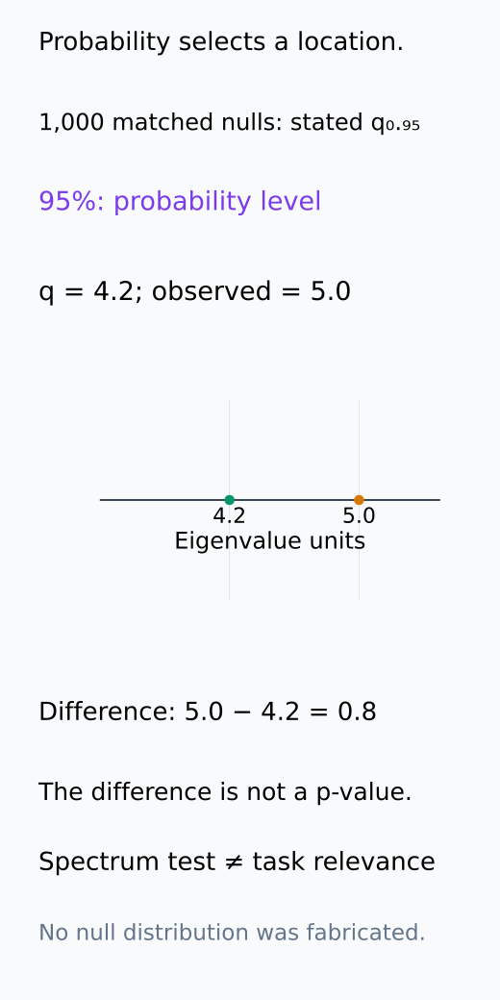
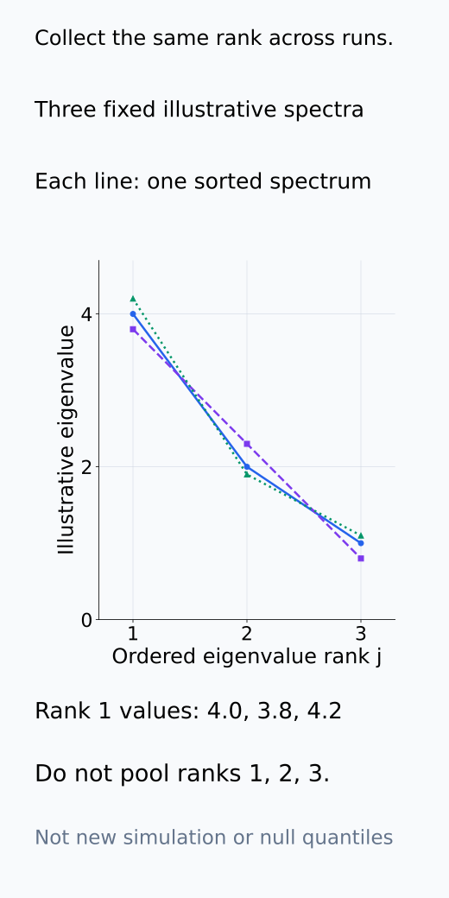
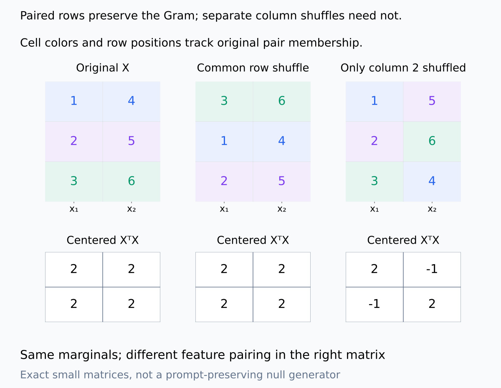
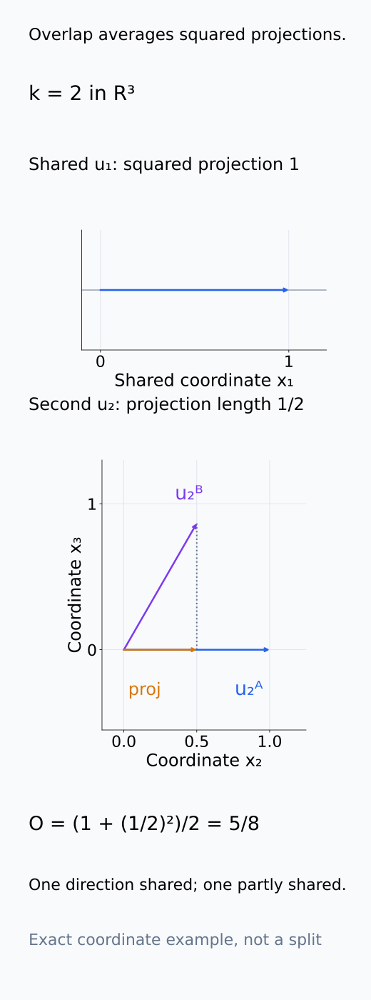
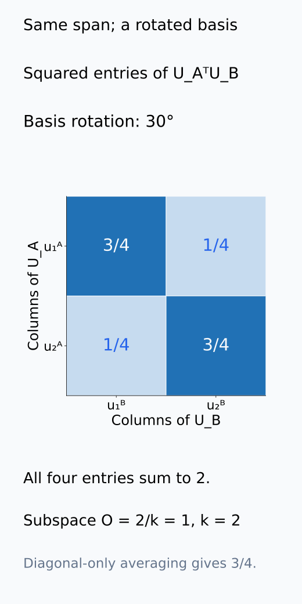
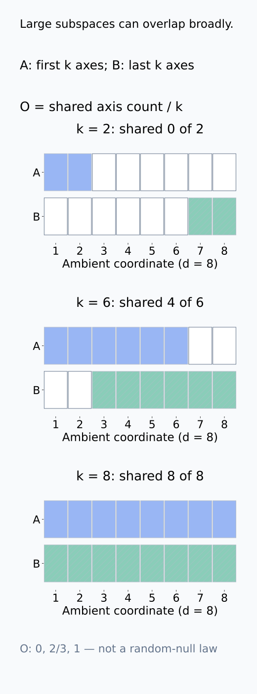
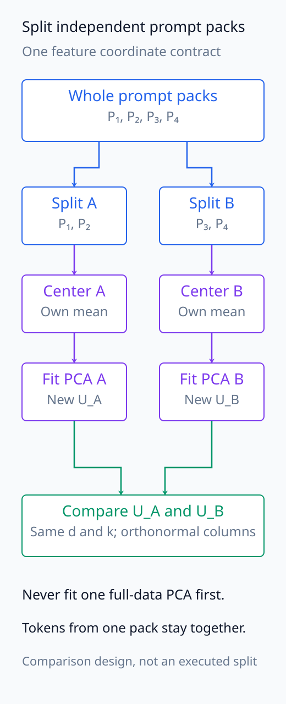
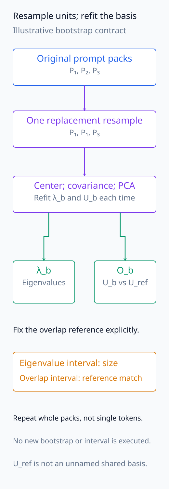
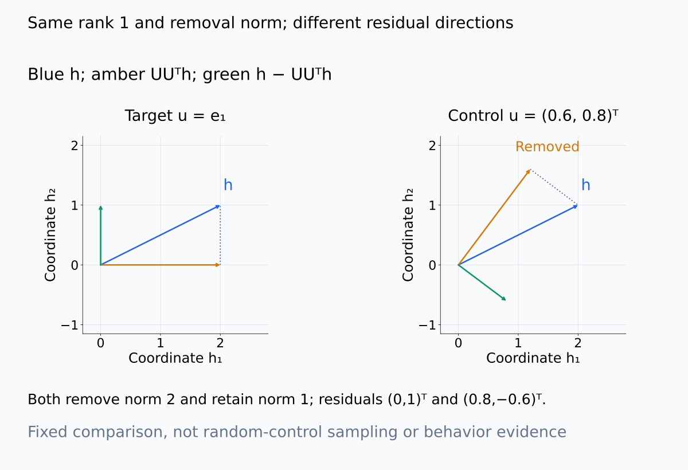

# A09-RMT-06. signal과 noise eigenvalue

## 이 단원이 필요한 이유

eigenvalue 크기 하나만으로 signal과 noise를 나눌 수 없다. null model 초과, split·seed 안정성, held-out target association과 intervention은 서로 다른 증거를 제공한다. spectrum 분석은 이 증거들을 한 판정 규칙으로 합치지 않고 단계별로 기록해야 한다.

## 학습 목표

- parallel analysis의 null threshold를 설명할 수 있다.
- eigenvalue separation과 eigenvector stability를 구분할 수 있다.
- split-half subspace overlap과 bootstrap interval을 설계할 수 있다.
- spectral component의 task relevance claim을 단계별로 작성할 수 있다.

## 선수지식 확인

- 선수 단원: [M04-09 신뢰구간과 bootstrap](../../part-1-foundations/M04/M04-09-confidence-intervals-bootstrap.md), [I06-05 PCA와 SVD 분석](../../part-3-interpretability/I06/I06-05-pca-svd-analysis.md), [A09-RMT-05 spiked covariance model](A09-RMT-05-spiked-covariance-model.md)
- 확인 질문: eigenvalue가 비슷한 두 direction을 각각 비교하는 것보다 두 direction의 span을 비교하는 편이 나은 이유는 무엇인가?

## 기호와 용어

| 기호·용어 | Common spoken reading | 의미 | shape·범위 |
|---|---|---|---|
| $q_{1-\alpha}^{\mathrm{null}}$ | `the one minus alpha null quantile` | null largest eigenvalue의 upper quantile | scalar |
| $\hat\lambda_j$ | `lambda hat sub j` | observed sample eigenvalue | nonnegative scalar |
| $\widehat U_k$ | `U hat sub k` | leading subspace의 orthonormal basis | $d\times k$ |
| $\lVert U_A^\top U_B\rVert_F^2/k$ | `the squared Frobenius norm of U sub A transpose U sub B, divided by k` | split subspace overlap | number in $[0,1]$ |

## 핵심 개념

### parallel analysis의 비교 대상

parallel analysis는 지정 null에서 같은 shape의 matrix를 여러 번 생성하고 각 matrix에 같은 centering·normalization·eigendecomposition을 적용한다. eigenvalue는 매번 큰 순서로 정렬한다. 각 rank의 null eigenvalue distribution이나 largest-eigenvalue quantile을 구해 observed eigenvalue와 비교한다. 예를 들어

$$
\hat\lambda_1>q_{1-\alpha}^{\mathrm{null}}
$$

이면 지정 null보다 큰 leading variance가 있다는 증거를 얻는다. $q_{1-\alpha}^{\mathrm{null}}$는 null largest eigenvalue 분포의 upper quantile이다. eigenvalue와 같은 variance 단위를 가지며 probability 값이 아니다. 알려진 연속 null 분포라면 그 threshold를 넘는 확률이 $\alpha$다. simulation quantile은 이를 근사하므로 반복 수와 fitting 절차도 기록한다.

rank $j$를 비교할 때에는 null의 $j$번째 ordered eigenvalue를 사용한다. 개별 rank의 95% threshold를 여러 개 적용했다고 전체 false-positive rate가 5%가 되는 것은 아니다. 어느 rank까지 검정할지와 다중비교 기준을 미리 정해야 한다.

null에서 무엇을 보존하고 무엇을 없앨지도 정한다. iid Gaussian null은 row 간 독립·isotropic noise를 가정한다. column별 permutation은 marginal 값들을 보존하지만 feature 간 pairing을 없애며, prompt 안 dependence도 깨뜨릴 수 있다. 반면 모든 column에 같은 row permutation을 적용하면 $X^\top X$가 그대로여서 spectrum의 noise 대조군이 되지 않는다. dependence를 보존하는 block null이 필요하면 그 생성 계약을 따로 정한다. 모든 조건을 무조건 보존하는 것이 아니라 검정하려는 구조와 nuisance를 구분하는 것이다.

quantile의 위치, ordered rank의 모으는 방향, null에서 없애는 pairing을 나누어 확인한다.

<figure class="lesson-figure" markdown="1">

<figcaption>기존 observed 5.0과 1,000개 matched null의 q₀.₉₅=4.2를 사용했다. 두 위치와 차이 0.8은 eigenvalue 단위이고 95%는 quantile을 고르는 probability level이다. 실제 null sample은 제공되지 않았으므로 distribution이나 p-value를 새로 그리지 않았다.</figcaption>

</figure>

<figure class="lesson-figure" markdown="1">

<figcaption>설명용 고정 spectrum 세 열을 큰 순서로 정렬하여 rank 1,2,3에서 각각 세 값을 모았다. 이 값들은 새 null simulation의 결과나 quantile 추정값이 아니며 observed rank j와 null rank j를 맞추는 위치만 보여 준다. 여러 rank의 개별 threshold를 쓰는 일은 별도의 다중비교 문제다.</figcaption>

</figure>

<figure class="lesson-figure lesson-figure--wide" markdown="1">

<figcaption>설명용 세 row의 두 feature를 썼다. 모든 column에 같은 row permutation을 하면 pairing과 centered Gram이 그대로다. 둘째 column만 따로 순환시키면 marginal 값은 같지만 pairing과 cross product가 달라진다. prompt dependence를 보존하는 null이라고 주장하는 예제는 아니다.</figcaption>

</figure>

### eigenvector와 subspace의 안정성

다음으로 data를 independent unit 기준으로 나누고 leading subspace overlap을 계산한다. eigenvalue gap이 작으면 vector별 sign·rotation이 불안정해도 subspace는 안정적일 수 있다. bootstrap은 eigenvalue와 overlap의 sampling uncertainty를 보여준다.

두 split에서 같은 feature coordinate를 사용하고, 각각 orthonormal column을 갖는 $U_A,U_B\in\mathbb R^{d\times k}$를 추정한다. $k$도 같고 각 split의 관찰 rank 이하여야 한다. overlap

$$
O=\frac{\lVert U_A^\top U_B\rVert_F^2}{k}
=\frac1k\sum_{i=1}^k\sum_{j=1}^k
\bigl((u_i^A)^\top u_j^B\bigr)^2
$$

는 한쪽 basis vector가 다른 subspace 안에 들어가는 squared projection을 평균한 값이다. 각 vector의 projection 길이는 1 이하여서 $0\le O\le1$이다. 1이면 두 span이 같고 0이면 직교한다. subspace 안에서 orthogonal basis를 바꾸어도 Frobenius norm은 유지되므로 sign이나 내부 rotation에 의존하지 않는다. 다만 $k$번째와 $k+1$번째 eigenvalue의 gap이 작으면 선택한 subspace의 경계 자체가 불안정할 수 있다.

same span 안의 개별 direction이 안정적인지는 이 값만으로 판단하지 않는다. 또 $k$가 $d$에 가까우면 unrelated subspace도 크게 겹칠 수 있으므로 dimension-matched overlap null과 비교한다. 서로 다른 model의 feature coordinate를 그대로 곱하는 것도 이 계약 밖이며 coordinate 정렬이 필요하다.

overlap은 index별 vector 일치가 아니라 전체 span에 대한 squared projection의 평균이다. basis rotation과 큰 k가 만드는 차이를 별도로 살펴보자.

<figure class="lesson-figure lesson-figure--tall" markdown="1">

<figcaption>R³에서 U_A=[e₁,e₂], U_B=[e₁,½e₂+(√3/2)e₃]인 설명용 orthonormal basis를 썼다. 첫 projection 제곱은 1, 둘째는 1/4이므로 O=(1+1/4)/2=5/8이다. 실제 split overlap이나 uncertainty 추정값이 아니다.</figcaption>

</figure>

<figure class="lesson-figure" markdown="1">

<figcaption>같은 plane의 basis를 30° 회전시킨 설명용 cross-basis matrix의 각 entry 제곱이다. diagonal 두 값만 평균하면 3/4지만 off-diagonal까지 합해 k=2로 나누면 O=1이다. 전체 span 비교는 basis 안의 sign·rotation에 의존하지 않는다.</figcaption>

</figure>

<figure class="lesson-figure lesson-figure--tall" markdown="1">

<figcaption>설명용 d=8에서 A는 앞 k개 coordinate, B는 뒤 k개 coordinate의 span이다. k=2는 O=0, k=6은 네 shared axis로 O=4/6, k=8은 O=1이다. 독립 random subspace의 null 분포를 계산한 그림은 아니며 dimension-matched 기준이 필요한 이유를 보여 준다.</figcaption>

</figure>

### split과 bootstrap이 만드는 비교

같은 prompt의 token들이 양쪽 split에 섞이면 독립 재현성이 부풀려질 수 있다. prompt 기준으로 나누고, centering·PCA basis 추정을 각각 다시 수행한다. 두 split이 공유하는 preprocessing과 feature 정의는 고정하여 비교 대상이 같게 한다. 전체 데이터에서 먼저 PCA를 fit한 뒤 row만 나누면 basis의 재추정 안정성을 측정하지 않는다.

bootstrap도 prompt 같은 independent unit을 resample하고 각 반복에서 covariance와 basis를 다시 추정한다. eigenvalue interval은 크기의 불확실성, overlap interval은 선택한 subspace 비교의 불확실성을 다룬다. 원래 basis와 bootstrap basis의 overlap인지, 독립 두 split의 overlap인지 reference를 명시한다. 이 두 interval을 같은 것으로 읽지 않는다.

어떤 unit을 나누고 다시 뽑는지, 어디서 basis를 refit하는지, 어떤 reference에 비교하는지를 흐름으로 고정한다.

<figure class="lesson-figure lesson-figure--tall" markdown="1">

<figcaption>prompt pack 전체가 한 split에만 들어가고 centering과 PCA fit을 양쪽에서 각각 수행하는 비교 계약이다. feature coordinate 정의는 공유하되 전체 data에서 먼저 fit한 하나의 basis를 나눠 쓰지 않는다. 새 split이나 PCA를 실행한 결과는 아니다.</figcaption>

</figure>

<figure class="lesson-figure lesson-figure--tall" markdown="1">

<figcaption>P₁,P₁,P₃라는 설명용 replacement resample에서 covariance와 basis를 다시 추정하도록 표시했다. eigenvalue와 reference basis 대비 overlap은 별도 측정으로 모은다. 실제 interval을 생성하지 않았으며 reference와 resampling unit을 명시하는 계약이다.</figcaption>

</figure>

### variance에서 task association과 개입으로

task relevance는 held-out label association이나 prediction으로 평가한다. functional use는 component projection·ablation 뒤 behavior change로 별도 확인한다. null 초과, reproducibility, recoverability와 causal use를 각각 기록한다.

PCA basis와 probe를 fit·선택한 sample을 held-out 평가에 재사용하지 않는다. label을 예측할 수 있다는 것은 그 representation에서 정보를 읽을 수 있다는 증거이며 모델이 그 정보를 사용하는 증거는 아니다. projection ablation을 $h\mapsto h-UU^\top h$로 정하면 특정 subspace 성분을 제거하지만, representation norm이나 분포도 바뀔 수 있다. 같은 dimension·제거량의 random subspace control과 비교하여 일반적 손상과 component-specific 효과를 분리한다. 이 비교도 지정 input·layer·metric·개입 범위의 결론이지 모든 모델 행동의 원인을 확정하는 것은 아니다.

같은 차원과 제거량을 맞춘 projection도 다른 방향을 남길 수 있다. behavior 효과의 specificity는 이 기하 계산과 별도로 측정해야 한다.

<figure class="lesson-figure lesson-figure--wide" markdown="1">

<figcaption>설명용 h=(2,1)ᵀ에서 target u=e₁와 control u=(0.6,0.8)ᵀ를 비교했다. 두 rank-one projection은 제거 norm 2와 남은 norm 1을 맞추지만 residual 방향은 (0,1)ᵀ와 (0.8,−0.6)ᵀ로 다르다. 이 control 방향은 고정 계산용이고 random control distribution이나 behavior 효과를 새로 측정하지 않았다.</figcaption>

</figure>

## 작은 예제

observed largest eigenvalue가 5.0이고 1,000개 matched null의 95% quantile이 4.2이면 null exceedance는 확인된다. split overlap이 0.15라면 stable direction이라는 주장은 보류한다.

5.0과 4.2의 차이는 eigenvalue 단위의 차이이며 $5.0-4.2$를 p-value로 읽지 않는다. overlap 0.15의 해석에는 $k,d$와 비교 기준이 추가로 필요하다. 이 숫자 하나를 전권 공통의 안정성 cutoff로 쓰는 것이 아니라, 안정성 증거가 부족한 상태에서 claim을 올리지 않는 예제다.

## 흔한 오해

- null threshold 초과와 false-positive probability를 같은 값으로 읽을 수 없다.
- stable high-variance component가 label이나 behavior에 관련된다는 보장은 없다.

## 연습문제

### 1. parallel analysis
observed eigenvalue가 3.1이고 null 95% quantile이 3.4이면 $\alpha=0.05$ 기준으로 null을 넘는가?

해설 보기

넘지 않는다. 지정 null에서 noise-compatible한 값으로 남는다.

### 2. overlap
두 split이 같은 one-dimensional direction을 sign만 반대로 추정했다. squared subspace overlap은 얼마인가?

해설 보기

sign은 span을 바꾸지 않으므로 overlap은 1이다.

### 3. hierarchy
null 초과와 split 안정성은 통과했지만 held-out label association이 없다. 어떤 claim까지 가능한가?

해설 보기

지정 null을 넘는 재현 가능한 variance direction이라고 말할 수 있다. task-relevant signal이라는 주장은 보류한다.

### 4. 모델 해석
한 component ablation이 behavior를 바꿨지만 random direction ablation도 같은 크기의 효과를 냈다. 무엇을 결론내리는가?

해설 보기

개입 효과의 component specificity가 확인되지 않았다. norm과 subspace dimension을 맞춘 control distribution에서 비교해야 한다.

## 근거와 갱신 경계

parallel analysis는 null generator의 타당성에 의존한다. 여러 eigenvalue를 동시에 선별할 때는 family-wise error나 false discovery control을 별도로 정한다.

parallel analysis를 finite-sample bias와 sampling variability의 null 비교로 사용하는 취지는 [Buja–Eyuboglu (1992), Remarks on Parallel Analysis](https://pubmed.ncbi.nlm.nih.gov/26811132/)의 초록에서 확인한다. 이 단원의 overlap 해석과 row-permutation 보존은 matrix 계산으로 전개하며 새 null 생성이나 bootstrap을 실행하지 않는다.

## 단원 요약

- null exceedance는 spectral signal 판정의 첫 단계이다.
- split 안정성은 eigenvector나 subspace의 재현성을 평가한다.
- held-out association과 intervention은 task relevance와 기능을 다룬다.
- 네 증거를 하나의 signal label로 압축하지 않는다.

## 통과 기준

- matched null과 subspace stability 검사를 설계할 수 있는가?
- variance·reproducibility·prediction·causal use claim을 구분할 수 있는가?

## 다음 단원

- [A09-RMT-07 weight·activation·Hessian spectrum](A09-RMT-07-weight-activation-hessian-spectra.md)

## 집필자 점검표

- [x] null 초과·안정성·task association·기능을 분리했다.
- [x] 문제 4개에 해설이 있다.
- [x] Common spoken reading이 실제 영어 학술 발화이며 한글 음역이나 기계적 직역을 포함하지 않는다.
- [x] 선수지식과 링크를 확인했다.
