# A09-RMT-07. weight·activation·Hessian spectrum

## 이 단원이 필요한 이유

AI 논문은 weight, activation covariance와 Hessian의 spectrum을 모두 다루지만 세 matrix는 index와 단위가 다르다. 같은 spectral 용어를 쓴다는 이유로 eigenvalue를 직접 비교하면 구조, data distribution과 loss curvature를 섞게 된다.

## 학습 목표

- weight singular value와 covariance·Hessian eigenvalue를 구분할 수 있다.
- 세 spectrum의 index space와 normalization을 명시할 수 있다.
- 대상별 null model을 설계할 수 있다.
- spectral observation에 맞는 모델 해석 claim을 작성할 수 있다.

## 선수지식 확인

- 선수 단원: [M02-13 특이값분해](../../part-1-foundations/M02/M02-13-singular-value-decomposition.md), [M03-12 Hessian](../../part-1-foundations/M03/M03-12-hessian.md), [I06-03 분포와 기초 통계](../../part-3-interpretability/I06/I06-03-distributions-basic-statistics.md), [A09-RMT-06 signal과 noise eigenvalue](A09-RMT-06-signal-noise-eigenvalues.md)
- 확인 질문: rectangular matrix 자체의 singular value와 $W^\top W$ eigenvalue 사이에는 어떤 관계가 있는가?

## 기호와 용어

| 기호·용어 | Common spoken reading | 의미 | shape·범위 |
|---|---|---|---|
| $W=U\Sigma V^\top$ | `W equals U Sigma V transpose` | weight matrix의 singular value decomposition | rectangular matrix factorization |
| $C_h=H_c^\top H_c/n$ | `C sub h equals H sub c transpose H sub c over n` | centered activation covariance | $d_h\times d_h$ |
| $\nabla_\theta^2L$ | `the Hessian of L with respect to theta` | parameter-space loss curvature | $p\times p$ |
| $\rho(A)$ | `the spectral radius of A` | square matrix의 eigenvalue absolute value 최대값 | nonnegative scalar |

## 핵심 개념

### weight spectrum은 input에서 output으로의 증폭이다

weight matrix $W\in\mathbb R^{d_{\mathrm{out}}\times d_{\mathrm{in}}}$에는 singular spectrum을 사용한다. right singular vector $v_j$는 input coordinate의 방향이고 left singular vector $u_j$는 output coordinate의 방향이다. unit $v_j$를 넣으면 $Wv_j=s_ju_j$가 되어 singular value $s_j$는 linear map의 길이 증폭을 뜻한다.

$W^\top W=V\Sigma^\top\Sigma V^\top$이므로 nonzero eigenvalue는 $s_j^2$다. $W^\top W$는 input-space matrix이고 $WW^\top$는 output-space matrix다. 두 matrix의 nonzero eigenvalue는 같지만 shape과 zero 개수는 다를 수 있다. 이 Gram matrix를 activation covariance라고 부르려면 sample matrix라는 별도 해석과 normalization이 필요하다.

rectangular $W$ 자체에는 eigenvalue와 spectral radius를 정의하지 않는다. square matrix에서도 $\rho(W)$와 largest singular value는 일반적으로 다르다. 예를 들어 $W=\begin{pmatrix}0&3\\0&0\end{pmatrix}$의 eigenvalue는 모두 0이지만 $(0,1)^\top$를 길이 3인 vector로 보낸다. eigenvalue가 작다는 사실만으로 모든 input 방향의 증폭이 작다고 할 수 없다.

scaling과 parameterization이 바뀌면 weight spectrum도 바뀐다. $W\mapsto aW$는 singular value를 $|a|$배, Gram eigenvalue를 $a^2$배 바꾼다. $a\ne0$일 때 두 linear layer의 곱 $W_2W_1$에서는 $W_1\mapsto aW_1$, $W_2\mapsto W_2/a$가 전체 함수를 보존할 수 있으므로 한 layer의 spectrum만으로 기능 변화를 주장하지 않는다.

input/output의 map과 두 Gram, eigenvalue만으로 놓치는 증폭, layer 사이의 보상 scale을 차례로 구분한다.

<figure class="lesson-figure lesson-figure--wide" markdown="1">

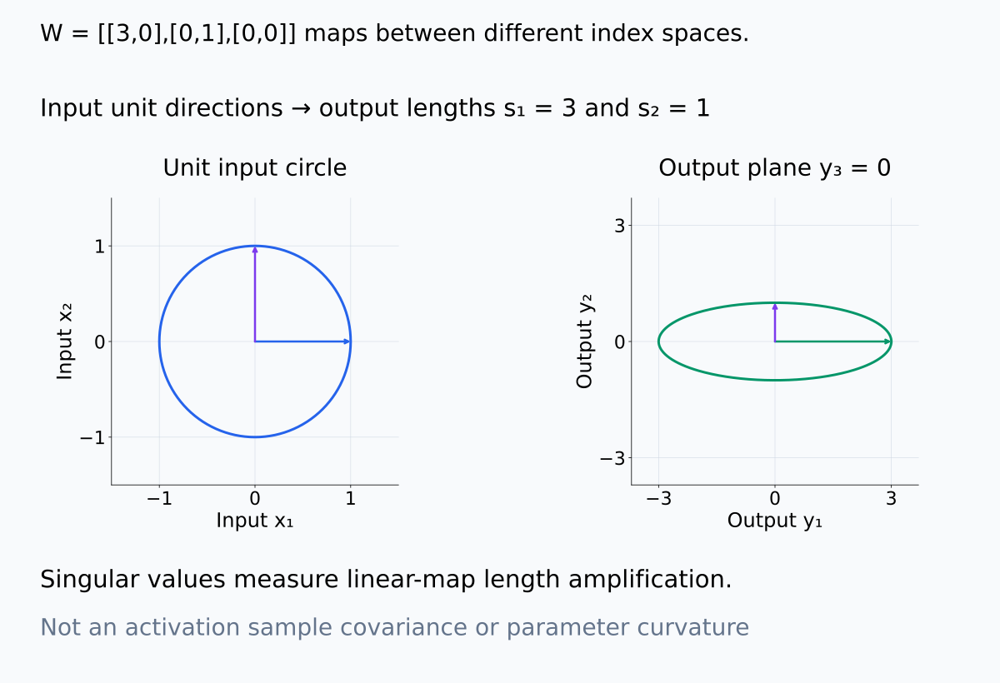

<figcaption>기존 singular value (3,1)을 갖는 설명용 W=[[3,0],[0,1],[0,0]]를 썼다. 두 unit input 방향은 output에서 길이 3과 1이 되고, 그림은 output의 y₃=0 plane을 그린다. 점 구름의 variance가 아니라 linear map의 길이 증폭이다.</figcaption>

</figure>

<figure class="lesson-figure lesson-figure--tall" markdown="1">

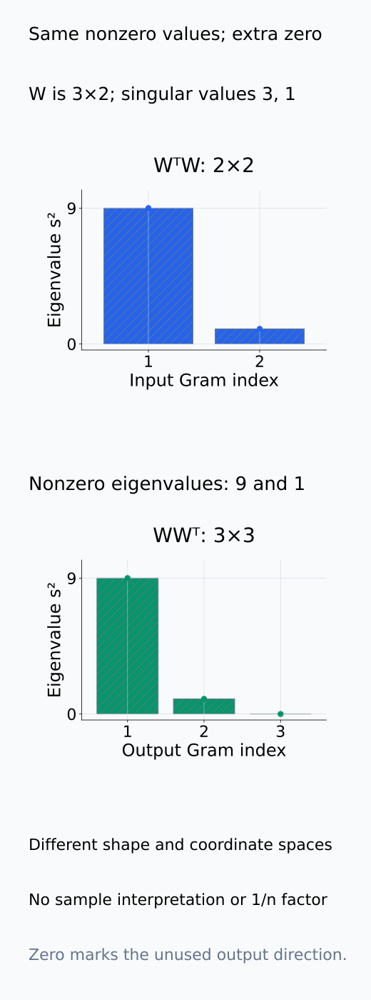

<figcaption>설명용 3×2 W의 input Gram WᵀW는 2×2이며 eigenvalue (9,1), output Gram WWᵀ는 3×3이며 (9,1,0)이다. nonzero 값은 s²로 같지만 index space와 zero 개수는 다르다. covariance라는 sample 해석이나 1/n normalization을 붙이지 않았다.</figcaption>

</figure>

<figure class="lesson-figure lesson-figure--wide" markdown="1">

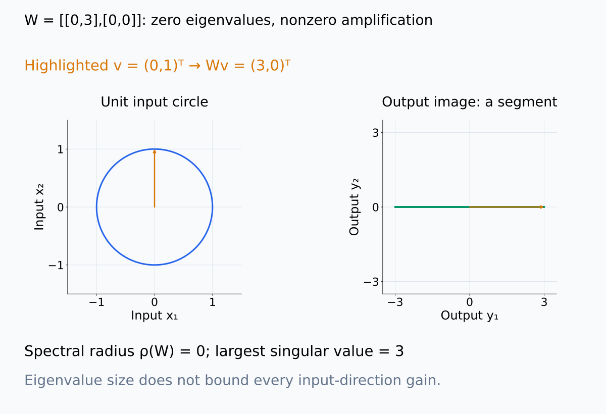

<figcaption>기존 W=[[0,3],[0,0]]의 unit circle 이미지는 output의 수평 segment다. v=(0,1)ᵀ는 Wv=(3,0)ᵀ가 되며 largest singular value는 3이지만 eigenvalue와 spectral radius는 0이다. 모든 input에 대한 증폭을 eigenvalue만으로 판단하지 않는다.</figcaption>

</figure>

<figure class="lesson-figure" markdown="1">

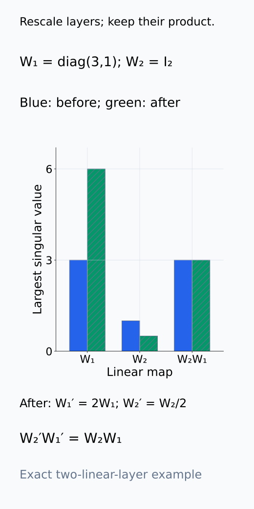

<figcaption>설명용 W₁=diag(3,1), W₂=I₂와 a=2를 썼다. W₁'=2W₁, W₂'=W₂/2의 largest singular value는 6과 1/2지만 W₂'W₁'=W₂W₁의 singular value (3,1)은 같다. 두 linear layer의 계산이고 nonlinear 구조 전체에 무조건 적용하는 주장이 아니다.</figcaption>

</figure>

### activation covariance는 관찰한 input의 variance다

activation matrix $H_c\in\mathbb R^{n\times d_h}$의 covariance

$$
C_h=\frac1nH_c^\top H_c
$$

는 지정 input distribution에서 hidden feature variance를 측정한다. 여기서 row는 input/token 관찰이고 column은 hidden feature다. unit feature 방향 $v$에는 $v^\top C_hv=\lVert H_cv\rVert^2/n$이므로 covariance eigenvalue는 관찰된 representation의 방향별 variance다. weight singular value처럼 임의 input에 대한 map 증폭을 직접 나타내지 않는다.

layer width, token sampling, centering과 normalization이 spectrum을 바꾼다. hidden value를 모두 $a$배 하면 eigenvalue는 $a^2$배이고, sample sum 대신 mean을 쓰면 $1/n$ factor가 붙는다. feature별 standardization은 방향마다 다른 scale을 적용하여 eigenvector도 바꿀 수 있다. 비교할 때 raw covariance인지 correlation에 해당하는 standardized covariance인지 명시한다.

activation spectrum은 관찰 row를 방향에 투영하여 얻은 variance다. feature별 scale 변경은 단순한 전체 배율과 다른 기하를 만든다.

<figure class="lesson-figure lesson-figure--tall" markdown="1">

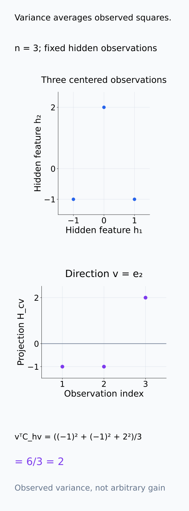

<figcaption>설명용 centered row (−1,−1), (1,−1), (0,2)를 hidden feature 좌표에서 그린 뒤 v=e₂의 projection을 모았다. Hcv=(−1,−1,2)ᵀ이므로 vᵀChv=6/3=2다. 관찰 distribution의 variance이고 임의 input에 대한 weight map 증폭은 아니다.</figcaption>

</figure>

<figure class="lesson-figure lesson-figure--tall" markdown="1">

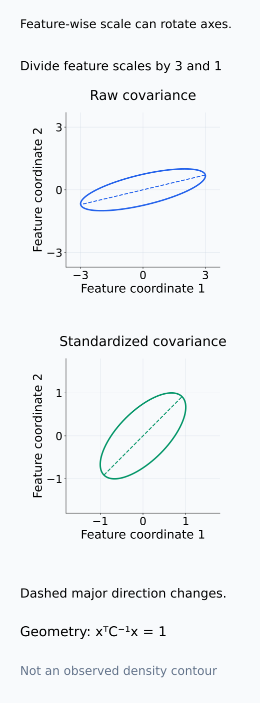

<figcaption>설명용 raw covariance [[9,2],[2,1]]과 feature standard deviation (3,1)로 나눈 covariance [[1,2/3],[2/3,1]]의 한 단위 ellipse를 비교했다. 서로 다른 feature scale을 적용하면 principal direction도 달라진다. 선은 covariance geometry이고 실제 sample density contour나 model 관측 결과가 아니다.</figcaption>

</figure>

### Hessian은 parameter 방향의 loss curvature다

Hessian $\nabla_\theta^2L$은 한 parameter point에서 지정 loss와 dataset의 curvature를 측정한다. $L$이 그 점 근처에서 twice continuously differentiable이면 대칭 matrix이며, parameter perturbation $tv$에 대한 전개는

$$
L(\theta+tv)=L(\theta)+t\nabla L(\theta)^\top v
+\frac{t^2}{2}v^\top\nabla_\theta^2L\,v+o(t^2)
$$

이다. gradient가 0일 때 unit eigenvector 방향의 이차항은 eigenvalue에 비례한다. negative eigenvalue는 covariance의 negative variance가 아니라 loss의 negative curvature다. gradient가 0이 아닌 점에서는 일차항도 고려해야 한다.

symmetry와 overparameterization은 zero 또는 near-zero direction을 만들 수 있지만 모든 큰 모델에서 이를 보장하지는 않는다. 함수가 보존되는 곡선을 따라 loss가 일정해도 곡선의 휘어짐과 gradient 항이 있을 수 있으며, stationary point인지 확인하지 않고 그 tangent를 Hessian null vector라고 부르지 않는다.

loss를 sum에서 mean으로 바꾸면 Hessian도 $1/n$배 된다. linear reparameterization $\theta=B\eta$에는 $\nabla_\eta^2L=B^\top(\nabla_\theta^2L)B$이므로 orthogonal 변환이 아닌 scale 변화는 eigenvalue를 바꾼다. sharpness를 같은 model 함수의 좌표 독립적인 특성처럼 읽으면 안 된다. Hessian의 index는 hidden feature가 아닌 $p$개의 parameter coordinate이며 단위도 loss/parameter squared다.

Hessian-vector product는 전체 $p\times p$ matrix를 저장하지 않고 지정 $v$에 대한 $\nabla_\theta^2L\,v$를 계산한다. 이를 반복하는 방법은 일부 extreme eigenvalue를 추정하지만 full spectrum을 얻었다는 뜻은 아니다. indefinite Hessian에서 단순 power iteration은 절댓값이 가장 큰 eigenvalue를 좇을 수 있어 largest positive eigenvalue와 구분해야 한다. 여기서는 eigensolver나 새 model 계산을 실행하지 않는다.

loss의 부호 있는 curvature와 좌표·stationarity 조건을 먼저 읽고, 지정 HVP와 일부 extreme direction을 full spectrum과 구분해 보자.

<figure class="lesson-figure" markdown="1">

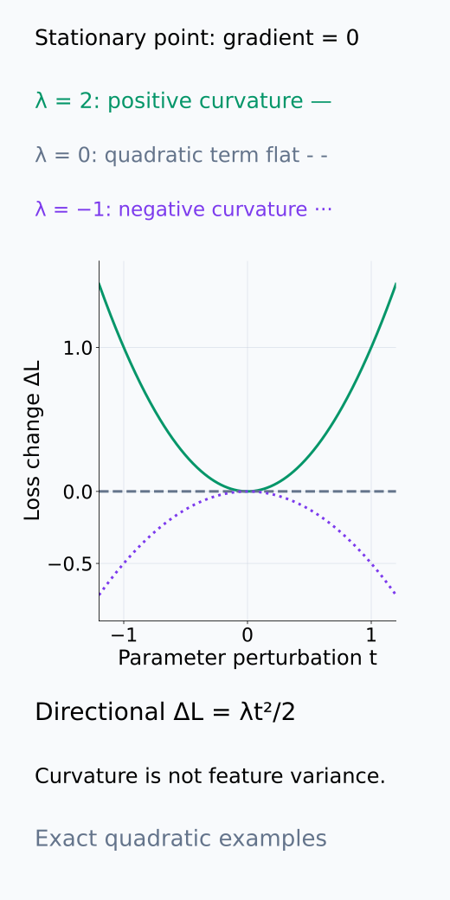

<figcaption>gradient가 0인 설명용 방향별 quadratic ΔL(t)=λt²/2를 λ=2,0,−1에서 비교했다. 아래로 휘는 curve는 loss의 negative curvature이고 negative activation variance가 아니다. 단원에서 명시한 stationary point의 이차항만 표시했다.</figcaption>

</figure>

<figure class="lesson-figure" markdown="1">

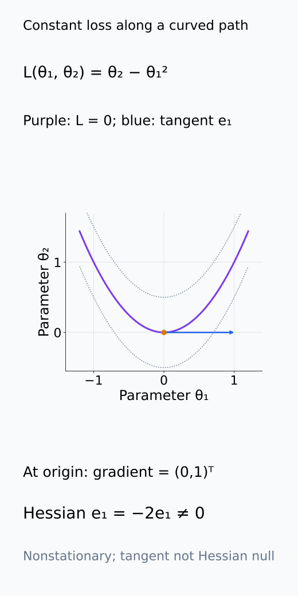

<figcaption>설명용 L(θ₁,θ₂)=θ₂−θ₁²의 curve (t,t²)는 loss가 항상 0이다. 원점의 tangent는 e₁지만 gradient=(0,1)ᵀ, Hessian e₁=−2e₁이므로 null vector가 아니다. curve의 휘어짐과 gradient가 함께 들어가는 조건을 그림으로 구분했다.</figcaption>

</figure>

<figure class="lesson-figure" markdown="1">

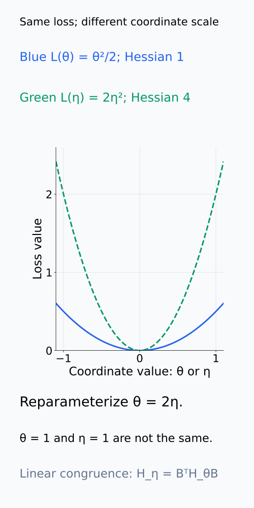

<figcaption>설명용 L(θ)=θ²/2를 θ=2η로 다시 쓰면 L(η)=2η²이고 Hessian은 1에서 4로 바뀐다. x축의 θ 또는 η 숫자 1이 같은 physical perturbation을 뜻하지 않는다. 같은 function의 sharpness를 좌표 독립적 특성으로 읽지 않는다.</figcaption>

</figure>

<figure class="lesson-figure" markdown="1">

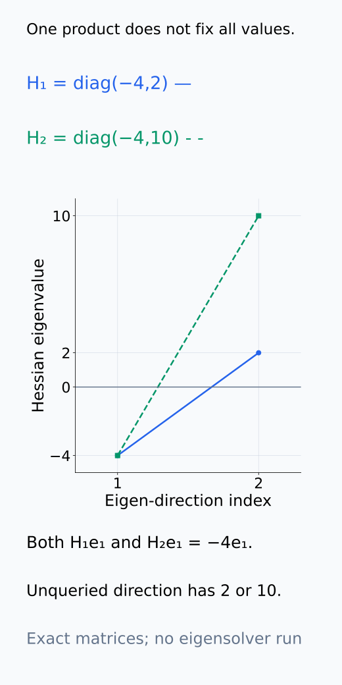

<figcaption>설명용 H₁=diag(−4,2), H₂=diag(−4,10)은 모두 He₁=−4e₁을 주지만 다른 eigenvalue는 다르다. 하나의 HVP가 full spectrum을 알려 주지 않는다는 구분이다. eigensolver나 model Hessian 계산을 실행하지 않았다.</figcaption>

</figure>

<figure class="lesson-figure" markdown="1">

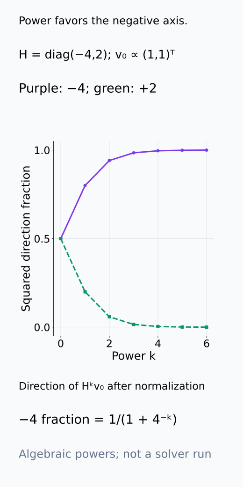

<figcaption>설명용 H=diag(−4,2), v₀=(1,1)ᵀ/√2에 대한 Hᵏv₀의 squared direction fraction을 exact 식으로 계산했다. −4 방향의 fraction은 1/(1+4⁻ᵏ)로 커지고 2 방향은 작아진다. power iteration이 추적하는 largest magnitude와 largest positive를 구분하며 새 eigensolver를 실행한 결과는 아니다.</figcaption>

</figure>

### matrix마다 다른 null과 claim

weight에는 entry variance와 row·column scale을 맞춘 random matrix, activation에는 sample structure를 맞춘 covariance null, Hessian에는 label·data·checkpoint를 고정한 control이 필요하다. 한 null을 세 대상에 재사용하지 않는다.

weight 비교는 map shape과 scale, activation 비교는 row sampling과 feature normalization, Hessian 비교는 objective와 parameter point를 먼저 고정한다. 이후 어떤 구조를 없애려는 null인지 명시한다. weight row·column을 단순히 permutation하면 singular value가 그대로여서 spectrum의 random-noise null이 되지 않는다. label을 바꾸는 Hessian control은 loss 자체를 바꾸므로 원래 dataset의 curvature 불확실성과 같은 질문이 아니다.

셋 모두 tail이 길다는 관찰도 같은 mechanism을 증명하지 않는다. weight의 큰 $s_j$는 map 증폭, covariance의 큰 $\lambda_j$는 sampled variance, Hessian의 큰 positive $\lambda_j$는 local curvature를 가리킨다. 기능적 관계를 주장하려면 input distribution·layer composition·loss 변화가 이 대상들을 어떻게 연결하는지 별도로 확인해야 한다.

## 작은 예제

$W$ singular value가 $(3,1)$이면 $W^\top W$의 nonzero eigenvalue는 $(9,1)$이다. 같은 숫자를 activation covariance eigenvalue와 비교해도 단위와 index가 다르므로 기능적 결론은 나오지 않는다.

이 $(9,1)$을 $W$ 자체의 singular value라고 보고하면 제곱을 한 번 더 잘못 적용하게 된다. 같은 eigenvalue 9가 activation에서는 hidden direction의 variance이고 Hessian에서는 parameter direction의 curvature일 수 있다. 숫자가 같아도 무엇을 perturb하거나 관찰했는지가 다르다.

## 흔한 오해

- rectangular weight matrix의 eigenvalue보다 singular value가 일반적인 비교 대상이다.
- sharp Hessian direction이 곧 많이 사용되는 activation feature라는 뜻은 아니다.

## 연습문제

### 1. singular spectrum
$W$의 singular value가 $(4,2,0)$이면 $W^\top W$의 nonzero eigenvalue를 쓰라.

해설 보기

singular value를 제곱해 $(16,4)$이다.

### 2. activation covariance
$H_c$가 $200\times64$이면 $C_h$의 shape과 rank 상한은 무엇인가?

해설 보기

$C_h$는 $64\times64$이고 rank는 최대 64이다.

### 3. Hessian sign
Hessian에 negative eigenvalue가 있으면 해당 parameter point를 strict local minimum으로 볼 수 있는가?

해설 보기

볼 수 없다. 그 eigenvector 방향으로 second-order negative curvature가 있다.

### 4. 모델 해석
weight와 activation spectrum이 모두 heavy-tailed해 보인다. 같은 mechanism의 증거라고 말할 수 있는가?

해설 보기

말할 수 없다. 대상 matrix, normalization과 null이 다르므로 각 tail fit과 functional relation을 따로 검증해야 한다.

## 근거와 갱신 경계

이 단원은 세 spectrum의 측정 대상을 구분한다. heavy-tail exponent fitting, free probability와 large-scale Hessian eigensolver의 정밀 이론은 다루지 않는다.

full matrix를 저장하지 않는 Hessian-vector product의 계산 원리는 [Pearlmutter, Fast Exact Multiplication by the Hessian](https://www.bcl.hamilton.ie/~barak/papers/nc-hessian.pdf)의 §2~3을 참고한다. 나머지 SVD·covariance·Taylor와 linear reparameterization의 관계는 선수 단원의 식을 이 단원의 index에 맞춰 전개했다.

## 단원 요약

- weight에는 singular spectrum을 사용한다.
- activation covariance spectrum은 sampled input distribution에 의존한다.
- Hessian spectrum은 loss, data와 parameter point의 curvature를 나타낸다.
- 세 대상은 각기 다른 normalization과 null model이 필요하다.

## 통과 기준

- matrix별 spectrum의 index와 단위를 적을 수 있는가?
- 하나의 spectral pattern에서 공통 mechanism을 과잉 주장하지 않을 수 있는가?

## 다음 단원

- [A09-RMT-08 종합 실습: spectrum의 null model](A09-RMT-08-capstone-spectrum-null-model.md)

## 집필자 점검표

- [x] weight·activation·Hessian spectrum의 대상을 구분했다.
- [x] 문제 4개에 해설이 있다.
- [x] Common spoken reading이 실제 영어 학술 발화이며 한글 음역이나 기계적 직역을 포함하지 않는다.
- [x] 선수지식과 링크를 확인했다.
