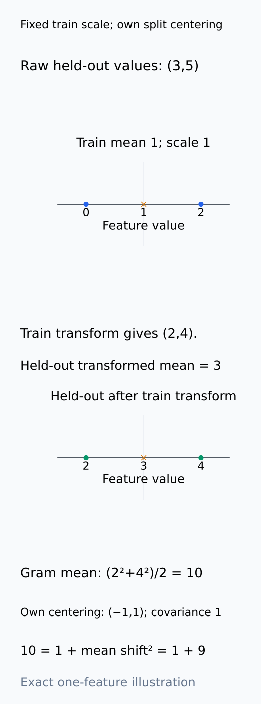
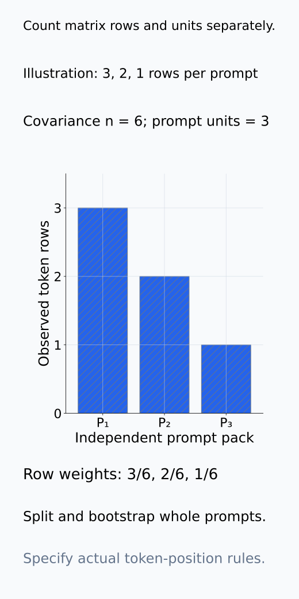
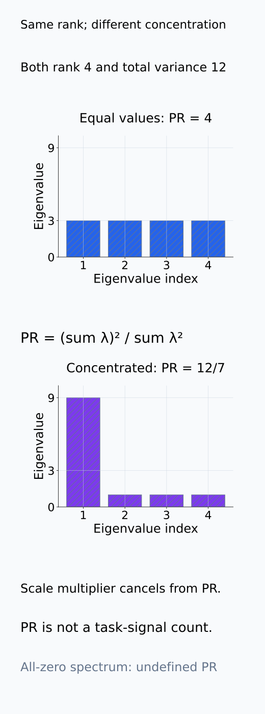
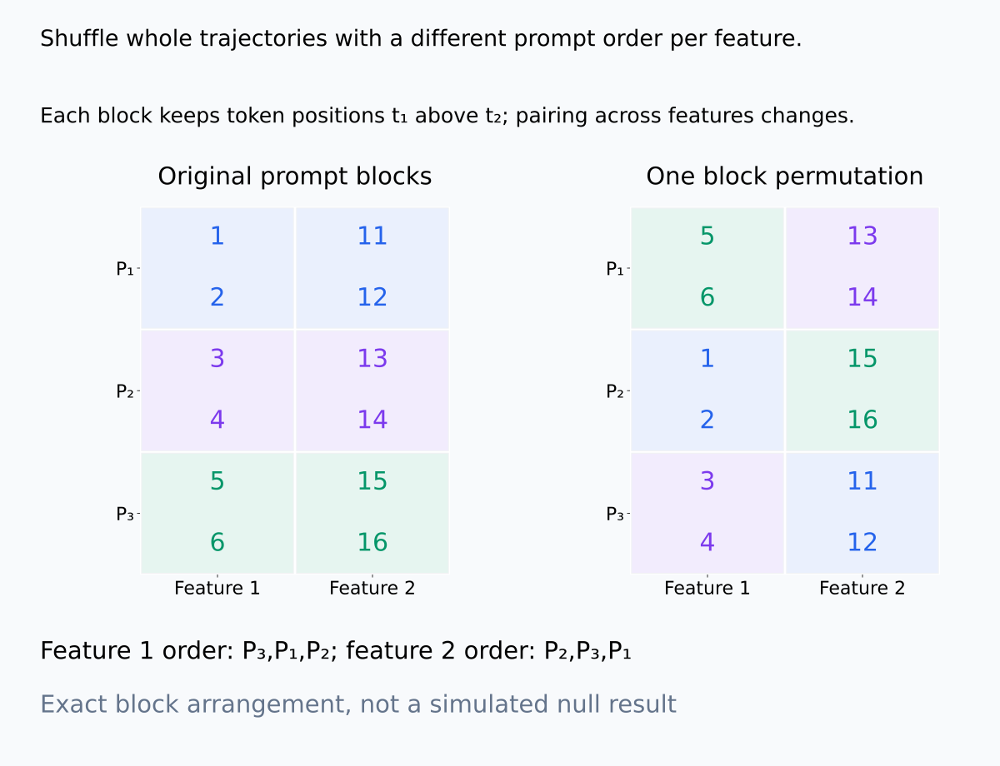
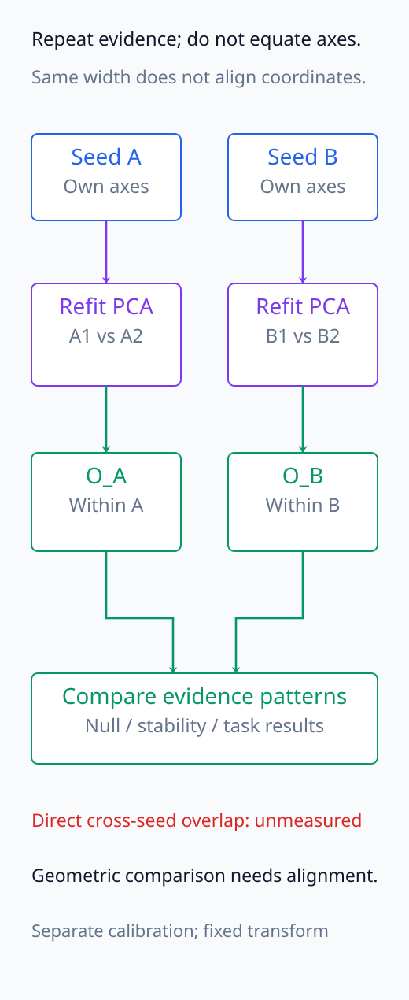
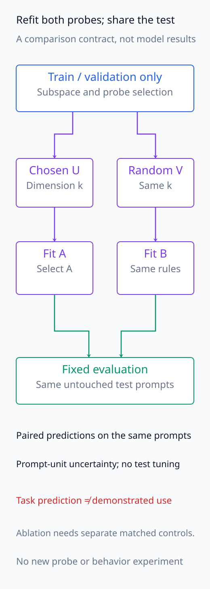
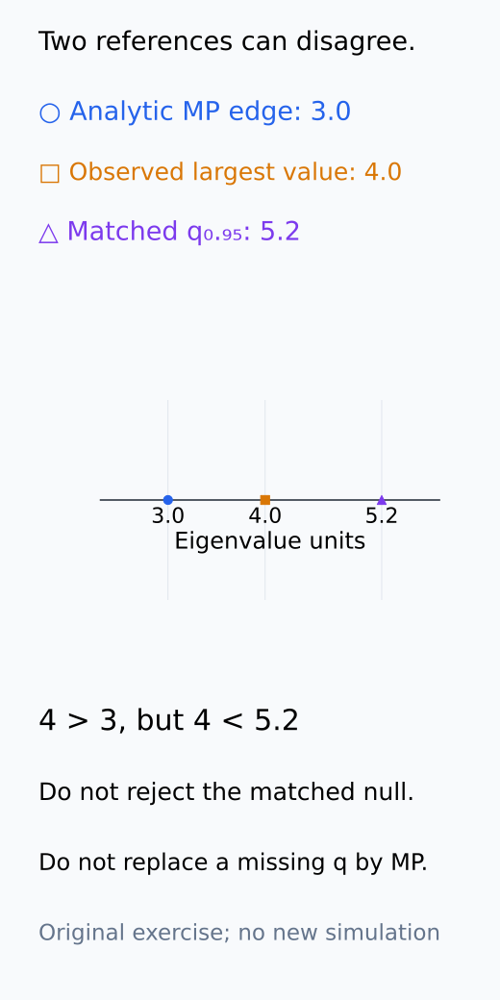

# A09-RMT-08. 종합 실습: spectrum의 null model

## 이 단원이 필요한 이유

activation spectrum에서 bulk와 outlier를 찾으려면 관찰 matrix와 null generator를 한 분석 계약에 넣어야 한다. 이 실습은 MP edge를 출발점으로 사용하되 prompt dependence, marginal variance, split stability와 task relevance를 단계별로 검증한다.

## 학습 목표

- activation covariance용 null hierarchy를 설계할 수 있다.
- analytic MP edge와 simulated null quantile을 비교할 수 있다.
- outlier subspace의 split·seed 안정성을 평가할 수 있다.
- variance signal과 task·causal signal을 구분해 보고할 수 있다.

## 선수지식 확인

- 선수 단원: [A09-RMT-01~07](A09-RMT-07-weight-activation-hessian-spectra.md)
- 확인 질문: iid Gaussian MP null이 실제 activation에서 실패할 수 있는 조건 두 가지는 무엇인가?

## 기호와 용어

| 기호·용어 | Common spoken reading | 의미 | shape·범위 |
|---|---|---|---|
| $S_{\mathrm{obs}}$ | `the observed covariance S` | 실제 activation sample covariance | $d\times d$ |
| $\lambda_{+,\mathrm{MP}}$ | `the Marchenko Pastur upper edge` | fitted iid null의 upper bulk edge | scalar |
| $q_{0.95}^{\mathrm{sim}}$ | `the ninety-fifth percentile of the simulated null` | simulated largest-eigenvalue threshold | scalar |
| $r_{\mathrm{stable}}$ | `the number of stable spectral directions` | null·split 기준을 함께 통과한 subspace dimension | nonnegative integer |

## 분석 계약

고정 model·layer·token rule에서 prompt별 activation을 모은다. prompt를 독립 experimental unit으로 두고 feature별 center와 scale 규칙을 train split에서 정한다. 두 model seed와 prompt split을 사용한다. spectrum 선별에는 test label을 사용하지 않는다.

이 단원은 분석 계약을 작성하는 실습이다. 이미 확보된 activation이 없으면 필요한 입력·예상 shape·판정 규칙을 적으며, 새 model 실행이나 simulation 결과를 만든 것으로 기록하지 않는다. prompt split, spectrum 선별용 train/validation, 최종 task 평가용 test의 역할을 먼저 정한다. 두 model seed는 두 checkpoint에서 관찰을 반복하는 것이며 두 번의 관찰만으로 model-seed population 전체를 대표하지는 않는다.

centering과 scaling은 구분한다. feature의 단위와 scale을 train에서 정해 다른 split에도 그대로 적용하되, 각 split의 covariance에는 그 split 안의 sample mean을 뺀다. train mean만 뺀 held-out matrix의 Gram은 held-out mean shift까지 포함할 수 있어 그 자체를 centered covariance라고 부르지 않는다. variance가 0인 feature의 제외 규칙도 먼저 정하고, 남은 실제 dimension $d$를 기록한다.

train에서 고정한 scale과 covariance에서 제거하는 split mean은 다음 계산처럼 다른 역할을 맡는다.

<figure class="lesson-figure lesson-figure--tall" markdown="1">

<figcaption>설명용 train 값 (0,2)의 mean 1과 scale 1을 고정하고 held-out (3,5)에 적용했다. ×는 각 mean이다. train mean만 뺀 값 (2,4)의 Gram mean은 10이지만 그 split mean 3을 다시 뺀 값 (−1,1)의 covariance는 1이다. 10=1+3²라는 차이는 mean shift이며 scale fitting과 split centering을 구분한다.</figcaption>

</figure>

### row·prompt와 covariance를 고정한다

관찰 row 수를 $n$이라 쓰고 $S_{\mathrm{obs}}=H_c^\top H_c/n$을 사용한다. token을 row로 쌓는다면 prompt 수와 $n$은 다르다. spectrum의 aspect ratio에는 실제 $d/n$을 쓰고 split·bootstrap에는 prompt unit을 쓴다. token 수가 많은 prompt가 더 큰 weight를 갖는지, prompt마다 같은 고정 위치 수를 모으는지도 명시한다. 이는 representation 자체가 같아도 관찰 distribution을 바꾸는 선택이다.

matrix row를 세는 n과 독립 resampling unit을 세는 prompt 수를 먼저 나누어 기록한다.

<figure class="lesson-figure" markdown="1">

<figcaption>설명용 prompt P₁,P₂,P₃의 token row 수를 3,2,1로 두었다. covariance의 n은 6이고 row 기준 weight는 3/6,2/6,1/6이지만 split·bootstrap unit은 prompt 세 개다. 이 그림은 고정 token 위치 계약을 대신하지 않으며 실제 sampling rule을 기록해야 하는 이유를 보여 준다.</figcaption>

</figure>

## 측정 절차

1. $S_{\mathrm{obs}}$의 eigenvalue, participation ratio와 aspect ratio를 계산한다.
2. shape와 global variance를 맞춘 iid Gaussian null의 MP edge를 구한다.
3. feature별 marginal을 보존하고 cross-feature pairing을 깨는 prompt-block permutation null을 생성한다.
4. null replicate마다 largest eigenvalue와 rank별 eigenvalue를 저장해 parallel-analysis quantile을 구한다.
5. null을 넘은 leading subspace를 prompt split과 model seed 사이에서 비교한다.
6. stable subspace의 held-out label prediction과 dimension-matched random-subspace control을 평가한다.
7. stable subspace projection·ablation을 random-subspace intervention과 비교한다.

### eigenvalue 요약과 analytic reference

participation ratio는 nonzero spectrum에서 $(\sum_j\lambda_j)^2/\sum_j\lambda_j^2$다. 동일한 양수 eigenvalue $r$개이면 $r$이고, variance가 소수 방향에 쏠리면 더 작다. 전체 scale을 곱해도 변하지 않지만 rank·독립 feature 수·task signal 수와 같은 값은 아니다. 모든 eigenvalue가 0이면 분모가 0이므로 정의되지 않았다고 기록한다.

global noise variance와 $\gamma=d/n$을 정해 analytic edge $\lambda_{+,\mathrm{MP}}=\sigma^2(1+\sqrt\gamma)^2$를 계산한다. global variance는 feature마다 동일한 noise를 가정하기 위한 하나의 scale이며 feature별 marginal 차이나 prompt dependence를 설명하지 못한다. analytic edge 초과는 limiting reference보다 높다는 관찰이지 그 자체가 finite-size 유의성 검정은 아니다. fitted variance의 추정 위치·사용 eigenvalue와 observed/null의 denominator를 함께 기록한다.

PR은 rank나 task signal 개수의 대체값이 아니라 spectrum의 집중도를 요약한다.

<figure class="lesson-figure lesson-figure--tall" markdown="1">

<figcaption>설명용 spectrum (3,3,3,3)과 (9,1,1,1)은 모두 rank 4와 total variance 12를 갖지만 participation ratio는 4와 12/7이다. 전체 배율은 비율에서 상쇄되지만 분포의 쏠림은 남는다. PR을 task signal 수로 읽지 않으며 모든 값이 0이면 정의되지 않는다.</figcaption>

</figure>

### prompt-block null이 보존하는 것을 적는다

block permutation의 한 계약은 prompt마다 같은 고정 token 위치를 모으고, feature별로 그 prompt trajectory 전체를 다른 prompt에 재배치하는 것이다. 각 feature에는 서로 다른 prompt permutation을 사용한다. 그 결과 feature별 값의 marginal과 block 안의 token 순서·변화는 유지되지만, 같은 prompt에서 함께 나타났던 서로 다른 feature의 pairing은 깨진다.

모든 feature에 같은 prompt permutation을 적용하면 row 묶음의 순서만 바뀌어 covariance spectrum은 그대로다. 반대로 token을 낱개로 섞으면 보존하려던 block 안 dependence도 사라진다. 길이가 다른 prompt를 임의로 이어 붙이는 대신 token 위치 규칙을 먼저 맞추며, nuisance stratum 안에서만 교환해야 하는 경우도 명시한다. 이 null은 모든 joint dependence를 보존하는 모델이 아니다. 교환되는 prompt block이 null 아래에서 exchangeable한지도 검토하고, 보존·제거 구조를 정확히 이름 붙인다.

각 null replicate에 observed와 같은 centering·scale fitting·eigenvalue 정렬을 적용한다. largest eigenvalue threshold와 rank별 threshold 중 어떤 판정을 할지 미리 정한다. 여러 rank·layer·seed를 살핀다면 그 선별 범위의 다중비교도 포함한다. simulation 반복이 실제로 없으면 $q_{0.95}^{\mathrm{sim}}$는 미측정으로 남긴다. analytic edge를 이 칸에 대신 넣지 않는다.

block 안의 token 순서를 유지하면서 feature 간 prompt pairing만 바꾸는 예를 아래처럼 구성할 수 있다.

<figure class="lesson-figure lesson-figure--wide" markdown="1">

<figcaption>설명용 세 prompt에서 같은 두 token 위치를 두 feature에 모았다. feature 1에는 P₃,P₁,P₂, feature 2에는 P₂,P₃,P₁ 순서를 각각 적용해 전체 두-token trajectory를 옮겼다. marginal 값과 trajectory 안의 순서는 남고 cross-feature prompt pairing은 바뀐다. 새 null replicate 결과나 모든 joint dependence를 보존하는 generator라는 뜻은 아니다.</figcaption>

</figure>

### 같은 subspace를 비교하는 좌표 계약

동일 checkpoint의 두 prompt split에서는 같은 feature coordinate와 같은 $k$를 써서 leading subspace를 각각 다시 fit하고 RMT-06의 overlap을 계산한다. $k$는 두 split의 rank 이하여야 하고 선택 경계의 eigenvalue gap도 기록한다. split마다 selected rank가 다르면 공통 $k$의 overlap과 각 split에서 선택된 rank를 따로 보고한다. 낮은 rank 쪽에 임의 vector를 붙여 동일 dimension처럼 만들지 않는다.

다른 model seed에서는 hidden coordinate가 permutation·rotation될 수 있다. 같은 layer width라는 이유로 $U_A^\top U_B$를 바로 계산하지 않는다. 기본 보고는 각 seed 안에서의 split stability·null 초과·held-out 결과가 재현되는지다. seed 간 geometric overlap을 추가로 사용한다면 held-out 평가와 분리된 calibration input에서 coordinate alignment를 정하고 변환·대상을 명시해야 한다. alignment가 없다면 직접 overlap은 미측정이며 결과 패턴의 재현성과 구분한다.

seed 안의 좌표 비교와 seed 사이의 결과 패턴 비교는 다른 경로로 기록한다.

<figure class="lesson-figure lesson-figure--tall" markdown="1">

<figcaption>각 seed 안에서 prompt split basis를 refit한 뒤 null 초과·stability·held-out 결과 패턴이 재현되는지 비교하는 기본 계약이다. 같은 d만으로 seed 사이 좌표가 같아지지는 않는다. 별도 calibration alignment 없이 직접 U_AᵀU_B를 계산하지 않으며 그 overlap은 미측정으로 둔다.</figcaption>

</figure>

### task prediction과 개입을 별도로 평가한다

선택한 basis와 probe는 train/validation에서 정하고 test에는 고정하여 적용한다. random subspace control도 같은 dimension에서 probe를 다시 fit하고 동일한 selection·test 규칙을 사용한다. 같은 test prompt의 prediction을 비교하여 dataset 차이를 줄이고, prompt unit의 불확실성을 기록한다. variance에서 뽑은 subspace로 label이 복원돼도 내부 모델의 readout이 그 정보를 사용한다는 결론은 아니다.

projection·ablation에는 적용 layer·token, 제거할 subspace, 유지할 mean, metric을 정한다. scaled coordinate에서 basis를 fit했다면 scale을 되돌리는 방식까지 포함해 원래 activation에 적용할 조작을 명시한다. 같은 $k$뿐 아니라 제거량·norm 손상도 맞춘 random-subspace 개입과 비교한다. 예측 성능이 좋은 subspace라도 개입 효과가 control과 같다면 recoverability와 component-specific functional evidence를 분리하여 기록한다.

chosen·control probe의 fit을 나누고, scaled basis로 개입했다면 원래 coordinate로 돌아오는 계산까지 명시한다.

<figure class="lesson-figure lesson-figure--tall" markdown="1">

<figcaption>chosen U_k와 dimension-matched random V_k에 probe를 각각 다시 fit·선택하고 같은 untouched test prompt에 고정 평가한다. control coordinate에 chosen probe를 그대로 옮기거나 test label로 subspace를 고르지 않는다. 새 prediction 결과가 아니며 recoverability를 functional use와 구분하는 비교 설계다.</figcaption>

</figure>

<figure class="lesson-figure lesson-figure--wide" markdown="1">

<figcaption>설명용 mean 0, D=diag(3,1), U=(1,1)ᵀ/√2, h=(3,0)ᵀ를 썼다. z=D⁻¹h에서 (I−UUᵀ)z=(0.5,−0.5)ᵀ를 얻고 D를 되돌리면 h'=(1.5,−0.5)ᵀ다. 같은 U를 raw h에 바로 적용한 (1.5,−1.5)ᵀ와 다르다. 실제 mean 유지·원래 scale 복원·제거량 control은 분석 계약에서 명시해야 하며 behavior 효과는 측정하지 않았다.</figcaption>

</figure>

## 결과 기록표

| 단계 | 통과 기준 | 허용 claim |
|---|---|---|
| analytic null | MP edge와 관찰 위치 비교 | iid isotropic limiting reference 대비 위치 차이 |
| simulated null | 사전 지정 null quantile 초과 | 지정 기준에서 matched null 초과 |
| split·seed | seed 안의 split stability와 결과 패턴 재현 | 지정 coordinate·split 조건의 stable variance subspace |
| held-out task | control 대비 prediction | recoverable task signal |
| intervention | matched control 대비 effect | 지정 조작에서의 functional evidence |

예를 들어 연습문제의 4.0은 analytic edge 3.0보다 크지만 simulated 95% quantile 5.2보다 작다. 이는 두 기준의 결론을 함께 기록해야 하는 사례다. analytic edge만 넘었다고 finite-size matched null을 기각하지 않는다. variance·stability·task·개입의 미측정 칸도 남겨 두어, 앞 단계 통과를 다음 단계의 증거로 대신하지 않는다.

두 null의 수치를 같은 축에 놓아도 통과 기준의 의미까지 같아지는 것은 아니다.

<figure class="lesson-figure" markdown="1">

<figcaption>기존 문제의 3.0<4.0<5.2를 같은 eigenvalue 축에 표시했다. observed 값은 analytic limiting edge를 넘지만 matched finite-size null quantile은 넘지 않는다. simulated 칸을 analytic 값으로 바꾸거나 두 기준 중 유리한 것만 선택하지 않는다. 세 값은 기존 stipulated 사례이고 이번에 simulation을 실행하지 않았다.</figcaption>

</figure>

## 흔한 오해

- analytic null과 simulated null 중 유리한 결과만 선택하면 selection bias가 생긴다.
- outlier 개수를 data를 본 뒤 threshold와 함께 조정하면 confirmatory claim을 할 수 없다.

## 연습문제

### 1. split
null threshold와 subspace dimension을 어느 split에서 정하고 task association을 어느 split에서 평가하는가?

해설 보기

train·validation data에서 threshold와 dimension을 정하고, 선택에 쓰지 않은 held-out test split에서 task association을 평가한다.

### 2. mismatch
MP edge는 3.0인데 matched permutation null의 95% quantile은 5.2이다. observed largest eigenvalue가 4.0이면 무엇을 결론내리는가?

해설 보기

iid MP null은 넘지만 dependence와 marginal을 더 보존한 permutation null은 넘지 않는다. matched null 기준 signal 주장은 보류한다.

### 3. rotation
leading eigenvalue 두 개가 거의 같고 split마다 eigenvector가 회전한다. 무엇을 비교하는가?

해설 보기

두 vector를 각각 맞추지 않고 leading two-dimensional subspace의 principal-angle overlap을 비교한다.

### 4. claim
stable outlier subspace가 label을 예측하지만 ablation 효과가 random subspace와 같다. 어떻게 보고하는가?

해설 보기

재현 가능한 variance subspace에서 label을 복원할 수 있지만 해당 subspace의 고유한 functional use는 확인되지 않았다고 쓴다.

## 근거와 갱신 경계

이 실습은 null hierarchy와 증거 순서를 고정한다. prompt-block permutation도 모든 dependence를 보존하지 않으므로 generator가 깨는 구조를 보고서에 명시한다.

## 단원 요약

- analytic MP와 matched simulation은 서로 다른 null을 제공한다.
- threshold 선택과 held-out task 평가는 분리한다.
- eigenvalue가 가까우면 vector보다 subspace 안정성을 본다.
- variance outlier, recoverability와 functional effect를 별도 claim으로 기록한다.

## 통과 기준

- matrix–unit–normalization–null–stability–task 계약을 완성할 수 있는가?
- null mismatch가 결론을 바꾸는 사례를 설명할 수 있는가?

## 다음 단원

- 다음 선택 모듈은 A09-CAU이다.

## 집필자 점검표

- [x] analytic·simulated null과 task·개입 검증을 분리했다.
- [x] 문제 4개에 해설이 있다.
- [x] Common spoken reading이 실제 영어 학술 발화이며 한글 음역이나 기계적 직역을 포함하지 않는다.
- [x] 선수지식과 링크를 확인했다.
