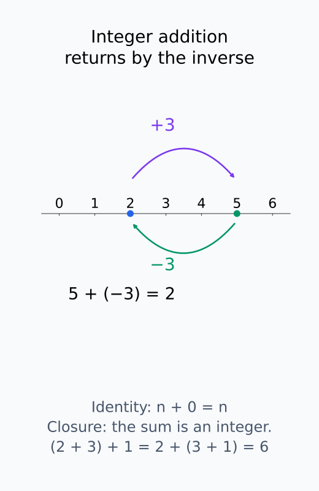
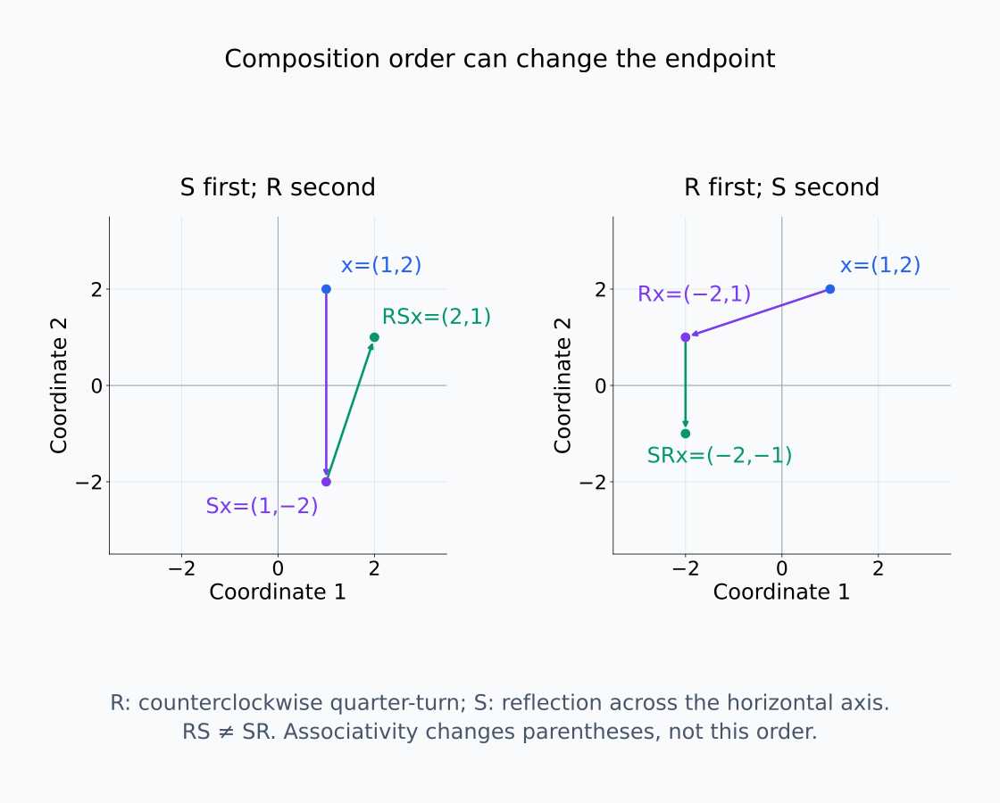
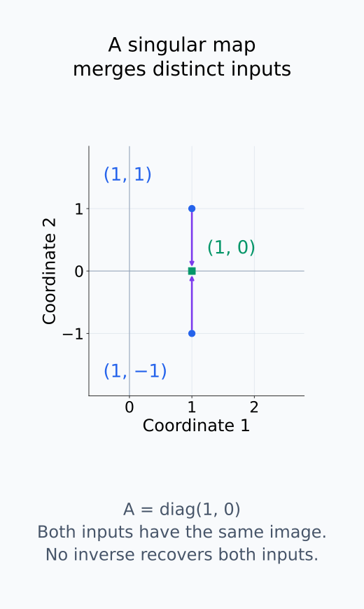
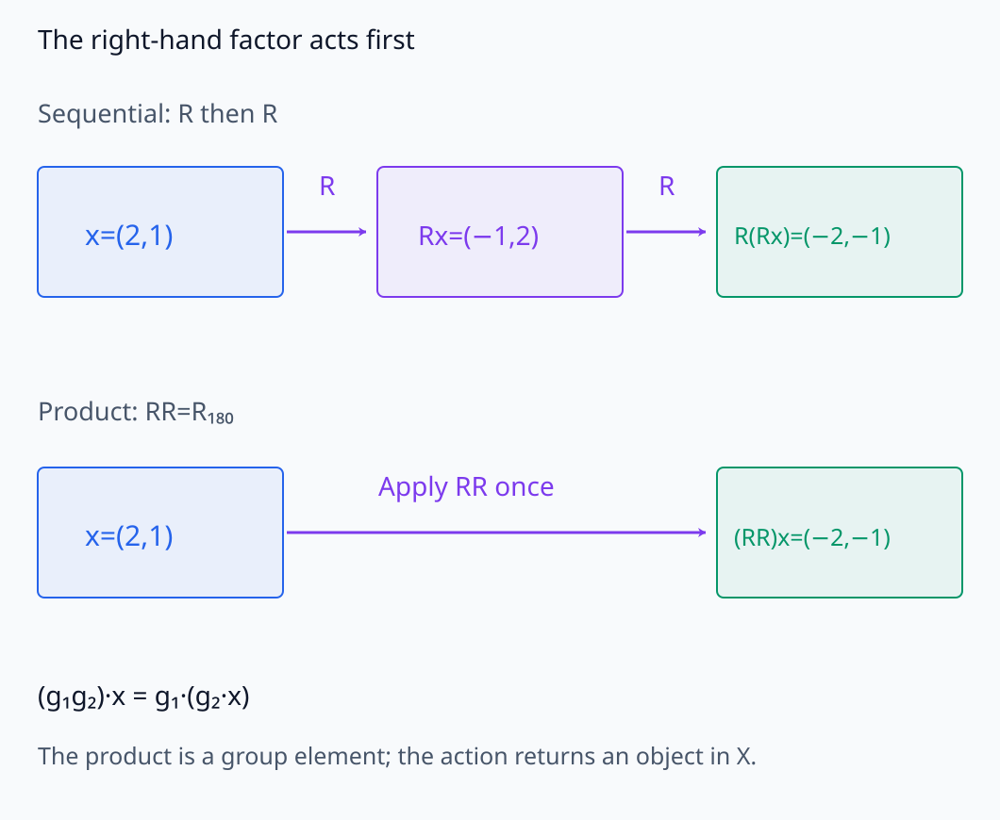
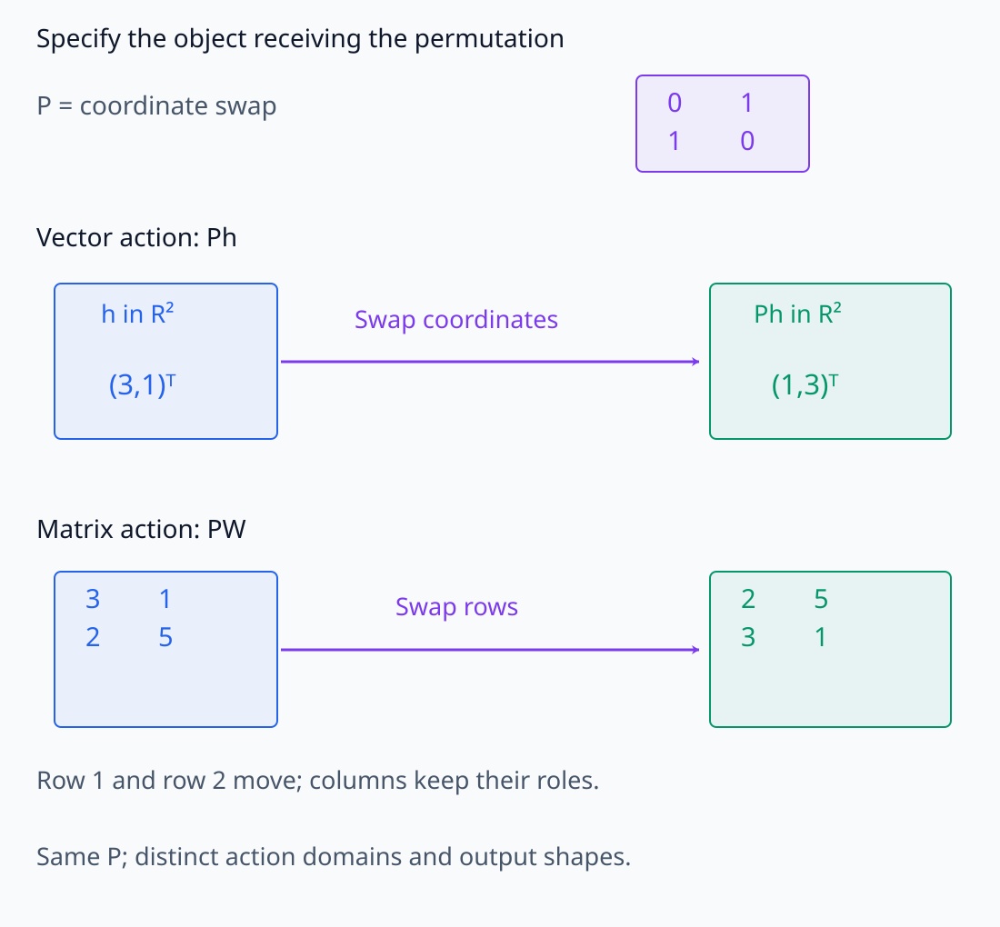
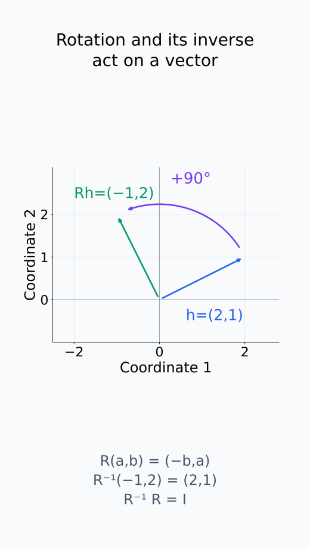
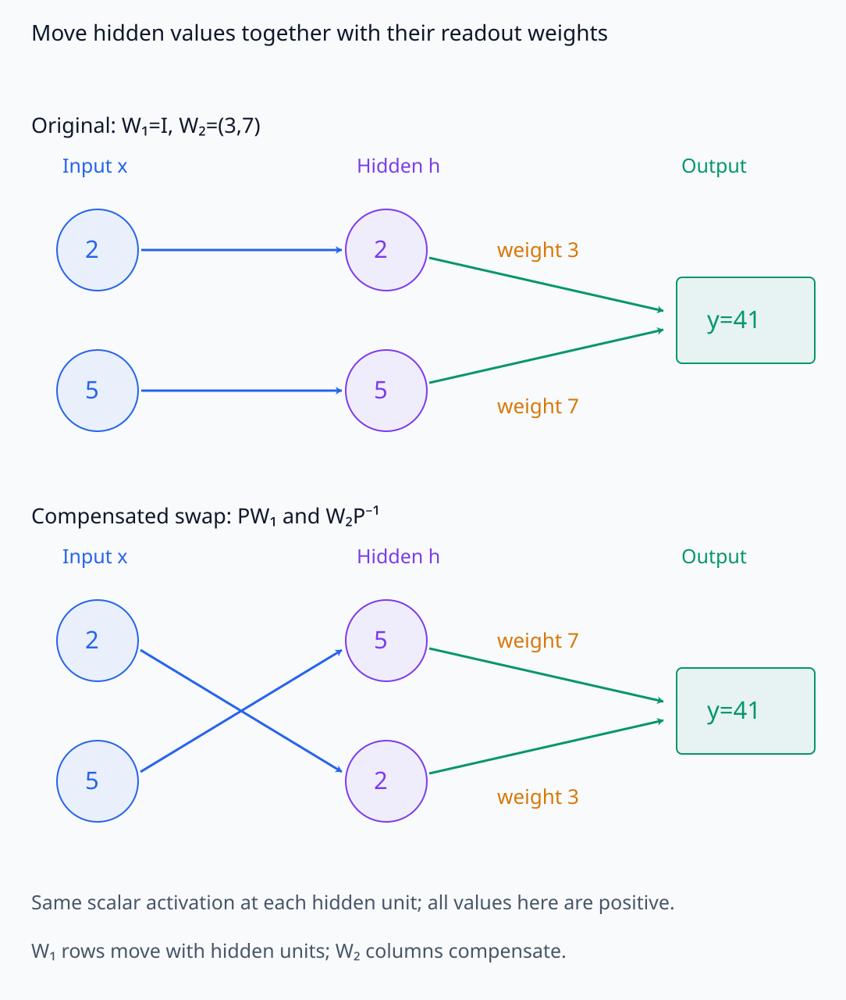

# A09-SYM-01. group과 group action

## 이 단원이 필요한 이유

neuron을 바꾸어 놓거나 hidden basis를 회전해도 같은 함수를 나타낼 수 있다. group은 합성 가능한 대칭변환의 구조를 표현하고, group action은 그 변환이 parameter·activation·input에 실제로 어떻게 작용하는지 정한다.

## 학습 목표

- group의 네 조건을 확인할 수 있다.
- group 자체와 action을 구분할 수 있다.
- permutation·rotation action의 예를 계산할 수 있다.
- 모델 동치가 어느 대상에 대한 action인지 명시할 수 있다.

## 선수지식 확인

- 선수 단원: [M03-02 선형사상](../../part-1-foundations/M03/M03-02-linear-maps-matrix-representation.md), [M03-15 모델 대칭성](../../part-1-foundations/M03/M03-15-reparameterization-model-symmetries.md)
- 확인 질문: 두 invertible basis change를 연달아 적용하면 어떤 종류의 변환이 되는가?

## 기호와 용어

| 기호·용어 | Common spoken reading | 의미 | shape·범위 |
|---|---|---|---|
| $(G,\circ)$ | `the group G with operation composition` | group과 연산 | algebraic structure |
| $e$ | `the identity element` | identity | element of $G$ |
| $g^{-1}$ | `g inverse` | inverse element | element of $G$ |
| $g\cdot x$ | `g acting on x` | $G$의 $X$ 위 action | element of $X$ |
| $R_\alpha$ | `R sub alpha` | 평면의 각도 $\alpha$ 회전 | $2\times2$ matrix |

## 핵심 개념

### group: 변환을 합성하는 규칙

group은 집합 $G$와 그 원소 두 개를 결합하는 연산으로 이루어진다. 이 단원에서는 연산을 합성으로 보고 $g_1\circ g_2$를 $g_1g_2$로 줄여 쓴다. 다음 네 조건을 확인한다.

- closure: $g_1,g_2\in G$이면 $g_1g_2\in G$이다. 허용한 두 변환을 연달아 적용한 결과도 허용한 변환이어야 한다.
- associativity: $(g_1g_2)g_3=g_1(g_2g_3)$이다. 합성의 괄호 위치를 바꾸어도 결과가 같다.
- identity: $eg=ge=g$인 원소 $e$가 있다. 행렬 곱에서는 identity matrix가 이 역할을 한다.
- inverse: 각 $g$에 대해 $g^{-1}g=gg^{-1}=e$인 원소 $g^{-1}\in G$가 있다. 변환을 되돌리는 연산도 같은 집합 안에 있어야 한다.

associativity는 순서 교환을 허용하는 조건이 아니다. 일반적으로 $g_1g_2$와 $g_2g_1$은 다르다. 또 invertible matrix 전체는 곱셈에 대한 group이지만, singular matrix까지 포함한 모든 정사각행렬은 inverse 조건을 만족하지 않는다. group을 정할 때는 원소의 집합과 연산을 함께 적어야 한다.

group 조건을 정수 덧셈과 행렬 변환에서 확인한다.

<figure class="lesson-figure" markdown="1">

<figcaption>정수 덧셈에서 2에 3을 더하면 5가 되고 inverse −3을 더하면 2로 돌아온다. 합은 다시 정수이고 identity는 0이다. 아래 괄호 식은 세 원소의 순서를 유지한 채 묶음만 바꾼다.</figcaption>
</figure>

<figure class="lesson-figure lesson-figure--wide" markdown="1">

<figcaption>R은 반시계 quarter-turn, S는 수평축 reflection이다. 같은 x=(1,2)에서 S를 먼저 적용한 RSx는 (2,1), R을 먼저 적용한 SRx는 (−2,−1)이다. 화살표는 계산 단계 사이의 대응이며 실제 연속 이동 경로를 그린 것이 아니다. associativity는 이 순서를 교환하지 않는다.</figcaption>
</figure>

<figure class="lesson-figure" markdown="1">

<figcaption>A=diag(1,0)은 서로 다른 (1,1), (1,−1)을 모두 (1,0)으로 보낸다. 이 결과 하나에서 두 입력을 각각 복구하는 inverse는 존재하지 않는다. singular 행렬을 포함한 전체 정사각행렬 집합은 inverse 조건을 만족하지 않는다.</figcaption>
</figure>

### action: 무엇에 변환을 적용하는가

action은 group element $g$와 대상 $x\in X$를 받아 같은 집합 $X$의 원소를 돌려주는 규칙이다. 다음 식을 만족하는 map $G\times X\to X$를 이 단원의 left action으로 사용한다.

$$
e\cdot x=x,
\qquad
(g_1g_2)\cdot x=g_1\cdot(g_2\cdot x)
$$

첫 식은 identity가 대상을 그대로 둔다는 뜻이다. 둘째 식에서는 오른쪽의 $g_2$를 먼저 적용하고 $g_1$을 나중에 적용한다. group 안에서 두 원소를 곱한 뒤 적용해도 이 순차 적용과 결과가 같아야 한다. 따라서 $g^{-1}\cdot(g\cdot x)=x$이며, 각 group element의 action은 되돌릴 수 있다.

group은 합성 규칙을 정하고 action은 대상별 적용 규칙을 정한다. 예를 들어 permutation을 좌표 vector에 적용하면 성분의 순서를 바꾸고, 행렬에 왼쪽에서 적용하면 행의 순서를 바꾼다. 같은 permutation이라도 $X$를 vector 집합으로 정했는지 parameter 행렬들의 집합으로 정했는지에 따라 action의 식이 달라진다.

action의 두 계산 경로와 적용 대상의 차이를 확인한다.

<figure class="lesson-figure lesson-figure--wide" markdown="1">

<figcaption>위 경로는 오른쪽 R부터 두 번 적용하고 아래 경로는 group 안에서 합성한 RR=R₁₈₀을 한 번 적용한다. 두 경로의 도착 vector는 (−2,−1)로 같다. group의 곱은 변환을 만들고 action은 그 변환을 X의 대상에 적용한다.</figcaption>
</figure>

<figure class="lesson-figure lesson-figure--wide" markdown="1">

<figcaption>같은 P도 h∈R²에서는 성분을 바꾸고 W∈R²×²에서는 왼쪽 곱으로 행을 바꾼다. 출력은 각 action이 정한 대상 집합 안에 남는다. 어떤 X에 적용하는지 먼저 정해야 P의 역할을 읽을 수 있다.</figcaption>
</figure>

### permutation과 rotation의 계산

hidden unit $m$개를 재배열하는 symmetric group $S_m$의 원소를 permutation matrix $P$로 표현할 수 있다. 각 행과 열에 1이 하나씩 있으며 나머지는 0이다. $P^{-1}=P^{\mathsf T}$이고, 두 permutation matrix의 곱도 좌표를 재배열한다. 이 group의 vector 위 action은 $h\mapsto Ph$이다.

평면 회전도 vector 위 action을 갖는다. 각도 $\alpha$의 회전을 $R_\alpha$라 쓰면 $R_\alpha R_\beta=R_{\alpha+\beta}$이고 역변환은 $R_{-\alpha}$이다. 예를 들어 $R_{\pi/2}=\begin{bmatrix}0&-1\\1&0\end{bmatrix}$는 $(a,b)$를 $(-b,a)$로 보낸다. 이 경우 합성은 각도를 더하는 규칙과 연결된다.

quarter-turn의 좌표와 inverse를 따라간다.

<figure class="lesson-figure" markdown="1">

<figcaption>옅은 좌표축에서 R(a,b)=(−b,a)를 확인한다. 예시 (2,1)은 (−1,2)로 가고 R⁻¹은 이를 다시 (2,1)로 보낸다. group 원소인 회전과 그 회전이 vector에 적용되는 계산을 구분한다.</figcaption>
</figure>

### parameter action과 함수 보존

두 layer $h=\phi(W_1x)$, $y=W_2h$에서 $W_1\in\mathbb R^{m\times d}$, $W_2\in\mathbb R^{q\times m}$라 하자. 같은 scalar 함수 $\phi$를 각 성분에 적용하면 $\phi(Pz)=P\phi(z)$이므로 다음 parameter action이 가능하다.

$$
(W_1,W_2)\mapsto(PW_1,W_2P^{-1}),
\qquad
h\mapsto Ph.
$$

첫 행렬의 행을 바꾸면 hidden unit의 이름이 바뀐다. 둘째 행렬은 그 변경을 역순으로 보상한다. 새 출력은 $W_2P^{-1}\phi(PW_1x)=W_2P^{-1}P\phi(W_1x)=W_2\phi(W_1x)$이므로 모든 입력에서 원래 출력과 같다. 이 action의 대상 $X$는 parameter 쌍이고, 입력 $x$ 자체는 바꾸지 않았다. input 회전에 대한 모델의 반응을 논할 때와 구분해야 한다.

두 action을 연달아 적용해도 $W_1$에는 $P_1P_2$가 왼쪽에서 곱해지고, $W_2$에는 $(P_1P_2)^{-1}=P_2^{-1}P_1^{-1}$가 오른쪽에서 곱해진다. 따라서 parameter 쌍의 적용 규칙도 action 법칙을 만족한다. 함수 보존은 이 보상과 activation 호환성에서 나온다. 허용한 group이 있다는 사실만으로 임의의 모델이 그 group에 대한 symmetry를 갖는 것은 아니다.

hidden 값과 다음 weight의 대응을 함께 옮긴다.

<figure class="lesson-figure lesson-figure--wide" markdown="1">

<figcaption>작은 두-unit 계산에서 W₁의 행을 옮기면 hidden 값이 (2,5)에서 (5,2)로 바뀐다. 다음 weight도 (3,7)에서 (7,3)으로 옮기면 3×2+7×5와 7×5+3×2가 모두 41이다. 이 그림은 같은 scalar activation이 있는 두-layer의 행·열 보상에 해당하며 입력 x는 그대로 둔다.</figcaption>
</figure>

## 작은 예제

두 hidden unit을 바꾸는 $P=\begin{bmatrix}0&1\\1&0\end{bmatrix}$는 $P^2=I$이므로 자기 자신이 inverse다.

$P(a,b)^{\mathsf T}=(b,a)^{\mathsf T}$이고 다시 적용하면 $(a,b)^{\mathsf T}$로 돌아온다. 두-layer 계산에서도 $W_1$의 두 행과 $W_2$의 두 열을 함께 바꾸어야 출력이 보존된다. 한쪽만 바꾸면 hidden unit과 출력 weight의 대응이 달라진다.

## 흔한 오해

- 변환 집합이 있다는 사실만으로 group은 아니다. inverse와 closure를 확인해야 한다.
- 같은 함수라는 말은 같은 parameter coordinate라는 뜻이 아니다.

## 연습문제

### 1. group 확인
정수의 덧셈은 group인가?

해설 보기

그렇다. identity는 0, $n$의 inverse는 $-n$이며 closure와 associativity를 만족한다.

### 2. action 법칙
matrix multiplication $g\cdot x=gx$가 $GL(d)$의 $\mathbb R^d$ 위 action임을 설명하라.

해설 보기

$Ix=x$이고 $(g_1g_2)x=g_1(g_2x)$이므로 두 action 법칙을 만족한다.

### 3. permutation
위 $P$를 vector $(a,b)$에 적용한 결과를 구하라.

해설 보기

$(b,a)$이다.

### 4. 모델 해석
representation을 비교할 때 group action의 domain을 적어야 하는 이유는 무엇인가?

해설 보기

같은 변환 기호라도 input, hidden coordinate, parameter에 작용할 때 보존하는 양과 의미가 다르기 때문이다.

## 근거와 갱신 경계

group과 group action은 abstract algebra의 표준 정의를 따른다. Lie group의 smooth structure는 다루지 않는다.

- [Ackerman, Algebra lecture notes, §§0.3–0.4](https://people.math.harvard.edu/~nate/teaching/UPenn/2007/fall/math_371/lectures/week_1/lecture_1/lecture_1.pdf): group과 action의 표준 정의를 확인하는 자료다. 본문의 행렬 보상은 주어진 두-layer 식에서 직접 계산했다.

## 단원 요약

- group은 합성 가능한 가역 대칭변환의 구조다.
- action은 group element가 특정 대상에 작용하는 규칙이다.
- permutation은 hidden coordinate 동치를 만들 수 있다.
- 모델 대칭성은 action 대상과 보존되는 함수를 함께 적는다.

## 통과 기준

- group 조건과 action 법칙을 확인할 수 있는가?
- neuron permutation의 보상변환을 설명할 수 있는가?

## 다음 단원

- [A09-SYM-02 orbit와 stabilizer](A09-SYM-02-orbits-stabilizers.md)

## 집필자 점검표

- [x] group과 action의 역할을 구분했다.
- [x] 문제 4개에 해설이 있다.
- [x] Common spoken reading이 실제 영어 학술 발화이며 한글 음역이나 기계적 직역을 포함하지 않는다.
- [x] 선수지식과 링크를 확인했다.
