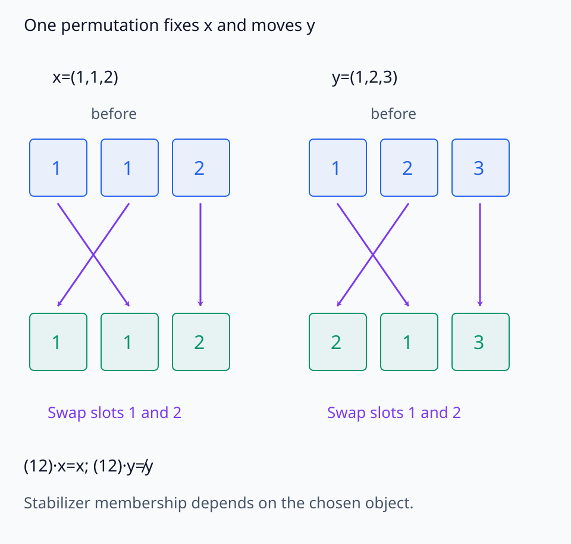
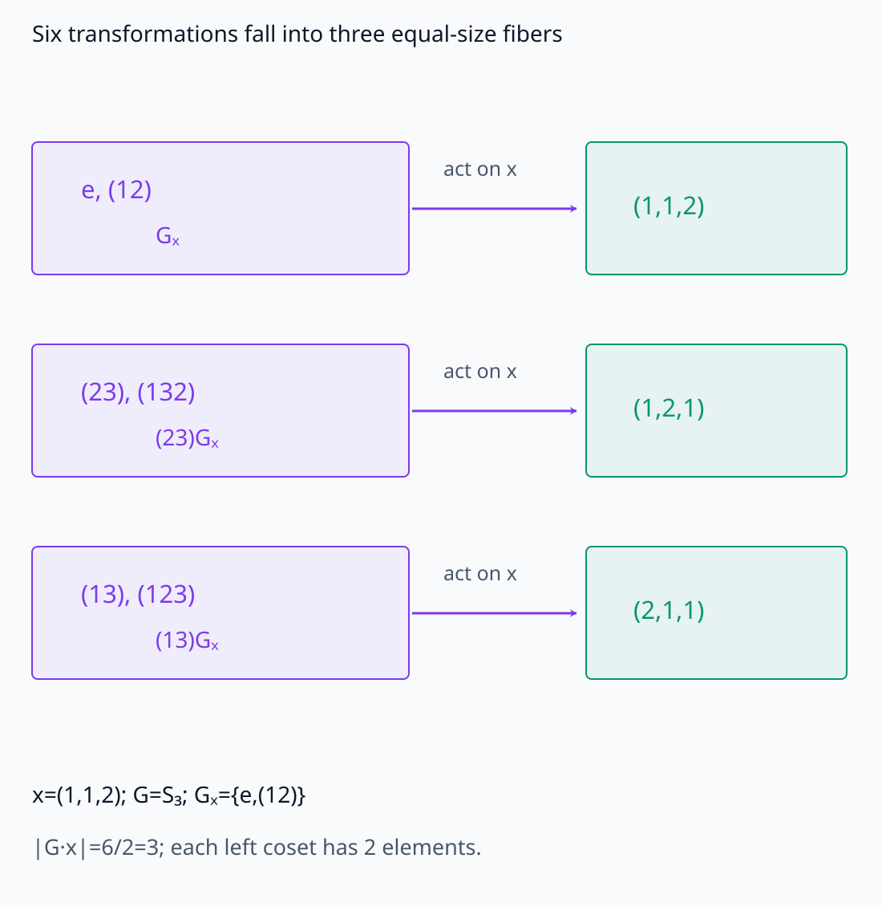
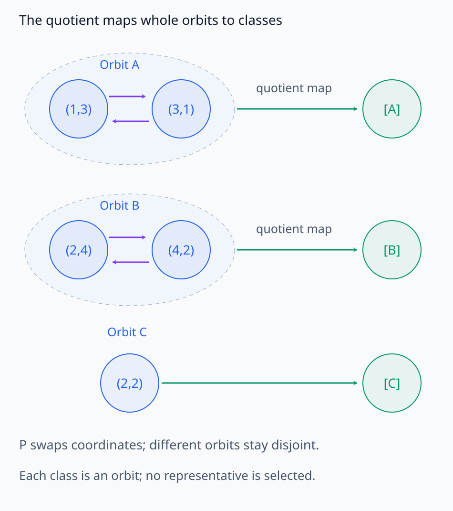
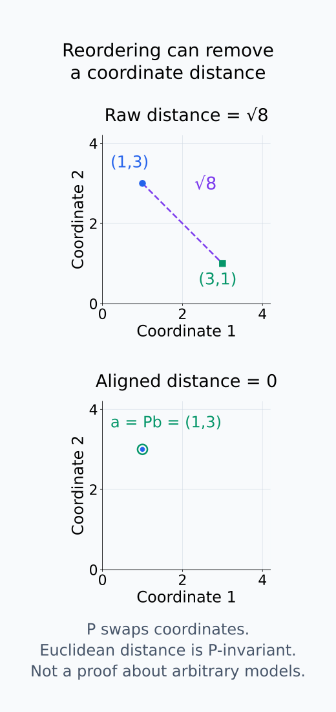

# A09-SYM-02. orbit와 stabilizer

## 이 단원이 필요한 이유

대칭변환으로 서로 이동할 수 있는 parameter는 같은 기능적 해의 여러 coordinate 표현일 수 있다. orbit는 한 대상의 모든 대칭 복사본을 모으고 stabilizer는 그 대상을 그대로 두는 변환을 모은다.

## 학습 목표

- orbit와 stabilizer를 계산할 수 있다.
- orbit가 동치류를 만드는 이유를 설명할 수 있다.
- orbit–stabilizer 관계를 finite example에 적용할 수 있다.
- parameter distance가 symmetry orbit 때문에 커질 수 있음을 설명할 수 있다.

## 선수지식 확인

- 선수 단원: [A09-SYM-01 group과 action](A09-SYM-01-groups-actions.md), [M03-06 동치관계와 몫공간](../../part-1-foundations/M03/M03-06-equivalence-relations-quotient-spaces.md)
- 확인 질문: 동치관계로 같은 것으로 볼 대상을 묶으면 무엇이 생기는가?

## 기호와 용어

| 기호·용어 | Common spoken reading | 의미 | shape·범위 |
|---|---|---|---|
| $G\cdot x$ | `the G orbit of x` | $x$의 orbit | subset of $X$ |
| $G_x$ | `the stabilizer of x` | $x$를 고정하는 subgroup | subgroup of $G$ |
| $X/G$ | `X modulo G` | orbit들의 quotient | set of equivalence classes |
| $\lvert G\cdot x\rvert$ | `the size of the orbit of x` | finite orbit cardinality | positive integer |

## 핵심 개념 1. orbit는 한 대상을 움직여 얻는 모든 결과다

group $G$가 집합 $X$에 작용한다고 하자. $x\in X$의 orbit는

$$
G\cdot x
=
\{g\cdot x:g\in G\}
$$

다. group element는 여러 개여도 같은 orbit point에 도착할 수 있다. orbit는 사용한 변환의 목록이 아니라 서로 다른 **도착 대상**의 집합이다.

$y=g\cdot x$인 어떤 $g$가 존재할 때 $x\sim y$라고 정의하면 이 관계는 동치관계다. identity가 reflexivity를, inverse가 symmetry를, group product가 transitivity를 보장한다. 따라서 $X$는 서로 겹치지 않는 orbit들로 분할된다.

각 조건을 action 식으로 확인할 수 있다. $x=e\cdot x$이므로 자기 자신은 같은 orbit에 속한다. $y=g\cdot x$이면 $x=g^{-1}\cdot y$여서 도달 관계를 뒤집을 수 있다. 또 $z=h\cdot y$이면 $z=(hg)\cdot x$이므로 두 번의 이동도 같은 orbit 안에 남는다. 따라서 $x$와 $y$가 한 번이라도 같은 orbit에서 만나면 두 점에서 출발해 얻는 orbit 전체가 같다.

## 핵심 개념 2. stabilizer는 한 점을 움직이지 않는 변환들이다

$x$의 stabilizer는

$$
G_x
=
\{g\in G:g\cdot x=x\}
$$

다. identity는 항상 $G_x$에 속하고, $x$를 고정하는 두 변환의 곱과 inverse도 $x$를 고정한다. 그러므로 $G_x$는 $G$의 subgroup이다.

$g\cdot x=h\cdot x=x$라면 $(gh)\cdot x=g\cdot(h\cdot x)=x$이다. $g\cdot x=x$의 양쪽에 $g^{-1}$을 적용하면 $g^{-1}\cdot x=x$도 얻는다. 이 계산은 stabilizer가 특정 대상 $x$에 대해 닫혀 있음을 보여 준다. 같은 $g$가 다른 대상 $y$까지 고정할 필요는 없다. 따라서 $G_x$의 원소를 “아무것도 하지 않는 변환”이라고 읽으면 적용 대상을 놓친다.

stabilizer가 크다는 말은 여러 group element가 $x$에 작용했을 때 새 위치를 만들지 못하고 같은 $x$로 돌아온다는 뜻이다. 대칭이 많은 대상일수록 stabilizer가 커질 수 있다.

<figure class="lesson-figure lesson-figure--wide" markdown="1">

<figcaption>왼쪽 orbit는 x가 도달할 수 있는 서로 다른 대상들을 모은다. 오른쪽 stabilizer는 서로 다른 변환이라도 결과를 같은 x에 남기는 경우를 모은다.</figcaption>
</figure>

그림에서 왼쪽의 화살표 수와 orbit point 수는 같을 필요가 없다. 서로 다른 두 변환이 같은 점으로 보내면 그 차이는 $x$를 고정하는 stabilizer element로 설명된다. 바로 이 중복 때문에 stabilizer의 크기가 orbit의 크기를 줄인다.

같은 변환이 어떤 대상을 고정하는지 비교한다.

<figure class="lesson-figure lesson-figure--wide" markdown="1">

<figcaption>(12)는 두 성분의 위치를 바꾼다. 두 값이 모두 1인 x는 그대로지만 y는 (2,1,3)으로 달라진다. Gₓ의 원소가 다른 대상 y까지 고정할 필요는 없다는 뜻이다.</figcaption>
</figure>

## 핵심 개념 3. orbit 크기는 stabilizer의 coset 수다

finite group에서는 map $g\mapsto g\cdot x$를 생각할 수 있다. 두 element $g_1,g_2$가 같은 orbit point를 만들 조건은

$$
g_1\cdot x=g_2\cdot x
\quad\Longleftrightarrow\quad
g_2^{-1}g_1\in G_x
$$

다. 즉, 같은 left coset에 속하는 group element들은 $x$에서 같은 결과를 만든다. 따라서 서로 다른 orbit point의 수는 stabilizer coset의 수와 같고

$$
|G\cdot x|
=
\frac{|G|}{|G_x|}
$$

이다. 이 식은 group element 수를 결과 수로 단순히 나눈 암기식이 아니라, 같은 결과를 만드는 변환 묶음의 크기가 $|G_x|$라는 counting statement다.

left coset $g_2G_x$는 $\{g_2h:h\in G_x\}$이다. 위 조건은 $g_1=g_2h$인 stabilizer element $h$가 존재한다는 말과 같다. 이때 $(g_2h)\cdot x=g_2\cdot x$이므로 coset 하나의 원소들은 같은 도착점을 만든다. 역으로 도착점이 같으면 $h=g_2^{-1}g_1$이 $x$를 고정한다. 또 $h\mapsto g_2h$가 일대일 대응이어서 각 coset에 $|G_x|$개의 원소가 있다. 서로 다른 coset들은 겹치지 않으므로 $|G|$를 이 묶음 크기로 나눈다. 유한성은 이 마지막 크기 나눗셈에 필요한 조건이다.

변환의 중복을 left coset별 도착점으로 묶는다.

<figure class="lesson-figure lesson-figure--wide" markdown="1">

<figcaption>본문의 x=(1,1,2)에서 Gₓ={e,(12)}이다. (23)Gₓ는 {(23),(132)}, (13)Gₓ는 {(13),(123)}이며 각 묶음은 같은 도착 vector를 만든다. orbit는 변환 6개의 목록이 아닌 서로 다른 결과 3개다. 같은 크기 2의 세 묶음이 6/2=3을 설명한다.</figcaption>
</figure>

## 핵심 개념 4. quotient는 symmetry 방향을 하나로 묶는다

quotient $X/G$는 각 orbit를 하나의 원소로 보는 집합이다. parameter symmetry에서 한 orbit 전체가 같은 함수를 나타낸다면 quotient의 한 점이 하나의 기능적 해에 대응할 수 있다. 그러나 quotient를 쓴다고 각 orbit에서 대표 parameter가 자동으로 선택되는 것은 아니다.

quotient의 원소는 좌표 vector 하나가 아니라 $[x]=G\cdot x$라는 동치류다. 이 집합을 표기했다고 덧셈·거리·group 연산이 저절로 생기지는 않는다. parameter action이 함수를 보존하면 같은 orbit의 parameter는 같은 함수를 나타내지만, 다른 orbit에서도 같은 함수가 나올 수 있다. 선택한 symmetry가 함수 동치의 모든 원인을 포함한다는 가정은 별도다.

model parameter $\theta$의 orbit가 같은 function을 나타낸다면 raw distance

$$
\|\theta_1-\theta_2\|
$$

는 기능적 차이와 symmetry orbit을 따른 이동을 함께 센다. 허용한 group $G$ 아래 symmetry-aligned distance는

$$
d_G(\theta_1,\theta_2)
=
\min_{g\in G}
\|\theta_1-g\cdot\theta_2\|
$$

처럼 비교할 수 있다. finite group에서는 모든 후보 중 minimum이 존재한다. 일반적인 무한 group에서는 minimum을 달성하지 못할 수 있어 infimum과 구분해야 한다. 또 이 식을 대표 좌표와 무관한 quotient 거리로 해석하려면 action이 선택한 norm의 거리를 보존하는지 등의 조건을 확인해야 한다. permutation과 Euclidean norm의 조합은 이 조건을 만족하지만 일반적인 scaling은 그렇지 않다.

어떤 $G$를 허용했는지와 minimum을 실제로 찾았는지가 결과의 일부다. 함수 보존 action으로 정확히 같은 orbit임을 보였다면 함수 동치도 따른다. 그와 달리 alignment 뒤 거리가 작다는 사실은 선택한 변환 아래 parameter가 가깝다는 뜻이다. 그 작은 차이가 출력에 얼마나 영향을 주는지는 별도 평가가 필요하다.

orbit 전체를 한 원소로 보내는 quotient map을 확인한다.

<figure class="lesson-figure lesson-figure--wide" markdown="1">

<figcaption>coordinate swap의 예시에서 각 점은 자신의 orbit 안에서 이동한다. quotient map은 A, B의 두 점을 각각 한 동치류로 보내고 고정점 (2,2)도 별도 동치류 C로 보낸다. [A]는 좌표 하나를 자동 선택한 것이 아니라 orbit 전체를 원소로 취한 표기다.</figcaption>
</figure>

raw 거리와 허용한 permutation 뒤의 거리를 비교한다.

<figure class="lesson-figure" markdown="1">

<figcaption>벡터 (1,3), (3,1)의 raw Euclidean 거리는 √8이다. 두 번째 벡터에 P를 적용하면 첫 벡터와 같아 aligned 거리는 0이다. 이 예시는 permutation과 Euclidean norm의 거리 보존 조합이다. 실제 parameter의 함수 보존은 그 모델에 허용된 action을 별도로 확인해야 한다.</figcaption>
</figure>

## 작은 예제

$S_3$가 vector $(1,1,2)$의 coordinate를 permute한다고 하자. group 크기는 $|S_3|=6$이지만 orbit에는

$$
(1,1,2),\quad(1,2,1),\quad(2,1,1)
$$

세 개만 있다. 첫 두 좌표의 값이 모두 1이므로 identity와 두 1의 위치를 바꾸는 permutation이 원래 vector를 그대로 둔다. 따라서 stabilizer 크기는 2이고

$$
|S_3\cdot(1,1,2)|
=
\frac{6}{2}
=3
$$

으로 실제 orbit 크기와 일치한다. 만약 세 coordinate 값이 모두 달랐다면 stabilizer에는 identity만 남고 orbit 크기는 6이 된다.

## 흔한 오해

- stabilizer는 orbit와 반대 개념이 아니라 orbit 크기를 결정하는 subgroup이다.
- quotient를 취했다고 각 동치류의 canonical representative가 자동으로 정해지지 않는다.

## 연습문제

### 1. orbit
부호 group $\{+1,-1\}$이 실수에 곱셈으로 작용할 때 $x=3$의 orbit를 구하라.

해설 보기

$\{3,-3\}$이다.

### 2. stabilizer
같은 action에서 $x=0$의 stabilizer를 구하라.

해설 보기

두 element 모두 0을 고정하므로 group 전체다.

### 3. orbit–stabilizer
$|G|=24$, $|G_x|=6$이면 orbit 크기는 얼마인가?

해설 보기

$24/6=4$이다.

### 4. checkpoint 비교
두 checkpoint의 raw parameter distance가 큰데 같은 orbit일 수 있다면 무엇을 추가로 계산해야 하는가?

해설 보기

허용한 group action에 대해 $\min_g\|\theta_1-g\cdot\theta_2\|$ 같은 symmetry-aligned distance나 function distance를 계산한다.

## 근거와 갱신 경계

orbit·stabilizer·quotient action은 group theory의 표준 정의를 따른다. continuous group에서의 measure와 orbit geometry는 다루지 않는다.

- [MIT Algebra I notes, Lectures 17–18](https://ocw.mit.edu/courses/res-18-011-algebra-i-student-notes-fall-2021/mit18_701f21_full_lec_new.pdf): orbit·stabilizer와 finite counting 관계의 표준 근거다. 거리 비교의 조건은 본문에서 사용하는 norm과 action에 대해 구분했다.

## 단원 요약

- orbit는 한 대상의 모든 symmetry copy다.
- stabilizer는 대상을 고정하는 subgroup이다.
- quotient는 orbit를 하나의 동치류로 본다.
- raw parameter distance는 orbit 방향 이동을 기능 차이로 셀 수 있다.

## 통과 기준

- finite action의 orbit와 stabilizer를 구할 수 있는가?
- symmetry-aligned 비교가 필요한 이유를 설명할 수 있는가?

## 다음 단원

- [A09-SYM-03 invariant와 equivariant](A09-SYM-03-invariant-equivariant.md)

## 집필자 점검표

- [x] orbit·stabilizer·quotient를 연결했다.
- [x] 문제 4개에 해설이 있다.
- [x] Common spoken reading이 실제 영어 학술 발화이며 한글 음역이나 기계적 직역을 포함하지 않는다.
- [x] 선수지식과 링크를 확인했다.
