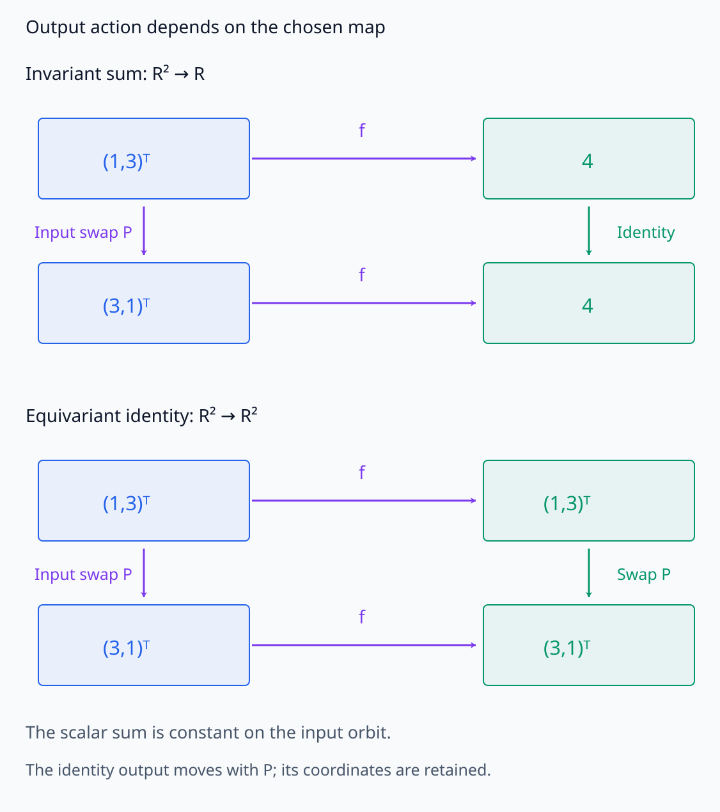
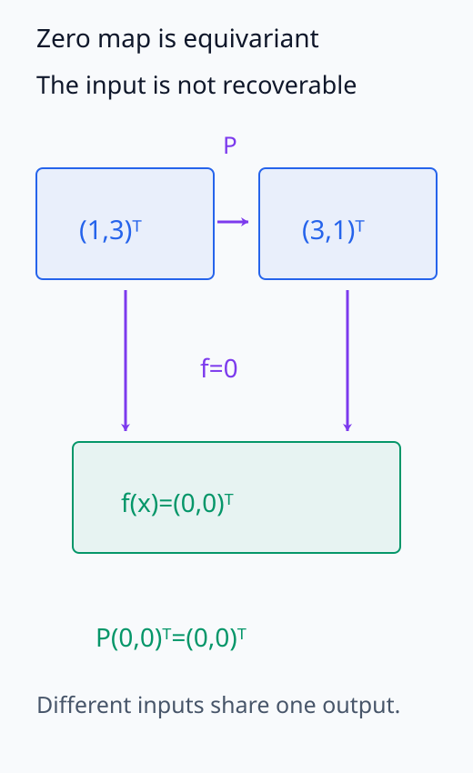
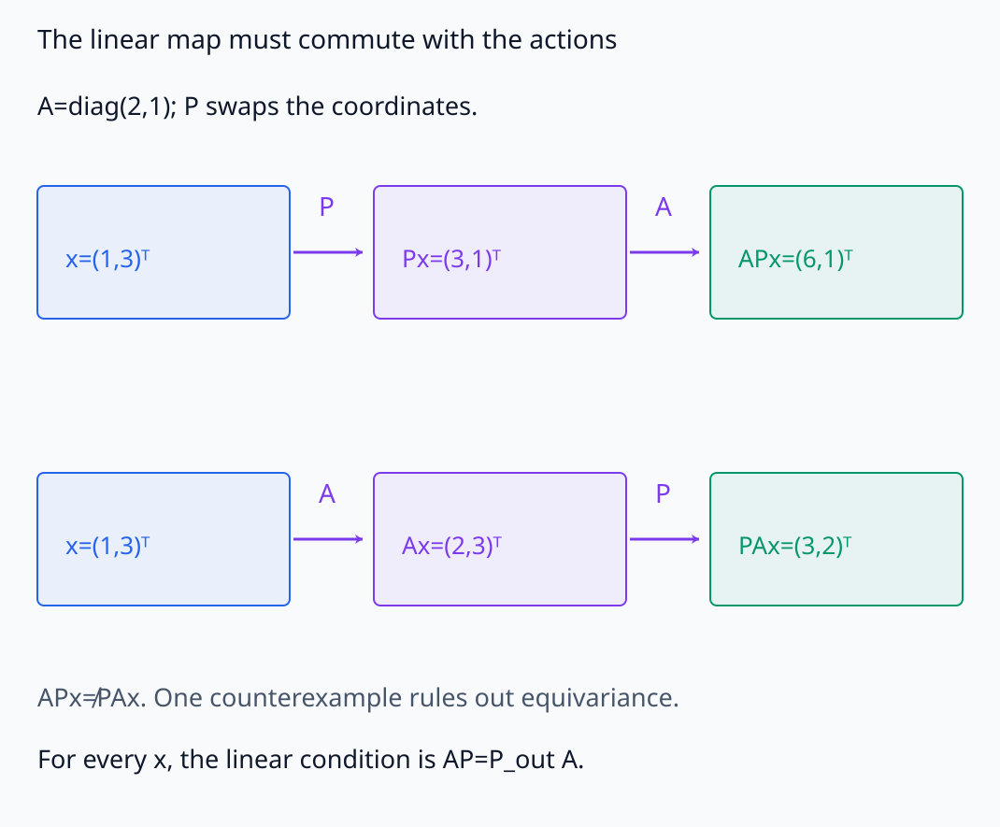
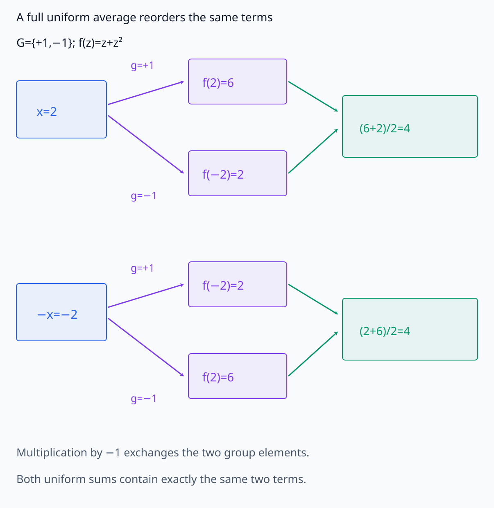
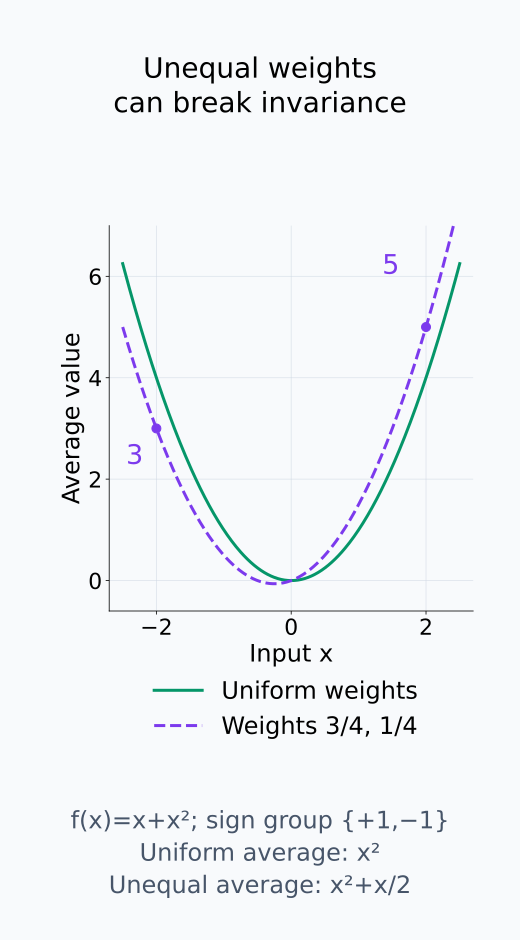
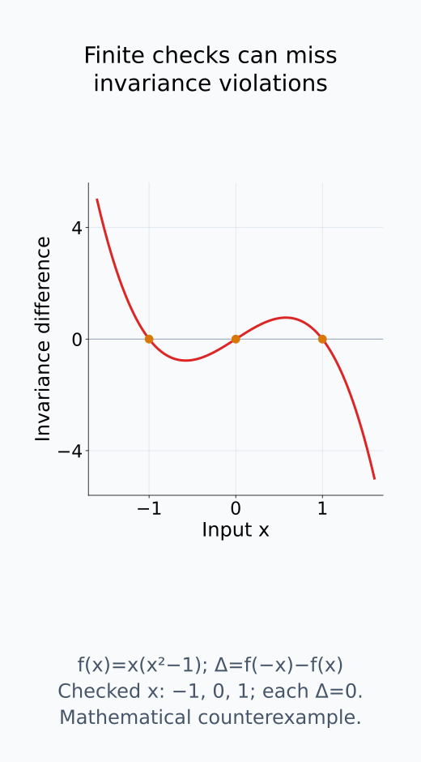

# A09-SYM-03. invariant와 equivariant

## 이 단원이 필요한 이유

입력을 변환했을 때 출력이 그대로여야 하는지, 대응되게 변해야 하는지는 task에 따라 다르다. invariant와 equivariant를 구분하면 data augmentation, architecture constraint와 representation metric의 가정을 정확히 쓸 수 있다.

## 학습 목표

- invariant·equivariant map의 식을 쓸 수 있다.
- input·output action을 명시할 수 있다.
- averaging으로 invariant를 만드는 원리를 설명할 수 있다.
- empirical invariance와 architectural guarantee를 구분할 수 있다.

## 선수지식 확인

- 선수 단원: [A09-SYM-01 group과 action](A09-SYM-01-groups-actions.md), [M03-04 불변량과 equivariance](../../part-1-foundations/M03/M03-04-invariants-equivariance.md)
- 확인 질문: image를 회전할 때 class label과 segmentation mask는 각각 어떻게 변해야 하는가?

## 기호와 용어

| 기호·용어 | Common spoken reading | 의미 | shape·범위 |
|---|---|---|---|
| $f(g\cdot x)=f(x)$ | `f of g acting on x equals f of x` | invariance | unchanged output |
| $f(g\cdot x)=\rho(g)f(x)$ | `f of g acting on x equals rho of g acting on f of x` | equivariance | transformed output |
| $\rho(g)$ | `rho of g` | output-space action | linear or nonlinear map |
| $\bar f(x)$ | `f bar of x` | group-averaged function | invariant summary |

## 핵심 개념

### 입력과 출력의 action을 따로 정한다

$f:X\to Y$에서 $g\cdot x$는 $X$ 위 action이고 $\rho(g)$는 같은 group element가 $Y$에 작용하는 규칙이다. 출력 action이 선형이면 $\rho(g)f(x)$는 행렬 곱으로 읽고, 일반적인 map이면 $\rho(g)(f(x))$라는 함수 적용으로 읽는다. 두 공간의 차원이 같거나 두 action의 행렬이 같아야 하는 것은 아니다.

invariant map은 $f(g\cdot x)=f(x)$를 모든 허용 $g,x$에 대해 만족한다. input orbit 전체에 같은 값을 주므로 $[x]$에 $f(x)$를 대응시키는 quotient 위의 함수를 정의할 수 있다. 대표 $x$를 같은 orbit의 다른 점으로 바꾸어도 함수값이 같다는 조건이 이 정의를 가능하게 한다.

equivariant map은 $f(g\cdot x)=\rho(g)f(x)$를 만족한다. 입력을 바꾼 뒤 계산하는 경로와 먼저 계산한 뒤 출력을 바꾸는 경로가 일치한다는 뜻이다. class label을 유지할 image 변환에는 unchanged output을 요구할 수 있고, segmentation mask를 같은 방식으로 움직여야 할 변환에는 대응하는 output action을 요구한다. 어떤 변환에서 label 의미가 바뀌는지는 task에서 먼저 정해야 한다.

같은 input 변환에 필요한 output action을 구분한다.

<figure class="lesson-figure lesson-figure--wide" markdown="1">

<figcaption>같은 input swap에서 합 함수의 출력은 scalar 4로 남고 identity map의 출력은 vector (1,3)에서 (3,1)로 움직인다. 첫 output action은 identity, 둘째는 P다. input과 output은 타입과 차원이 같을 필요가 없다.</figcaption>
</figure>

### equivariance는 정보 보존과 같은 조건이 아니다

output action을 identity로 정하면 equivariance 식은 invariance 식이 된다. 일반적인 equivariant feature에는 변환에 따라 움직이는 성분을 남겨 둘 수 있고, 이후 invariant pooling으로 task output을 만들 수 있다. 다만 equivariance 자체가 $f$의 일대일성이나 원래 입력의 복원을 보장하지는 않는다. 선형 output action에서는 zero map도 equivariant다. 변환에 대한 대응 규칙과 정보 손실의 정도는 별도로 확인한다.

선형 $f(x)=Ax$와 input/output permutation을 생각하면 두 계산 경로는 $A P_{\mathrm{in}}x$와 $P_{\mathrm{out}}Ax$이다. 모든 $x$에서 같으려면 $AP_{\mathrm{in}}=P_{\mathrm{out}}A$이어야 한다. 입력과 출력에 같은 $P$를 쓰는 경우 이 조건이 $AP=PA$로 줄어든다.

두 경로의 일치와 입력 정보의 보존을 따로 확인한다.

<figure class="lesson-figure" markdown="1">

<figcaption>zero map은 모든 입력을 (0,0)으로 보내고 output permutation도 (0,0)을 그대로 둔다. f(Px)=Pf(x)를 만족하지만 입력을 복원할 수 없다. 변환 대응 규칙과 일대일성은 다른 조건이다.</figcaption>
</figure>

<figure class="lesson-figure lesson-figure--wide" markdown="1">

<figcaption>A=diag(2,1)과 같은 input/output swap P에서 두 경로는 (6,1), (3,2)로 다르다. 모든 x에서 APx=PAx가 되려면 AP=PA여야 한다. input과 output action이 다르면 일반 조건은 AP_in=P_out A다.</figcaption>
</figure>

### group average가 같은 값을 만드는 이유

finite group에서 scalar 또는 같은 vector space의 값들을 내는 $f$를 생각하자. 그 공간에서 합과 평균을 정의할 수 있으면

$$
\bar f(x)=\frac1{|G|}\sum_{g\in G}f(g\cdot x)
$$

는 invariant다. 다른 group element $h$를 입력에 적용하면

$$
\bar f(h\cdot x)
=\frac1{|G|}\sum_{g\in G}f((gh)\cdot x)
=\bar f(x).
$$

$g\mapsto gh$는 inverse를 갖는 재배열이므로 $g$가 전체 group을 한 번 돌 때 $gh$도 전체 group을 한 번 돈다. 합의 항 순서만 바뀌어서 값이 같다. 여기서는 원래 $f$가 invariant일 필요가 없다. 전체 group을 균등하게 평균한다는 점이 핵심이다. 일부 augmentation만 골라 평균하거나 불균등 weight를 쓰면 이 계산을 그대로 적용할 수 없다. class 이름처럼 덧셈을 정의하지 않은 출력에는 먼저 평균할 score 등의 대상을 정해야 한다.

uniform average가 항을 재배열하는 계산과 weight 조건을 확인한다.

<figure class="lesson-figure lesson-figure--wide" markdown="1">

<figcaption>수학 예시 f(z)=z+z²에서 두 group element로 얻은 값은 6과 2다. 입력에 −1을 적용하면 group 전체의 두 항이 서로 바뀌지만 균등 합과 평균 4는 같다. 이 계산은 g↦gh가 전체 group을 재배열한다는 본문 논리의 두-element 사례다.</figcaption>
</figure>

<figure class="lesson-figure" markdown="1">

<figcaption>uniform average는 x²로 x와 −x에서 같지만 weight를 3/4,1/4로 바꾸면 x²+x/2다. 이 경우 −2에서는 3, 2에서는 5여서 sign action에 invariant하지 않다. 전체 group을 같은 weight로 평균한다는 조건을 확인한다.</figcaption>
</figure>

### 경험적 관측과 구조적 보장

훈련 데이터에서 작은 변화만 관측됐다는 것은 approximate empirical invariance다. 모든 group element에 대한 architecture-level identity와는 증거 수준이 다르다.

경험적 검사는 지정한 $x,g$에서 $f(g\cdot x)$와 $f(x)$의 차이, 또는 $f(g\cdot x)$와 $\rho(g)f(x)$의 차이를 측정한다. 후자의 비교에서는 출력을 같은 좌표 대응에 놓아야 한다. 값이 작았다는 결과는 검사한 범위의 오차를 뜻한다. architecture-level guarantee는 layer와 합성 규칙이 모든 허용 입력·변환에서 식을 만족한다는 근거를 요구한다. augmentation으로 학습했다는 사실만으로 이 identity를 얻지는 못한다.

유한 입력 검사와 모든 입력의 identity를 구분한다.

<figure class="lesson-figure" markdown="1">

<figcaption>이 수학 반례의 f(−x)−f(x)는 지정한 세 x=−1,0,1에서 0이지만 다른 입력에서는 달라진다. 실제 학습 모델의 관측값이 아니라 유한 검사만으로 모든 입력의 identity를 증명하지 못한다는 반례다.</figcaption>
</figure>

## 작은 예제

coordinate permutation group에서 $f(x)=\sum_i x_i$는 invariant이고 $f(x)=x$는 같은 permutation action에 equivariant다.

$x=(1,3)^{\mathsf T}$의 성분을 바꾸면 $(3,1)^{\mathsf T}$이지만 합은 두 경우 모두 4다. identity map의 출력은 두 성분이 함께 재배열되므로 $f(Px)=Pf(x)$이다. 합을 취하면 이 순서 차이를 구별하지 못한다. 두 식이 요구하는 출력의 관계가 다른 것을 같은 예제에서 확인할 수 있다.

## 흔한 오해

- invariance가 항상 좋지는 않다. task-relevant transformation까지 지우면 정보가 손실된다.
- augmentation은 exact equivariance를 보장하지 않는다.

## 연습문제

### 1. invariant
$f(x)=\|x\|_2$가 orthogonal group에 invariant임을 보이라.

해설 보기

$\|Qx\|_2^2=x^\top Q^\top Qx=\|x\|_2^2$이다.

### 2. equivariant
$f(x)=Ax$가 permutation $P$에 equivariant이려면 어떤 식을 만족해야 하는가?

해설 보기

같은 output action을 쓰면 $AP=PA$가 모든 허용 $P$에 대해 성립해야 한다.

### 3. group average
부호 group에서 $\bar f(x)=[f(x)+f(-x)]/2$가 even function임을 설명하라.

해설 보기

$\bar f(-x)=[f(-x)+f(x)]/2=\bar f(x)$이다.

### 4. 모델 평가
test augmentation에서 output 변화가 작으면 exact invariance라 부를 수 있는가?

해설 보기

아니다. 지정 sample·transformation에 대한 approximate empirical result로 보고하고 architecture proof와 구분한다.

## 근거와 갱신 경계

invariance·equivariance와 group averaging은 representation theory의 표준 구성이다. Haar integration이 필요한 infinite compact group은 다루지 않는다.

- [MIT 18.702, Summing over the group](https://math.mit.edu/classes/18.702/summary-feb24.pdf): group 전체를 합할 때 multiplication이 원소를 재배열한다는 근거를 확인한다. 본문의 함수 평균식은 이 재배열을 입력 action에 적용해 유도했다.

## 단원 요약

- invariant map은 orbit에 같은 값을 준다.
- equivariant map은 input action을 output action으로 옮긴다.
- group averaging은 invariant를 만드는 한 방법이다.
- empirical robustness와 exact symmetry guarantee를 구분한다.

## 통과 기준

- 주어진 map의 invariance·equivariance를 확인할 수 있는가?
- 어떤 정보를 보존하거나 제거하는지 설명할 수 있는가?

## 다음 단원

- [A09-SYM-04 permutation symmetry](A09-SYM-04-permutation-symmetry.md)

## 집필자 점검표

- [x] invariant와 equivariant의 output action을 명시했다.
- [x] 문제 4개에 해설이 있다.
- [x] Common spoken reading이 실제 영어 학술 발화이며 한글 음역이나 기계적 직역을 포함하지 않는다.
- [x] 선수지식과 링크를 확인했다.
