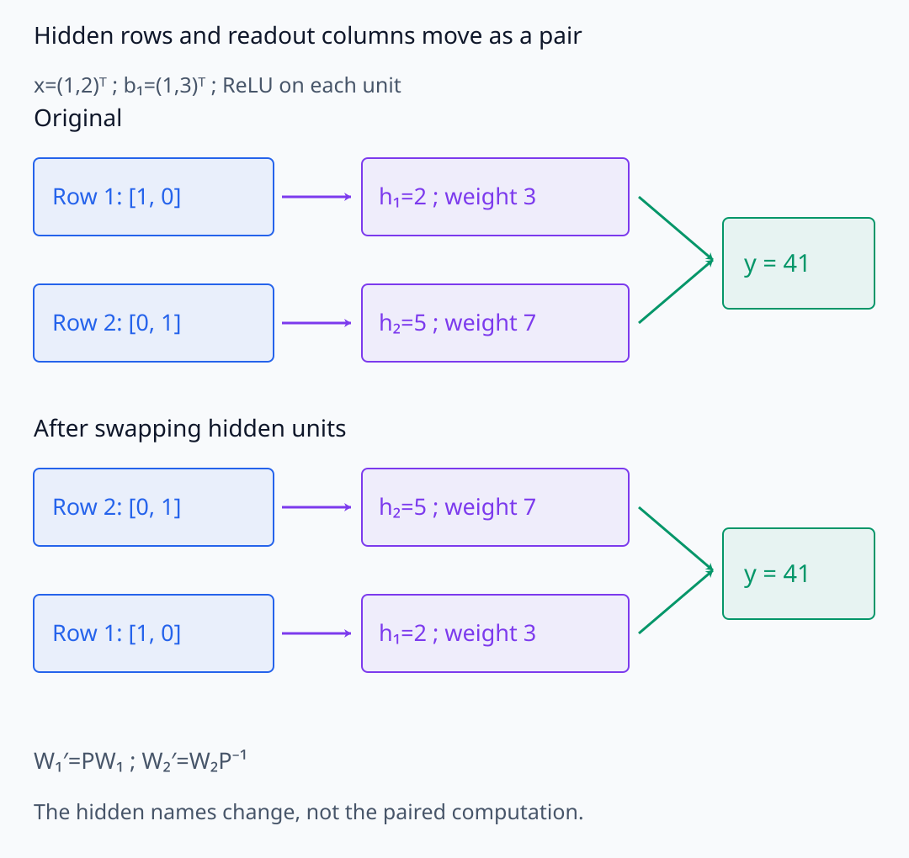
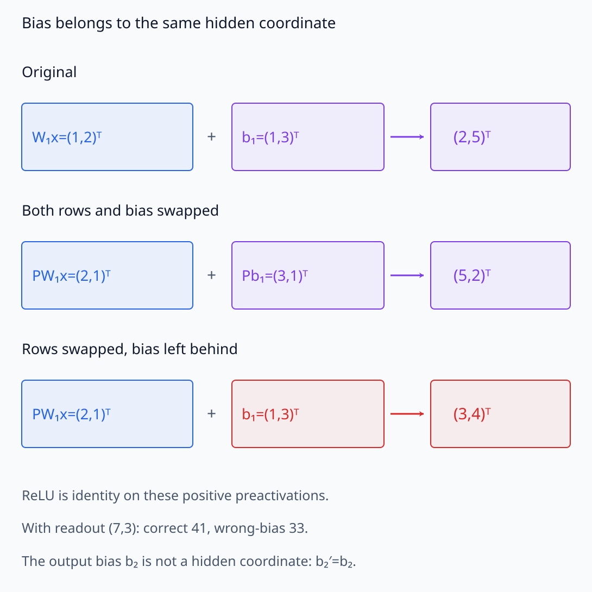
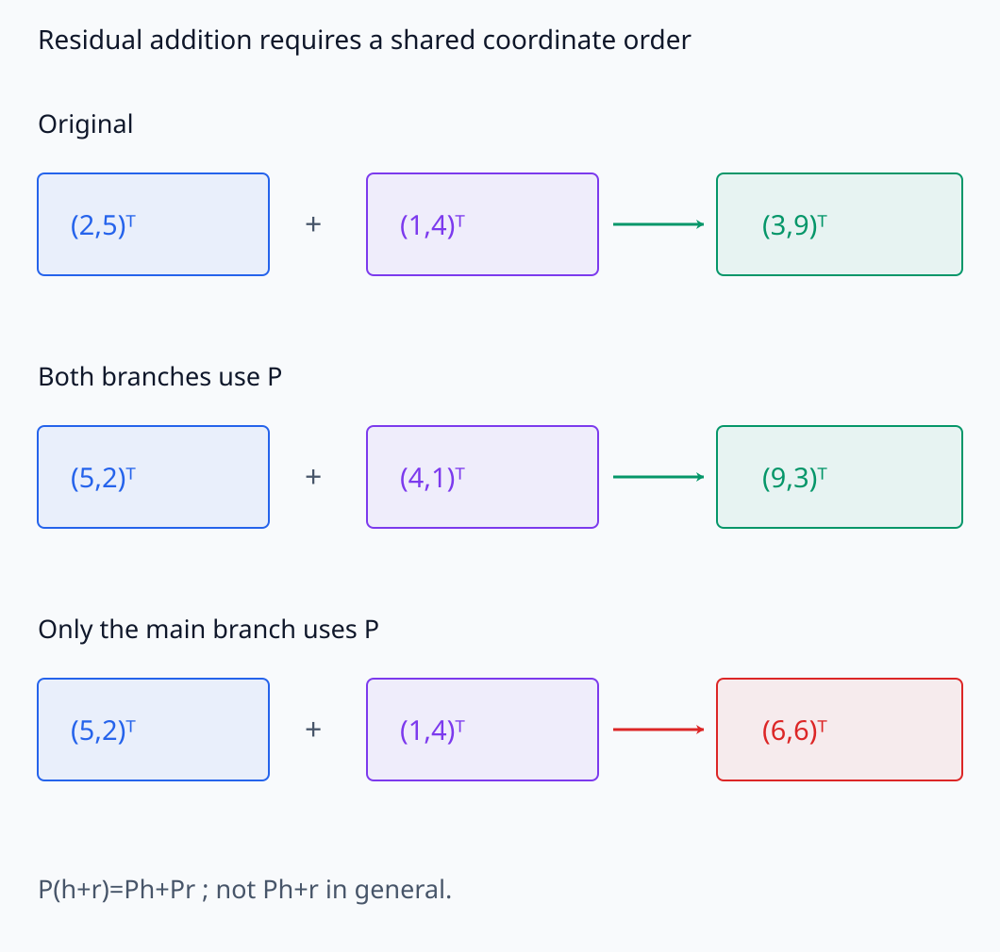
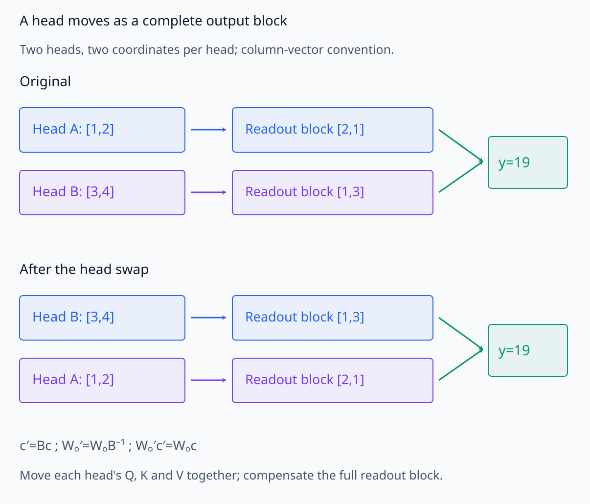
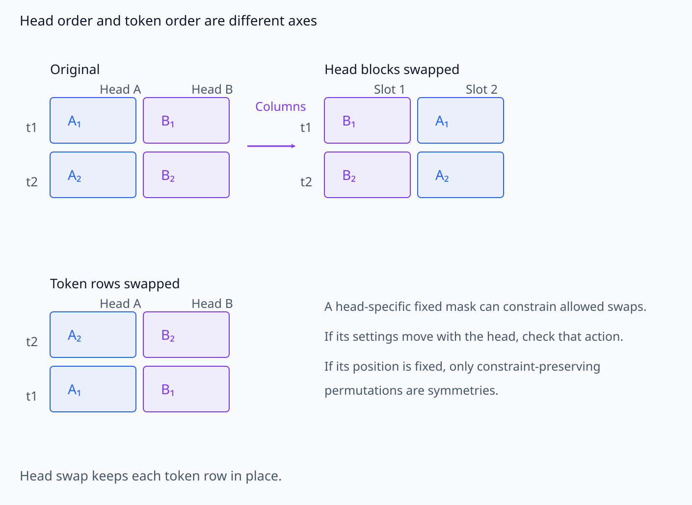
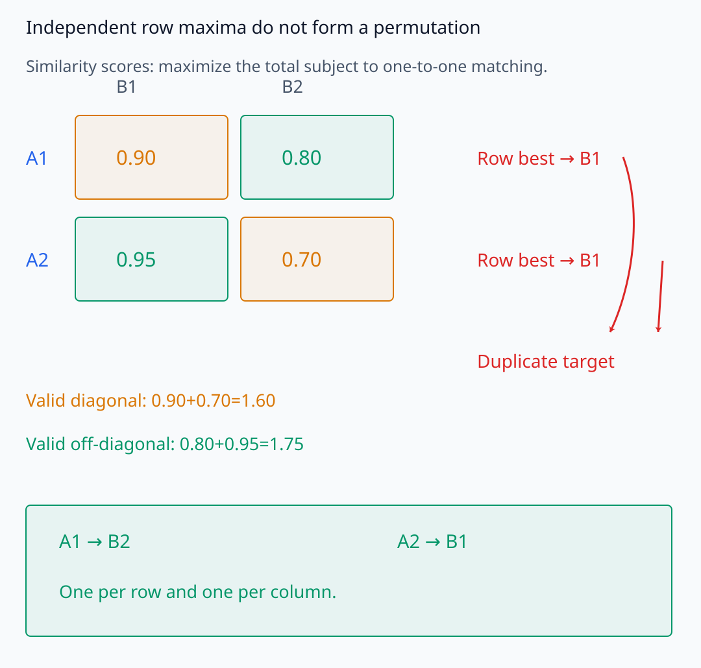
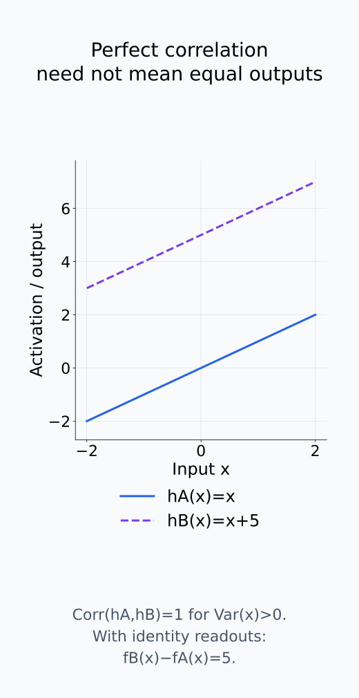
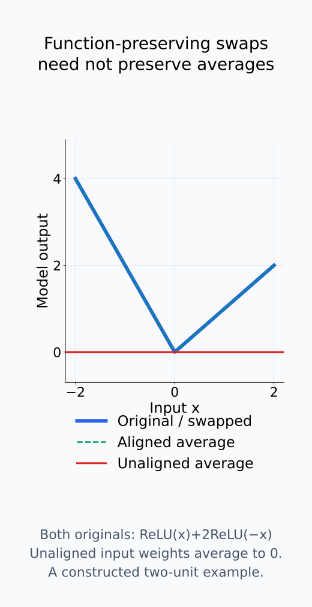

# A09-SYM-04. permutation symmetry

## 이 단원이 필요한 이유

hidden unit와 attention head의 순서는 이름표일 수 있다. 보상되는 permutation을 무시하면 같은 계산을 하는 두 모델이 coordinate-wise로 전혀 달라 보이고, neuron matching과 parameter averaging이 실패할 수 있다.

## 학습 목표

- 두-layer network의 permutation 보상식을 쓸 수 있다.
- activation과 weight의 permutation을 추적할 수 있다.
- head permutation이 허용되는 조건을 설명할 수 있다.
- matching score와 기능적 동치를 구분할 수 있다.

## 선수지식 확인

- 선수 단원: [A09-SYM-02 orbit와 stabilizer](A09-SYM-02-orbits-stabilizers.md), [M03-15 모델 대칭성](../../part-1-foundations/M03/M03-15-reparameterization-model-symmetries.md)
- 확인 질문: hidden coordinate를 바꾼 뒤 다음 layer에서 inverse를 적용하면 무엇이 보존되는가?

## 기호와 용어

| 기호·용어 | Common spoken reading | 의미 | shape·범위 |
|---|---|---|---|
| $P$ | `P` | permutation matrix | orthogonal binary matrix |
| $W_1'=PW_1$ | `W sub one prime equals P W sub one` | hidden rows의 재배열 | matrix |
| $W_2'=W_2P^{-1}$ | `W sub two prime equals W sub two P inverse` | 다음 layer의 보상 | matrix |
| $\pi\in S_m$ | `pi in S sub m` | $m$개 unit의 permutation | group element |
| $B$ | `B` | head 출력의 block permutation | square permutation matrix |

## 핵심 개념

### hidden unit의 이름과 연결 weight

$f(x)=W_2\phi(W_1x)$에서 모든 hidden unit에 같은 scalar activation을 적용한다고 하자. $W_1$의 행은 hidden unit별 입력 weight이고 $W_2$의 열은 각 hidden unit에서 출력으로 가는 weight이다. $P$를 왼쪽에서 곱하면 $W_1$의 행이 재배열된다. 같은 순서 변경을 activation에 적용하고 출력 연결을 보상하면

$$
W_2P^{-1}\phi(PW_1x)
=W_2P^{-1}P\phi(W_1x)=f(x).
$$

이다. $\phi(Pz)=P\phi(z)$는 같은 함수를 성분마다 적용할 때 순서 변경과 activation 계산을 교환할 수 있다는 식이다. 이어서 $P^{-1}P=I$가 hidden 순서 변경을 출력에서 지운다. permutation은 활성값을 새 값으로 만드는 것이 아니라, 그 값과 연결 weight의 이름표를 함께 바꾼다.

아래에서는 hidden row와 다음 readout column의 짝을 원래 순서와 바뀐 순서에서 비교한다.

<figure class="lesson-figure lesson-figure--wide" markdown="1">

<figcaption>W₁의 행을 바꿀 때 hidden 값과 W₂의 대응 열도 함께 옮긴다. 각 unit에 같은 scalar activation을 적용하고 bias도 같은 순서를 따르면 원래 출력 41을 보존한다.</figcaption>

</figure>

### activation과 bias까지 같은 순서를 따른다

bias를 포함한 $h=\phi(W_1x+b_1)$, $y=W_2h+b_2$에서는 $W_1'=PW_1$, $b_1'=Pb_1$, $W_2'=W_2P^{-1}$, $b_2'=b_2$로 둔다. 이때 새 preactivation은 $P(W_1x+b_1)$이고 새 hidden activation은 $h'=Ph$이다. 출력 bias는 hidden 좌표가 아니므로 그대로 둔다. hidden bias만 원래 순서에 남겨 두면 row weight와 bias가 다른 unit에 연결된다.

여러 hidden layer에서도 중간 weight는 앞 layer의 순서 변경을 입력 쪽에서 보상하고 자기 layer의 순서를 출력 쪽에서 바꾸어야 한다. 각 행렬을 서로 독립적으로 재배열할 수 있는 것은 아니다. residual branch나 공유 parameter가 있으면 같은 hidden 좌표를 사용하는 연결들의 순서를 함께 맞춰야 한다.

bias와 residual 연결도 같은 hidden 좌표를 사용하는지 따로 확인해야 한다.

<figure class="lesson-figure lesson-figure--wide" markdown="1">

<figcaption>W₁x=(1,2)ᵀ와 b₁=(1,3)ᵀ를 함께 바꾸면 hidden 값이 (5,2)ᵀ가 된다. bias를 남기면 (3,4)ᵀ가 되어 같은 보상 readout (7,3)에서도 41이 아닌 33을 낸다. 출력 bias b₂는 그대로 둔다.</figcaption>

</figure>

<figure class="lesson-figure lesson-figure--wide" markdown="1">

<figcaption>원래 합 (3,9)ᵀ의 swap은 (9,3)ᵀ다. 두 branch를 함께 swap해야 이 결과를 얻으며, 한 branch만 바꾸면 (6,6)ᵀ가 된다. 공유 좌표를 쓰는 연결은 독립적으로 재배열할 수 없다.</figcaption>

</figure>

### attention head는 block 전체를 옮긴다

같은 크기의 head 출력들을 column vector로 쌓아 $c$라 하고 output을 $W_Oc$로 쓰자. head의 순서만 바꾸는 block permutation $B$를 적용하면 $c'=Bc$이다. $W_O'=W_OB^{-1}$로 두면 $W_O'c'=W_Oc$가 된다. row-vector 구현에서 concatenate한 행렬을 오른쪽에서 바꾸는 표기는 곱셈 방향도 이에 맞춰 바뀐다.

head 출력을 실제로 재배열하려면 해당 head의 query·key·value parameter를 한 묶음으로 옮겨야 한다. output projection에서는 그 head 출력에 대응하는 전체 block을 보상한다. 한 head 내부 성분의 순서를 바꾸는 것과 head 여러 개의 순서를 바꾸는 것은 서로 다른 action이다. 이 단원에서는 후자를 비교한다.

head-specific mask·routing·parameter tying이 있으면 허용 symmetry가 줄어든다. mask 등이 head에 속한 함께 이동 가능한 설정인지, 특정 위치에 고정된 architecture 제약인지 확인해야 한다. 제약을 보존하는 permutation에 대해서만 위 계산을 모델 전체의 함수 보존으로 이어갈 수 있다. attention head 순서를 바꾸는 계산은 token 순서를 바꾸는 계산과도 구분한다.

head block의 이동과 token 행의 이동을 구분하면 보상해야 할 연결을 추적할 수 있다.

<figure class="lesson-figure lesson-figure--wide" markdown="1">

<figcaption>head 출력은 성분 하나가 아닌 block 단위로 옮긴다. c=[1,2|3,4]와 Wₒ=[2,1|1,3]의 출력은 19이며 두 block과 대응 output weight block을 함께 swap하면 그대로 19다. 실제 head의 Q·K·V도 함께 이동하고 architecture 제약을 보존해야 한다.</figcaption>

</figure>

<figure class="lesson-figure lesson-figure--wide" markdown="1">

<figcaption>head 순서 변경은 각 token 행 안에서 block 열을 옮기는 것이고 token 순서 변경은 행을 옮기는 것이다. head-specific mask·routing이 위치에 고정되어 있다면 그 제약을 보존하는 swap만 허용된다.</figcaption>

</figure>

### matching은 대응 후보를 고르는 절차다

matching은 correlation을 최대화하거나 weight distance를 최소화하는 assignment problem으로 만들 수 있다. 높은 matching score는 기능 동치의 충분조건이 아니다.

두 모델의 neuron $i,j$ 사이 similarity를 정한 뒤, 각 neuron을 상대 모델의 서로 다른 neuron 하나에 대응시킨다. correlation을 similarity로 쓰면 합을 최대화하고 distance를 cost로 쓰면 합을 최소화한다. 각 row와 column을 한 번씩 선택하는 제약이 permutation의 일대일성을 구현한다. neuron마다 가장 높은 상대를 독립적으로 고르면 같은 target을 여러 번 선택해 permutation을 만들지 못할 수 있다.

matching으로 고른 $P$를 한 모델에 일관되게 적용하면 그 모델 자체의 함수는 보존할 수 있다. 그러나 상대 모델과 activation이 잘 맞았다는 점은 두 모델의 함수가 같다는 증명이 아니다. 제한된 데이터의 correlation은 bias·scale이나 관측하지 않은 입력 차이를 놓칠 수 있다. alignment 뒤 parameter 평균도 별개의 모델 계산이므로 함수 보존이나 성능 보존을 다시 확인해야 한다.

matching의 일대일 제약과 함수 동치·평균 모델의 보장은 서로 다른 질문이다.

<figure class="lesson-figure lesson-figure--wide" markdown="1">

<figcaption>각 row의 최고값만 고르면 두 neuron이 모두 B1에 대응해 permutation이 되지 않는다. 일대일 제약 아래에서는 off-diagonal 대응의 합 1.75가 diagonal 합 1.60보다 크다. 이 점수는 함수 동치의 증명이 아니다.</figcaption>

</figure>

<figure class="lesson-figure" markdown="1">

<figcaption>hA=x와 hB=x+5는 x에 변동이 있는 자료에서 correlation이 1이지만 identity readout의 출력은 항상 5만큼 다르다. 이 그림은 제한된 activation similarity와 함수 일치를 구분하기 위한 수학적 예제다.</figcaption>

</figure>

<figure class="lesson-figure" markdown="1">

<figcaption>fA=ReLU(x)+2ReLU(−x)에서 hidden unit을 swap한 fB는 같은 함수다. 대응하지 않은 입력 weight (1,−1)와 (−1,1)를 평균하면 둘 다 0이 되어 평균 모델은 0을 출력한다. 먼저 정렬한 이 예제의 평균은 원래 함수를 보존하지만 임의의 모델 병합 성능을 보장하지는 않는다.</figcaption>

</figure>

## 작은 예제

hidden activation $h=(2,5)$를 swap해 $(5,2)$로 만들고 다음 weight $(3,7)$도 $(7,3)$으로 바꾸면 dot product는 둘 다 $41$이다.

원래 계산은 $3\times2+7\times5=41$이고 보상한 계산은 $7\times5+3\times2=41$이다. activation만 swap하면 $3\times5+7\times2=29$가 된다. 재배열 자체보다 값과 출력 weight의 대응을 유지하는지가 출력 보존을 결정한다.

## 흔한 오해

- neuron index가 같다고 seed 간 같은 feature인 것은 아니다.
- 모든 permutation이 symmetry인 것은 아니며 architecture connectivity를 보존해야 한다.

## 연습문제

### 1. 보상 계산
$h=(1,4)$, $w=(2,3)$을 swap permutation으로 동시에 바꿔 dot product가 보존됨을 보이라.

해설 보기

원래 값은 $14$, 바꾼 값은 $(3,2)\cdot(4,1)=14$이다.

### 2. bias
$h=\phi(Wx+b)$에서 unit을 permute할 때 $b$는 어떻게 변하는가?

해설 보기

$b'=Pb$로 같은 unit 순서에 맞춰 permute한다.

### 3. assignment
두 seed의 neuron correlation matrix에서 one-to-one matching을 쓰는 이유는 무엇인가?

해설 보기

여러 neuron을 같은 target에 중복 대응시키지 않고 permutation이라는 bijection 제약을 유지하기 위해서다.

### 4. 평균 모델
permutation alignment 없이 두 network weight를 평균내면 왜 성능이 떨어질 수 있는가?

해설 보기

서로 다른 hidden unit 역할의 좌표를 성분별로 섞어 두 함수의 symmetry-equivalent structure를 파괴할 수 있기 때문이다.

## 근거와 갱신 경계

hidden-unit permutation symmetry는 feed-forward network reparameterization의 직접 결과다. architecture-specific routing과 normalization은 case별로 symmetry를 다시 확인한다.

- [Ainsworth et al., Git Re-Basin, §§2–3](https://arxiv.org/pdf/2209.04836): 함수 보존 permutation과 데이터/weight 기반 matching을 구분하는 연구 사례다. matching 뒤 모델 간 동치나 병합 성능을 일반적으로 보장하는 정리로 사용하지 않는다.
- [Vaswani et al., Attention Is All You Need, §3.2.2](https://arxiv.org/pdf/1706.03762): head concatenation과 output projection 식을 확인한다. 본문의 block 보상은 그 계산에서 직접 유도했다.

## 단원 요약

- hidden permutation은 다음 layer의 inverse permutation과 함께 함수를 보존할 수 있다.
- bias와 output projection도 대응해 바꾼다.
- matching은 constrained assignment 문제다.
- index·correlation 일치와 기능 동치는 구분한다.

## 통과 기준

- two-layer permutation 보상식을 전개할 수 있는가?
- head permutation의 architecture 조건을 말할 수 있는가?

## 다음 단원

- [A09-SYM-05 scaling·rotation과 gauge freedom](A09-SYM-05-scaling-rotation-gauge.md)

## 집필자 점검표

- [x] permutation 보상과 architecture 조건을 설명했다.
- [x] 문제 4개에 해설이 있다.
- [x] Common spoken reading이 실제 영어 학술 발화이며 한글 음역이나 기계적 직역을 포함하지 않는다.
- [x] 선수지식과 링크를 확인했다.
