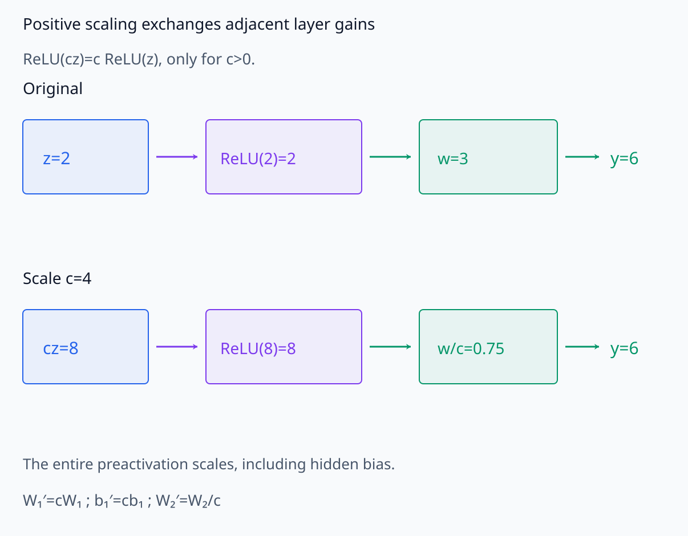
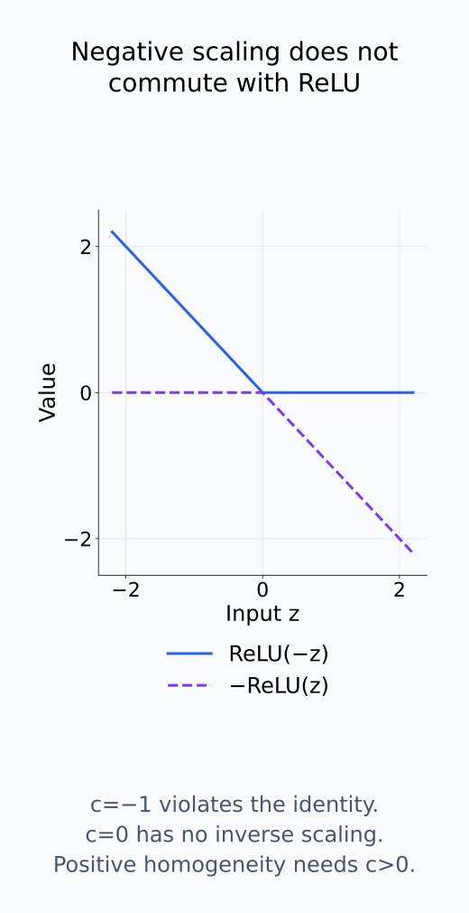
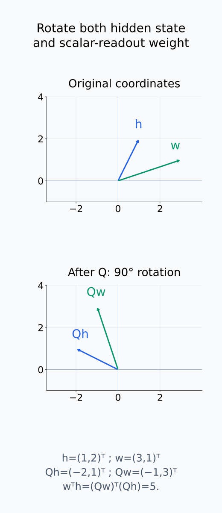
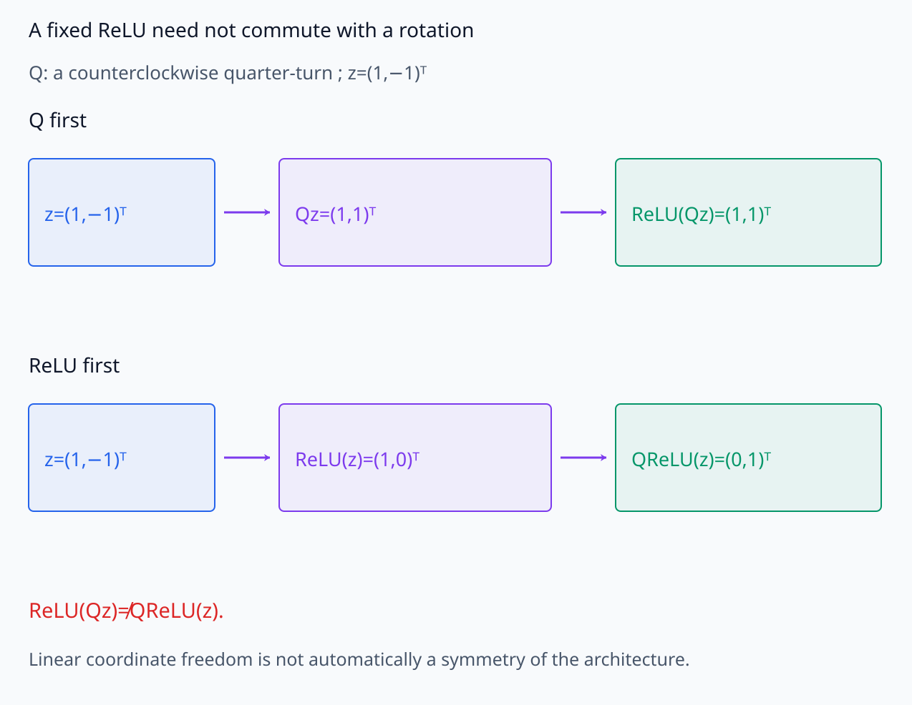
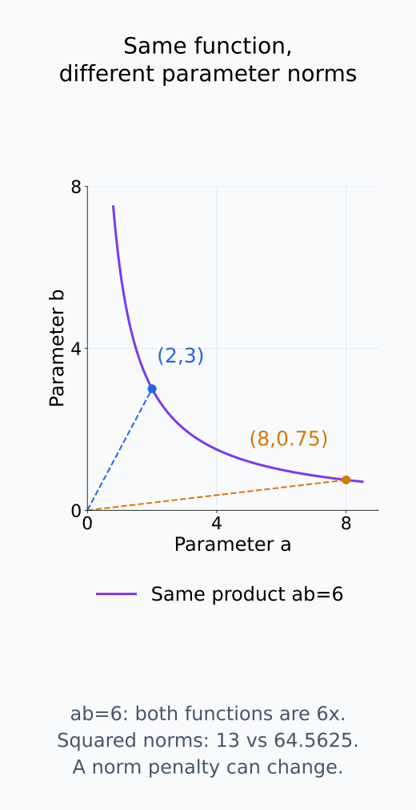
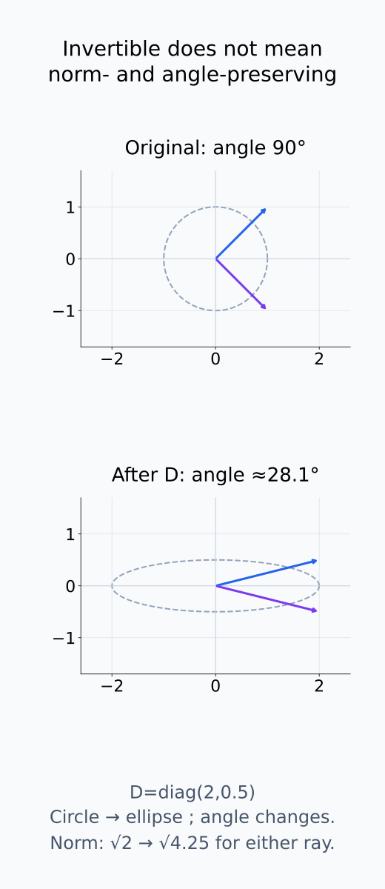
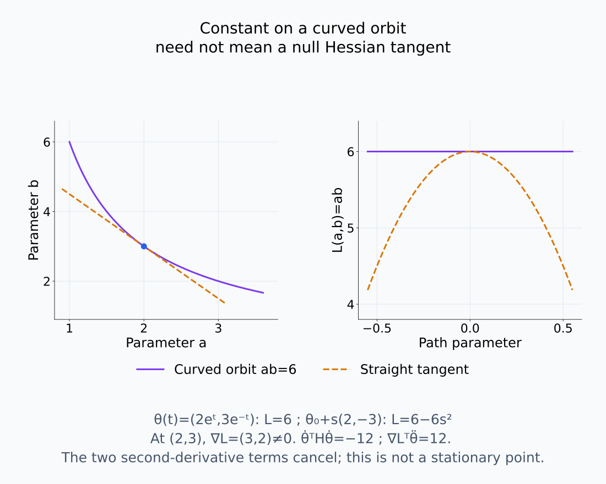
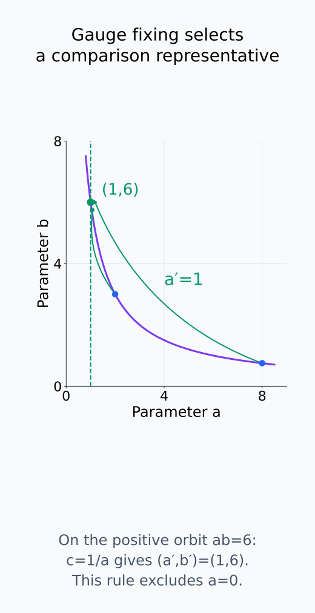
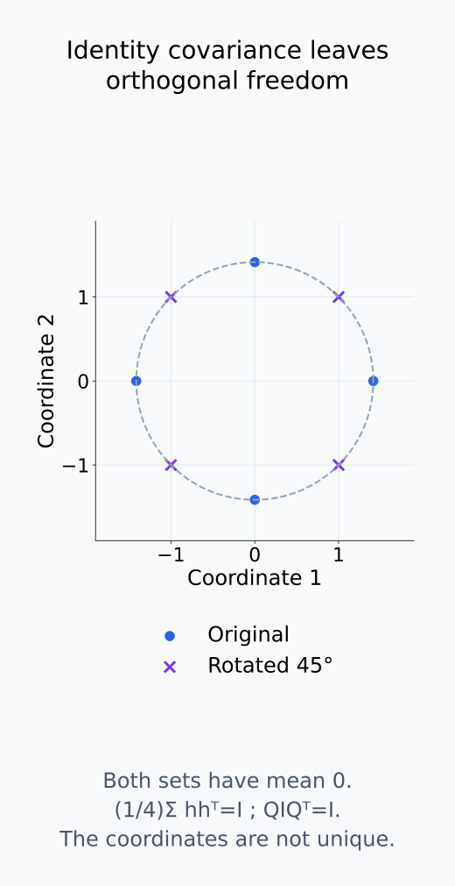

# A09-SYM-05. scaling·rotation과 gauge freedom

## 이 단원이 필요한 이유

parameter와 hidden coordinate에는 기능을 바꾸지 않는 scale·basis freedom이 존재할 수 있다. gauge freedom을 무시하면 norm, angle, Hessian과 feature identity를 coordinate-independent 사실처럼 해석하게 된다.

## 학습 목표

- positive-homogeneous network의 scaling symmetry를 계산할 수 있다.
- hidden basis rotation의 보상변환을 쓸 수 있다.
- gauge-dependent quantity와 invariant quantity를 구분할 수 있다.
- gauge fixing의 이점과 임의성을 설명할 수 있다.

## 선수지식 확인

- 선수 단원: [A09-SYM-02 orbit와 stabilizer](A09-SYM-02-orbits-stabilizers.md), [M03-03 기저변환](../../part-1-foundations/M03/M03-03-change-of-basis-coordinate-dependence.md), [M03-15 모델 대칭성](../../part-1-foundations/M03/M03-15-reparameterization-model-symmetries.md)
- 확인 질문: basis를 바꾸어도 linear map 자체가 같게 유지되려면 matrix representation은 어떻게 바뀌는가?

## 기호와 용어

| 기호·용어 | Common spoken reading | 의미 | shape·범위 |
|---|---|---|---|
| $c>0$ | `c greater than zero` | positive scale | scalar |
| $Q^\top Q=I$ | `Q transpose Q equals I` | orthogonal basis change | matrix identity |
| $h'=Qh$ | `h prime equals Q h` | hidden coordinate rotation | vector |
| $[\theta]$ | `the equivalence class of theta` | gauge orbit | parameter class |
| $H$ | `H` | parameter Hessian | square matrix |

## 핵심 개념

### scaling: 인접 layer가 배율을 교환한다

ReLU는 각 성분에서 $\phi(z)=\max(0,z)$이다. $c>0$이면 $cz$와 $z$의 부호가 같으므로 $\phi(cz)=c\phi(z)$가 성립한다. 따라서

$$
W_2\phi(W_1x)
=\frac1cW_2\phi(cW_1x)
$$

이다. $W_1$을 $c$배 하면 hidden activation도 $c$배가 되고 $W_2$를 $1/c$배 하면 그 배율이 출력에서 상쇄된다. 한 layer norm은 커지고 다음 layer norm은 작아져도 함수는 같다. hidden bias가 있으면 $W_1$과 함께 $c$배 해야 preactivation 전체가 같은 배율로 바뀐다.

양의 scale이라는 조건이 필요하다. 음의 $c$는 ReLU의 활성/비활성 성분을 바꿀 수 있고, $c=0$은 되돌릴 수 없다. GELU처럼 degree-one positive homogeneity를 만족하지 않는 activation에 이 식을 그대로 적용하지도 못한다. 또한 함수가 같아도 weight norm penalty를 더한 학습 objective는 달라질 수 있다. 함수 보존과 regularizer까지 포함한 objective 보존을 구분한다.

양의 scale을 주고받는 계산과 음의 scale에서 실패하는 계산을 나누어 본다.

<figure class="lesson-figure lesson-figure--wide" markdown="1">

<figcaption>c=4이면 preactivation 2가 8이 되고 ReLU 출력도 4배가 된다. 다음 weight를 3에서 0.75로 줄이면 출력은 계속 6이다. hidden bias가 있으면 W₁과 함께 c배 하여 preactivation 전체를 같은 배율로 바꿔야 한다.</figcaption>

</figure>

<figure class="lesson-figure" markdown="1">

<figcaption>c=−1에서는 ReLU(−z)와 −ReLU(z)가 서로 다른 쪽에서 0이 되어 같지 않다. c=0은 inverse scale이 없으므로 되돌릴 수 있는 action이 아니다. 이 비교는 ReLU에 대한 것이며 GELU의 positive homogeneity를 가정하지 않는다.</figcaption>

</figure>

### rotation: 어떤 hidden interface에서 허용되는가

linear hidden interface에서는 $h'=Qh$, $W'=WQ^{-1}$로 basis를 바꿀 수 있다. nonlinearity, normalization, sparsity constraint가 있으면 arbitrary rotation symmetry가 깨질 수 있다.

이 식에서는 이미 계산한 hidden vector를 새 좌표로 표현하고, 그것을 읽는 다음 선형 map을 함께 바꾼다. 그러면 $W'h'=WQ^{-1}Qh=Wh$이다. $Q$가 orthogonal이면 $Q^{-1}=Q^\top$이며 scalar output $w^\top h$에는 $w'=Qw$가 대응한다. $w$와 $h$를 함께 바꿔야 같은 값을 얻는다.

두 선형 layer의 중간이라면 생산하는 행렬을 $Q$로 곱하고 다음 행렬을 $Q^{-1}$로 보상할 수 있다. 중간에 고정된 elementwise activation이 있으면 추가로 $\phi(Qz)=Q\phi(z)$가 필요하다. ReLU는 일반적인 rotation에 대해 이 식을 만족하지 않는다. 수학적으로 hidden 좌표를 바꾸어 표현할 수 있다는 사실과, 원래 architecture 안에서 parameter만 바꾸어 같은 계산을 구현할 수 있다는 사실은 다르다.

같은 readout을 유지하는 좌표 회전과 고정 activation을 통과하는 회전은 다르다.

<figure class="lesson-figure lesson-figure--tall" markdown="1">

<figcaption>h=(1,2)ᵀ와 w=(3,1)ᵀ를 같은 orthogonal Q로 90° 회전하면 h′=(−2,1)ᵀ, w′=(−1,3)ᵀ가 된다. 두 좌표 표현의 dot product는 모두 5다. 이 보상은 다음 scalar linear readout에 대한 것이며 고정 nonlinearity의 rotation symmetry를 뜻하지 않는다.</figcaption>

</figure>

<figure class="lesson-figure lesson-figure--wide" markdown="1">

<figcaption>z=(1,−1)ᵀ에 90° 회전을 먼저 적용하면 ReLU(Qz)=(1,1)ᵀ이고 ReLU를 먼저 적용하면 QReLU(z)=(0,1)ᵀ다. 선형 interface의 좌표변환 보상은 가능해도 고정된 elementwise activation을 가로질러 임의의 rotation symmetry를 주장할 수는 없다.</figcaption>

</figure>

### 어떤 양이 gauge에 의존하는가

이 단원에서 gauge는 같은 observable function을 나타내는 coordinate freedom이다. 허용한 action을 먼저 정하고, 그 action 아래 값이 바뀌는지를 확인한다. 함수 output은 함수 보존 action에서 같다. 반면 개별 neuron의 이름이나 layer weight norm은 허용한 permutation·scaling에 따라 바뀔 수 있다.

의존성은 변환 종류에도 달린다. orthogonal $Q$는 hidden Euclidean norm과 angle을 보존하지만 일반적인 invertible basis change는 보존하지 않는다. $w^\top h$ 같은 scalar도 vector와 그것을 읽는 weight를 올바르게 보상했을 때 보존된다. orbit에 대해 최소화한 비교값 역시 사용한 norm과 action의 호환 조건을 확인해야 한다. [A09-SYM-02](A09-SYM-02-orbits-stabilizers.md)의 거리 조건 없이 “orbit-minimized이므로 gauge-invariant”라고 결론내리지 않는다.

Hessian을 읽을 때는 곡선 orbit와 직선 방향을 구분한다. smooth parameter 경로 $\theta(t)$에서 $L(\theta(t))$가 일정하더라도, 두 번 미분한 식은

$$
0=\dot\theta^\top H\dot\theta
+\nabla L^\top\ddot\theta
$$

이다. $H$는 $L$의 parameter Hessian이다. gradient가 0이 아닌 점에서는 orbit의 굽음에 해당하는 둘째 항이 첫째 항을 상쇄할 수 있다. 따라서 함수 보존 곡선을 따라 loss가 일정하다는 사실만으로 임의의 점에서 Hessian의 zero eigenvalue를 주장할 수 없다. smooth symmetry가 전체 objective를 보존하고 stationary point를 같은 orbit의 stationary point로 옮기면, orbit를 따라 $\nabla L=0$을 미분해 $H\dot\theta=0$을 얻는다. 이 조건에서 symmetry tangent는 Hessian의 null direction이다. ReLU의 미분 불가능한 지점에는 smooth Hessian 논리를 그대로 쓰지 않는다.

출력의 불변성과 좌표의 기하량·Hessian 조건은 아래에서 각각 비교한다.

<figure class="lesson-figure" markdown="1">

<figcaption>(2,3)과 (8,0.75)는 모두 ab=6 위에 있어 모든 x에서 6x를 낸다. 원점으로부터의 거리와 squared norm은 각각 13과 64.5625로 달라지므로 norm penalty까지 포함한 objective가 자동으로 보존되지는 않는다.</figcaption>

</figure>

<figure class="lesson-figure lesson-figure--tall" markdown="1">

<figcaption>일반적인 invertible D=diag(2,0.5)는 unit circle을 ellipse로 바꾸며 (1,1)ᵀ와 (1,−1)ᵀ 사이 90°도 약 28.1°로 바꾼다. orthogonal action과 일반적인 basis change에서 보존되는 기하량은 다르다. scalar readout 보존에는 별도의 inverse 보상이 필요하다.</figcaption>

</figure>

<figure class="lesson-figure lesson-figure--wide" markdown="1">

<figcaption>smooth objective L(a,b)=ab와 θ(t)=(2eᵗ,3e⁻ᵗ)에서는 L=6이 일정하다. 하지만 (2,3)의 직선 tangent θ₀+s(2,−3) 위에서는 L=6−6s²다. stationary point가 아닌 이 예제에서 θ̇ᵀHθ̇=−12와 ∇Lᵀθ̈=12가 상쇄되므로 일정한 orbit만으로 Hessian null direction을 결론낼 수 없다.</figcaption>

</figure>

### gauge fixing은 비교할 대표를 정한다

gauge fixing은 orbit에서 비교 규칙에 맞는 representative를 고르는 절차다. 예를 들어 아래 선형 예제에서 $a>0$이면 $c=1/a$로 $a'=1$을 맞출 수 있다. 같은 곱을 가진 parameter를 공통 scale 기준에서 비교할 수 있지만, $a=0$에는 이 규칙을 적용할 수 없다. 대표 선택의 범위와 남은 symmetry를 명시한다.

whitening으로 covariance를 identity로 맞춘 뒤에도 orthogonal rotation은 identity covariance를 보존한다. eigenvector를 추가 기준으로 삼으면 중복 eigenvalue를 가진 공간 안의 회전 등이 남을 수 있다. coordinate를 고정하는 규칙은 비교를 재현하기 위한 선택이며, 특정 coordinate의 feature 해석이 유일하다는 근거가 되지는 않는다.

대표를 고르는 규칙과 그 규칙 뒤에도 남는 자유도를 별도로 확인한다.

<figure class="lesson-figure" markdown="1">

<figcaption>a>0에서 c=1/a라는 규칙을 고르면 ab=6 위의 대표들을 (a′,b′)=(1,6)으로 맞출 수 있다. 이는 비교를 위한 대표 선택이며 a=0에는 적용되지 않는다. 이 규칙이 가능한 범위와 선택 기준을 함께 명시해야 한다.</figcaption>

</figure>

<figure class="lesson-figure" markdown="1">

<figcaption>평균이 0인 ±√2e₁, ±√2e₂의 covariance를 1/4 Σhhᵀ로 계산하면 I다. 이를 45° 회전한 네 점도 같은 I를 가진다. whitening으로 covariance를 고정해도 orthogonal 좌표 자유도는 남으며, 여기처럼 eigenvalue가 모두 같으면 eigenbasis도 유일하지 않다.</figcaption>

</figure>

## 작은 예제

$f(x)=abx$에서 $(a,b)$를 $(ca,b/c)$로 바꿔도 product $ab$는 같다. 하지만 $a^2+b^2$는 일반적으로 달라진다.

$a=2,b=3,c=4$이면 $(a',b')=(8,0.75)$이고 두 parameter 모두 모든 $x$에서 $6x$를 출력한다. squared norm은 13에서 64.5625로 바뀐다. 같은 함수의 coordinate 크기를 바꾼 것이므로 norm만 보고 함수가 더 복잡해졌다고 판단할 수 없다.

## 흔한 오해

- weight norm 변화가 항상 function complexity 변화는 아니다.
- whitening 뒤에도 orthogonal freedom이 남는다. eigenbasis까지 선택할 때는 degenerate eigenspace 안의 rotation freedom도 확인한다.

## 연습문제

### 1. scaling
$a=2,b=3,c=4$에서 $(ca,b/c)$와 product를 구하라.

해설 보기

$(8,0.75)$이고 product는 원래와 같은 6이다.

### 2. norm 의존성
위 변환 전후 $a^2+b^2$를 비교하라.

해설 보기

전에는 13, 후에는 $64+0.5625$로 크게 달라져 gauge-dependent임을 보인다.

### 3. rotation
$h'=Qh$일 때 scalar output $w^\top h$를 보존하는 $w'$를 구하라.

해설 보기

$w'=Qw$이면 $w'^\top h'=w^\top Q^\top Qh=w^\top h$이다.

### 4. Hessian 해석
parameter gauge direction에서 Hessian eigenvalue가 0에 가까울 수 있는 이유는 무엇인가?

해설 보기

그 방향으로 움직여도 function과 loss가 변하지 않으면 local curvature가 없거나 매우 작기 때문이다.

## 근거와 갱신 경계

scaling·basis symmetry는 positive homogeneity와 linear coordinate change에서 직접 유도한다. gauge라는 용어는 observable을 보존하는 reparameterization이라는 제한된 의미로 쓴다.

## 단원 요약

- positive homogeneity는 layer 간 scale 교환을 허용한다.
- hidden basis change는 adjacent map의 보상변환이 필요하다.
- parameter norm과 Hessian에는 gauge-dependent 성분이 있다.
- gauge fixing은 비교 규칙이지 유일한 진실이 아니다.

## 통과 기준

- scaling·rotation 보상식을 계산할 수 있는가?
- gauge-dependent 주장과 invariant 주장을 구분할 수 있는가?

## 다음 단원

- [A09-SYM-06 representation theory 입문](A09-SYM-06-representation-theory.md)

## 집필자 점검표

- [x] gauge freedom과 observable을 구분했다.
- [x] 문제 4개에 해설이 있다.
- [x] Common spoken reading이 실제 영어 학술 발화이며 한글 음역이나 기계적 직역을 포함하지 않는다.
- [x] 선수지식과 링크를 확인했다.
