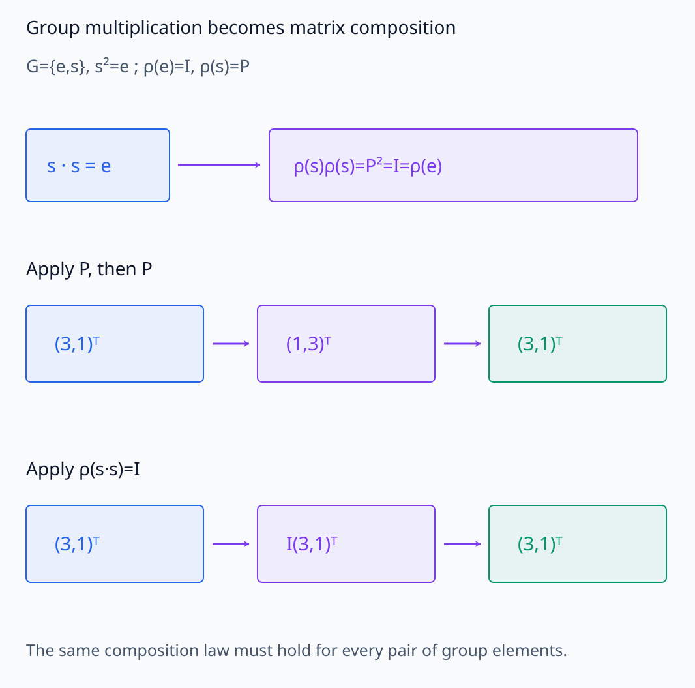
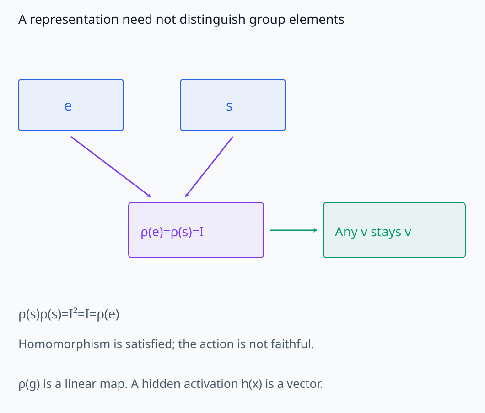
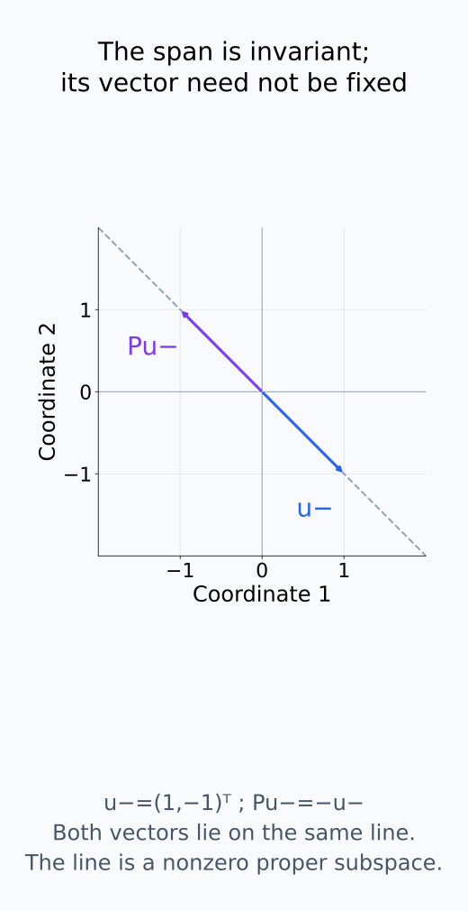
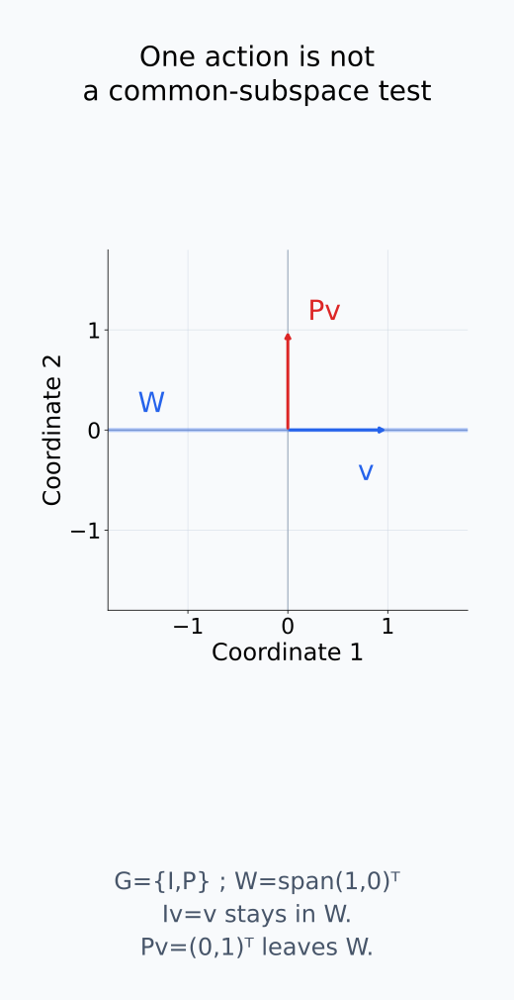
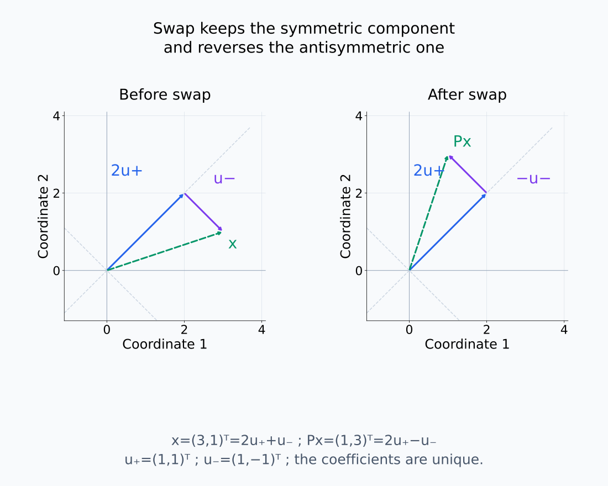
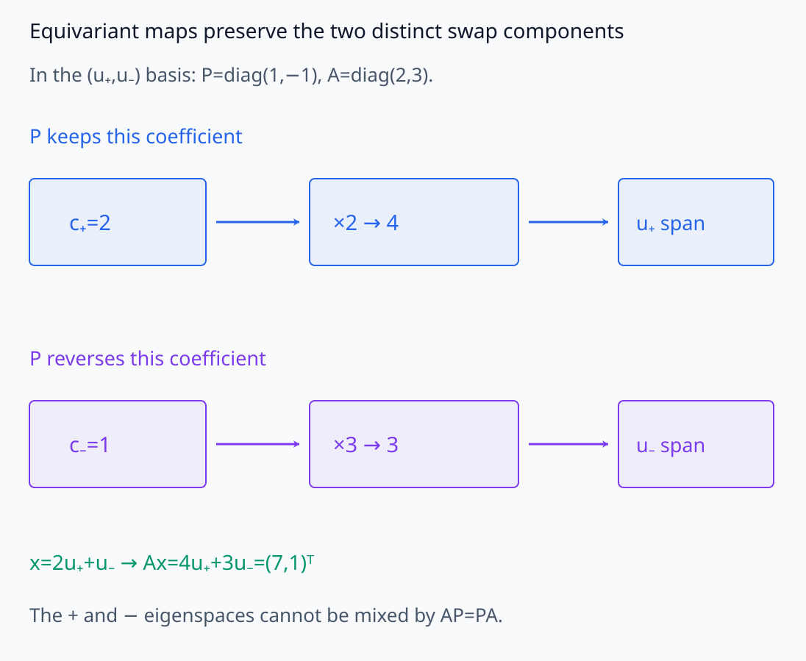
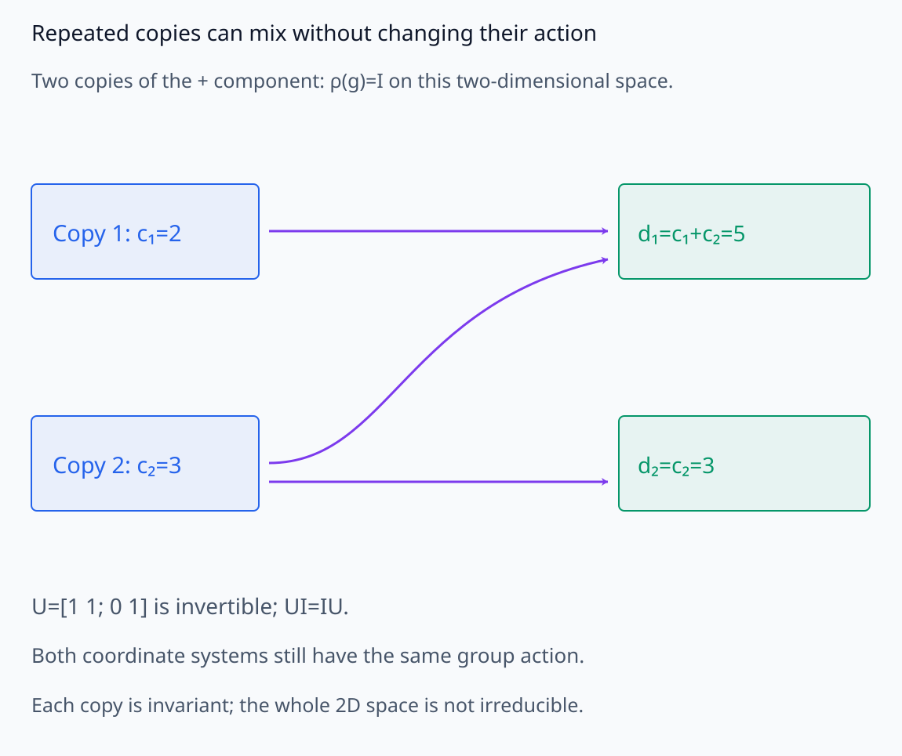
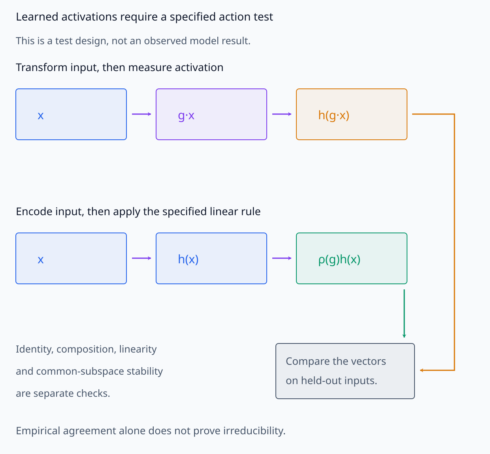

# A09-SYM-06. representation theory 입문

## 이 단원이 필요한 이유

group action이 vector space에서 linear하면 matrix로 분석할 수 있다. representation theory는 symmetry action을 invariant subspace와 irreducible component로 분해해 어떤 feature channel이 함께 변해야 하는지 설명한다.

## 학습 목표

- linear representation의 homomorphism 조건을 쓸 수 있다.
- invariant subspace와 irreducible representation을 구분할 수 있다.
- 간단한 permutation representation을 분해할 수 있다.
- learned representation에서 irreducible structure를 주장할 때 필요한 검증을 말할 수 있다.

## 선수지식 확인

- 선수 단원: [A09-SYM-03 invariant와 equivariant](A09-SYM-03-invariant-equivariant.md), [M03-01 벡터공간](../../part-1-foundations/M03/M03-01-abstract-vector-spaces.md), [M03-05 부분공간](../../part-1-foundations/M03/M03-05-subspaces-direct-sums-decomposition.md)
- 확인 질문: 한 linear map family가 공통으로 보존하는 subspace는 무엇을 뜻하는가?

## 기호와 용어

| 기호·용어 | Common spoken reading | 의미 | shape·범위 |
|---|---|---|---|
| $\rho:G\to GL(V)$ | `rho from G to G L of V` | linear representation | group homomorphism |
| $\rho(g_1g_2)=\rho(g_1)\rho(g_2)$ | `rho of g sub one g sub two equals rho of g sub one rho of g sub two` | homomorphism condition | matrix equality |
| $W\le V$ | `W is a subspace of V` | invariant subspace candidate | vector subspace |
| $V=\bigoplus_iV_i$ | `V is the direct sum of V sub i` | component decomposition | direct sum |
| $u_+,u_-$ | `u sub plus and u sub minus` | swap의 symmetric·antisymmetric 기저 vector | vectors in $\mathbb R^2$ |

## 핵심 개념

### representation은 선형 action의 규칙이다

이 단원에서는 finite-dimensional real vector space $V$에서의 representation을 생각한다. $GL(V)$는 $V$를 자기 자신으로 보내는 invertible linear map들의 group이다. $\rho$는 각 $g\in G$에 그 map을 하나씩 대응시키며

$$
\rho(e)=I,
\qquad
\rho(g_1g_2)=\rho(g_1)\rho(g_2)
$$

를 만족한다. 이 homomorphism 조건은 group multiplication을 linear map의 composition으로 보존한다는 뜻이다. 그 결과 $g\cdot v=\rho(g)v$가 group action이 된다. 기저를 고르면 각 map을 행렬로 쓰지만 representation 자체는 특정 행렬 좌표에 한정되지 않는다.

서로 다른 group element가 같은 linear map으로 작용할 수도 있다. 예를 들어 모든 $g$를 identity로 보내는 규칙도 위 식을 만족한다. group의 원소를 구별하는 능력과 homomorphism 조건은 서로 다른 요구다. 또한 machine-learning hidden representation은 입력에서 만든 activation이고, 여기의 $\rho$는 그 activation 등이 변환을 따르는 규칙이다. 같은 단어라도 대상의 타입을 구분한다.

group의 합성 규칙을 map으로 옮기는 것과 activation vector를 구분해 본다.

<figure class="lesson-figure lesson-figure--wide" markdown="1">

<figcaption>G={e,s}, s²=e에 ρ(s)=P를 대응시키면 P²=I=ρ(e)다. (3,1)ᵀ에 P를 두 번 적용하는 경로와 ρ(s·s)를 한 번 적용하는 경로는 같은 점으로 돌아온다. homomorphism은 이러한 합성 규칙을 모든 group 원소 쌍에 대해 보존하는 조건이다.</figcaption>

</figure>

<figure class="lesson-figure lesson-figure--wide" markdown="1">

<figcaption>같은 G={e,s}에서 ρ(e)=ρ(s)=I로 두어도 identity와 합성 조건을 만족한다. 서로 다른 group 원소가 다른 map으로 작용해야 한다는 faithful 조건은 homomorphism과 별개다. ρ(g)는 변환 규칙이고 hidden activation h(x)는 그 규칙이 작용하는 vector다.</figcaption>

</figure>

### invariant subspace와 irreducibility

$W\le V$가 모든 $g$에 대해 $\rho(g)W\subseteq W$이면 invariant subspace다. $W$ 안의 임의의 vector를 변환해도 $W$ 밖으로 나가지 않는다는 조건이다. 하나의 vector가 그대로 고정돼야 하는 조건은 아니다. inverse action도 존재하므로 이 경우 $\rho(g)W=W$가 된다.

$V\ne\{0\}$이고 nonzero proper invariant subspace가 없는 representation을 irreducible이라 한다. proper는 $W\ne V$라는 뜻이다. $\{0\}$과 $V$ 자체는 어느 representation에서도 invariant이므로 이 둘을 제외해야 분해 가능성을 구별할 수 있다. 여러 map 중 하나의 eigenvector만 찾는 것으로는 부족하다. 같은 subspace가 모든 허용 group element 아래 유지돼야 한다.

span의 보존과 개별 vector의 고정, 모든 action의 공통 조건은 서로 다르다.

<figure class="lesson-figure" markdown="1">

<figcaption>P(1,−1)ᵀ=(−1,1)ᵀ이므로 vector는 고정되지 않지만 u₋의 span 안에 남는다. invariant subspace는 그 안의 vector가 모두 제자리에 있어야 하는 것이 아니라 모든 허용 action이 공간 밖으로 보내지 않는다는 조건이다.</figcaption>

</figure>

<figure class="lesson-figure" markdown="1">

<figcaption>candidate W=span(1,0)ᵀ는 identity에서 유지되지만 P는 (1,0)ᵀ를 (0,1)ᵀ로 보내 W 밖으로 나간다. 한 action의 eigenvector만 찾거나 일부 변환만 검사해서는 공통 invariant subspace를 확인한 것이 아니다.</figcaption>

</figure>

### swap을 두 component로 분해한다

두 coordinate를 swap하는 representation은 $V=\mathbb R^2$를 $(1,1)$ span과 $(1,-1)$ span으로 분해한다. 첫 component는 swap에 unchanged이고 둘째는 sign이 바뀐다. equivariant linear map은 group action과 commute하며 이 component 구조의 제약을 받는다.

$u_+=(1,1)^{\mathsf T}$, $u_-=(1,-1)^{\mathsf T}$라 하면 $Pu_+=u_+$, $Pu_-=-u_-$이다. 두 span은 각각 자기 안에 남고 교집합은 $\{0\}$이다. 또 어떤 $x=(a,b)^{\mathsf T}$도

$$
x=\frac{a+b}{2}u_++\frac{a-b}{2}u_-
$$

로 유일하게 쓰므로 두 span의 direct sum이 전체 $V$다. 각 span은 1차원이어서 그 안에는 nonzero proper subspace가 없다. 따라서 이 예제의 두 제한 representation은 irreducible이다. antisymmetric component의 vector는 swap에서 부호가 바뀌지만 그 span은 invariant이다.

같은 action을 가진 공간 사이의 equivariant linear map $A$는 $AP=PA$를 만족한다. $Pv=v$인 vector에는 $PAv=APv=Av$여서 $Av$도 symmetric span에 남는다. $Pv=-v$인 경우도 $PAv=-Av$이므로 antisymmetric span으로 간다. 이 예제에서는 두 성분을 서로 섞는 map을 허용할 수 없다. 일반적으로 같은 종류의 irreducible component가 여러 번 나타나면 그 복사본 사이의 혼합이 가능할 수 있어, 분해만으로 개별 channel을 유일하게 정하지는 못한다.

swap의 성분을 분해한 뒤 각각의 action과 허용되는 component 혼합을 추적한다.

<figure class="lesson-figure lesson-figure--wide" markdown="1">

<figcaption>(3,1)ᵀ=(2,2)ᵀ+(1,−1)ᵀ에서 symmetric 성분은 그대로이고 antisymmetric 성분만 부호가 바뀌어 (1,3)ᵀ가 된다. 두 1D span의 교집합은 0이며 이 예제에서는 두 coefficient가 유일하게 정해진다. 옮겨 그린 component 화살표도 같은 vector를 나타낸다.</figcaption>

</figure>

<figure class="lesson-figure lesson-figure--wide" markdown="1">

<figcaption>같은 swap action 사이의 equivariant A는 AP=PA를 만족해 u₊ span과 u₋ span을 각각 보존한다. 예시 A=diag(2,3)는 이 기저에서 coefficient 2와 1을 4와 3으로 보내어 Ax=(7,1)ᵀ를 만든다. 여기의 diag 표기는 원래 좌표가 아닌 (u₊,u₋) 기저에서의 표기다.</figcaption>

</figure>

<figure class="lesson-figure lesson-figure--wide" markdown="1">

<figcaption>같은 + representation이 두 번 나타나면 그 두 coefficient를 U=[1 1;0 1]로 섞어도 ρ(g)=I와 commute한다. 각각은 invariant 1D copy이고 두 copy를 합친 2D 공간은 더 작게 나뉘므로 irreducible하지 않다. component 종류를 알아도 개별 channel 좌표가 유일하게 정해지지는 않는다.</figcaption>

</figure>

### learned activation에서 확인할 대상

finite sample에서 특정 basis가 그럴듯하게 보인다는 사실만으로 irrep를 식별할 수 없다. group action, closure, subspace stability와 multiplicity를 확인해야 한다.

먼저 input transform $g$에 대응하는 activation 변화 규칙 $\rho(g)$를 정하고, identity·composition 및 linearity를 검사한다. 다음으로 후보 subspace의 vector를 각 $\rho(g)$가 그 안에 남기는지 확인한다. approximate empirical agreement는 검사한 변환과 입력 범위의 근거이며 exact algebraic identity와 구분한다.

invariant subspace를 찾은 뒤에도 그 안을 더 작은 공통 invariant subspace로 나눌 수 있는지 검토해야 irreducibility를 주장할 수 있다. 한 action 행렬의 대각화나 작은 reconstruction error만으로 그 단계를 대신하지 않는다. 중복 component가 있으면 허용되는 basis 혼합 때문에 feature channel의 이름은 고정되지 않을 수 있다. 이 단원은 character 계산 없이 이 구분과 위 swap 분해까지만 다룬다.

learned activation의 검사는 두 경로의 vector를 비교하는 데서 시작하지만 그 결과만으로 irreducibility를 확정하지 않는다.

<figure class="lesson-figure lesson-figure--wide" markdown="1">

<figcaption>먼저 input transform g와 activation 변화 규칙 ρ(g)를 정한 뒤 h(g·x)와 ρ(g)h(x)를 held-out 입력에서 비교한다. 그림은 검사 설계이지 실행 결과가 아니다. 일치하는 예제가 있어도 identity·composition·linearity, 모든 action 아래의 subspace stability와 추가 분해 가능성을 따로 검토해야 한다.</figcaption>

</figure>

## 작은 예제

$P=\begin{bmatrix}0&1\\1&0\end{bmatrix}$는 $(1,1)$에 eigenvalue 1, $(1,-1)$에 eigenvalue $-1$로 작용한다.

$x=(3,1)^{\mathsf T}$이면 symmetric coefficient는 2, antisymmetric coefficient는 1이다. 따라서 $x=(2,2)^{\mathsf T}+(1,-1)^{\mathsf T}$이며 swap 뒤에는 $(2,2)^{\mathsf T}-(1,-1)^{\mathsf T}=(1,3)^{\mathsf T}$가 된다. 같은 vector를 두 성분의 변환 규칙으로 추적한 계산이다.

## 흔한 오해

- representation은 machine-learning hidden representation과 같은 말이 아니다. 여기서는 group의 linear action이다.
- irreducible component가 항상 1차원인 것은 아니다.

## 연습문제

### 1. homomorphism
$\rho(n)=R_{n\theta}$가 integer addition group의 rotation representation임을 설명하라.

해설 보기

$R_{(m+n)\theta}=R_{m\theta}R_{n\theta}$이고 $R_0=I$이므로 homomorphism이다.

### 2. invariant subspace
swap matrix 아래 $\operatorname{span}(1,1)$이 invariant임을 보이라.

해설 보기

$P(1,1)=(1,1)$이므로 span 전체가 자신으로 간다.

### 3. component
$x=(3,1)$을 symmetric·antisymmetric component로 분해하라.

해설 보기

$(2,2)+(1,-1)$이다.

### 4. 모델 해석
activation subspace가 group component라고 주장하려면 어떤 intervention을 할 수 있는가?

해설 보기

입력을 group transform한 뒤 activation이 사전 지정한 $\rho(g)$에 따라 변하는지 held-out sample에서 검사한다.

## 근거와 갱신 경계

linear representation·invariant subspace·irreducibility는 representation theory의 표준 정의를 따른다. character theory와 noncompact group은 다루지 않는다.

- [MIT Algebra II notes, Lecture 1: Representations](https://ocw.mit.edu/courses/res-18-012-algebra-ii-student-notes-spring-2022/mit18_702s22_lec1.pdf): real linear representation과 matrix/coordinate-free action의 연결을 확인한다. 본문의 두-coordinate swap 분해는 주어진 행렬에서 직접 계산했다.
- [같은 강의의 Lecture 2, §§2.3–2.4](https://ocw.mit.edu/courses/res-18-012-algebra-ii-student-notes-spring-2022/mit18_702s22_lect2.pdf): invariant subspace·irreducibility의 정의와 swap direct sum을 대조한다. character 계산은 이 단원의 범위에 넣지 않는다.

## 단원 요약

- representation은 group을 invertible linear map으로 보낸다.
- invariant subspace는 모든 group action 아래 보존된다.
- irreducible decomposition은 symmetry-coupled channel을 드러낸다.
- learned activation의 irrep 주장은 transformation test가 필요하다.

## 통과 기준

- 간단한 representation을 invariant component로 분해할 수 있는가?
- algebraic representation과 hidden representation을 구분할 수 있는가?

## 다음 단원

- [A09-SYM-07 모델 정렬과 동치류](A09-SYM-07-model-alignment-equivalence-classes.md)

## 집필자 점검표

- [x] representation theory의 핵심 타입을 구분했다.
- [x] 문제 4개에 해설이 있다.
- [x] Common spoken reading이 실제 영어 학술 발화이며 한글 음역이나 기계적 직역을 포함하지 않는다.
- [x] 선수지식과 링크를 확인했다.
