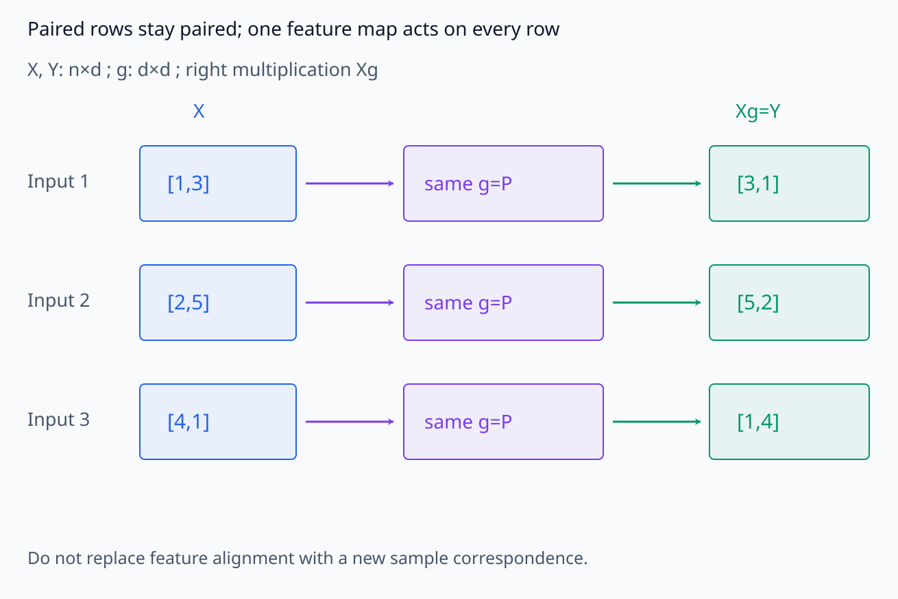
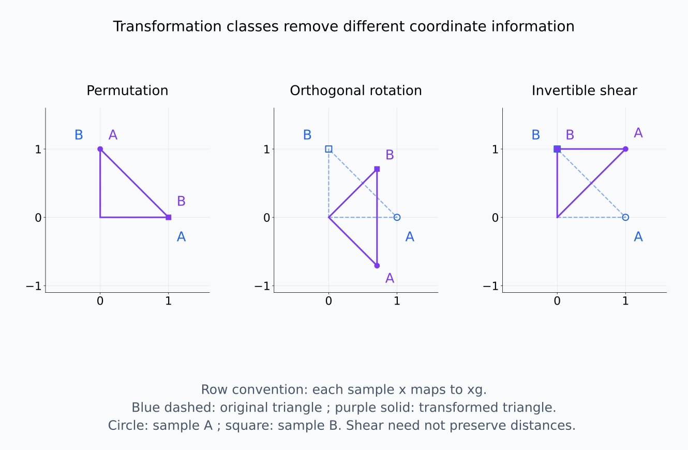
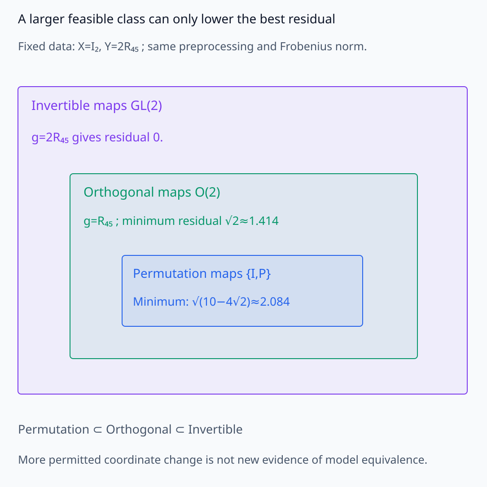
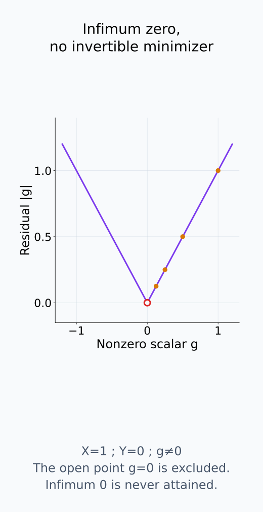
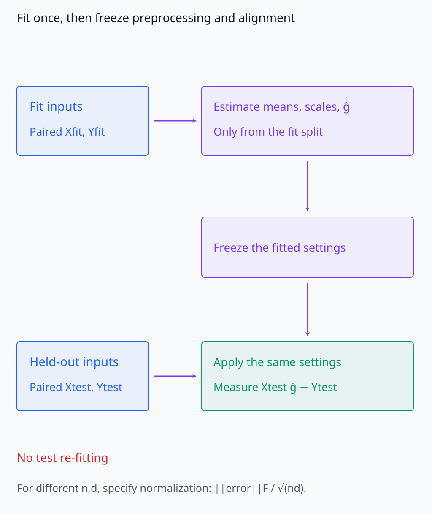
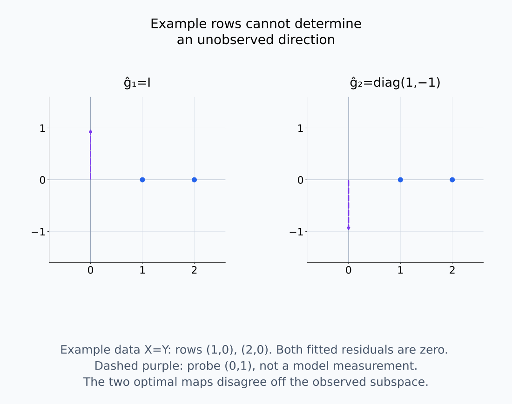
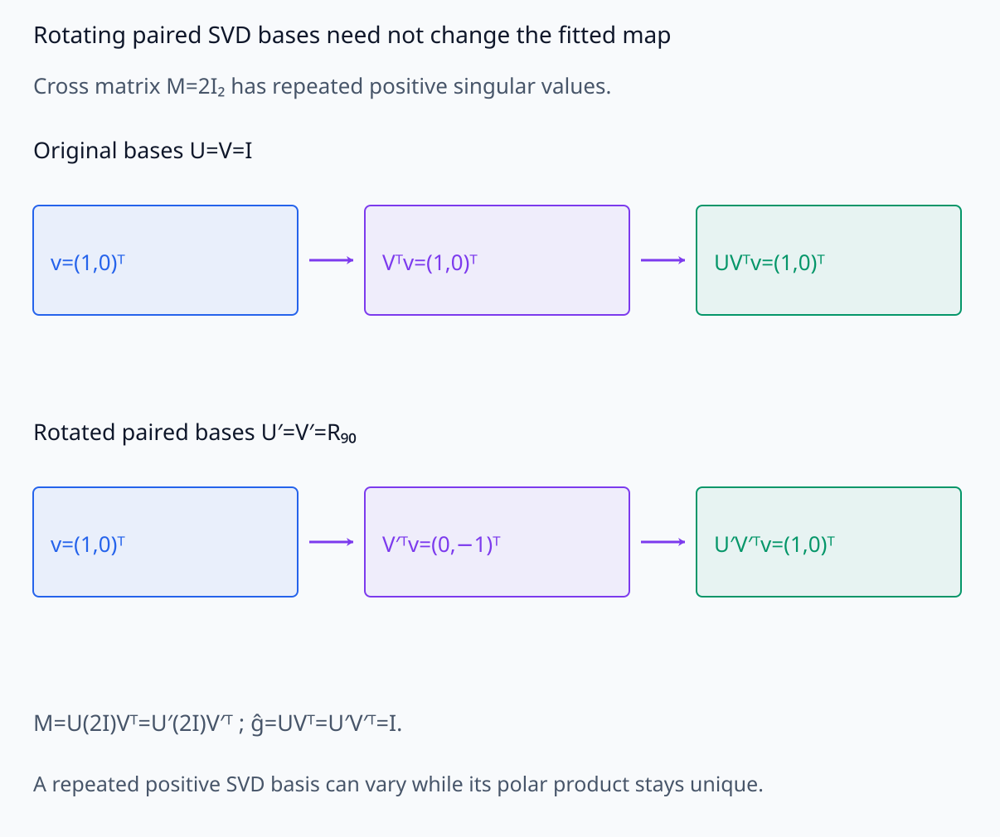
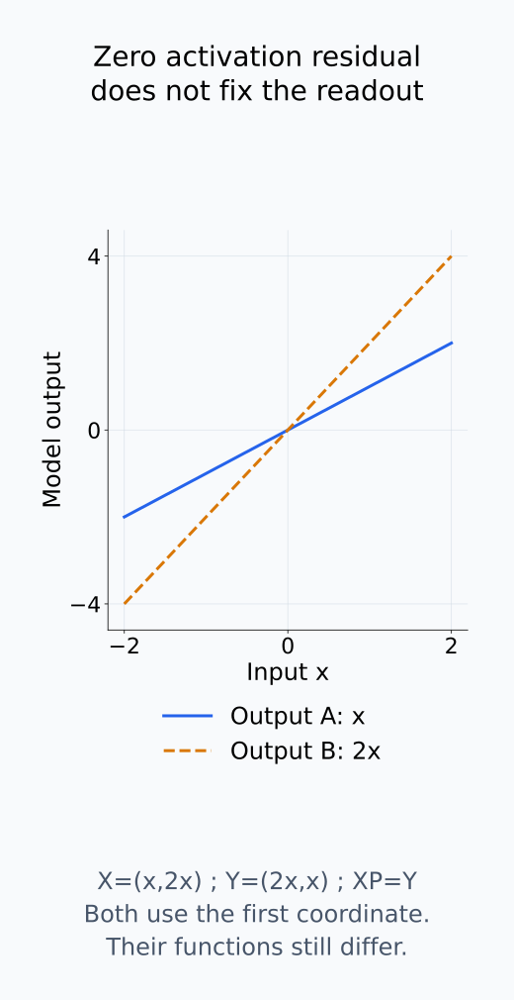

# A09-SYM-07. 모델 정렬과 동치류

## 이 단원이 필요한 이유

seed가 다른 모델의 neuron·subspace·weight를 직접 비교하면 symmetry가 만든 좌표 차이를 학습 결과 차이로 오해할 수 있다. alignment는 허용한 transformation class 안에서 대응을 찾고, quotient 관점은 alignment 뒤에도 남는 불확실성을 드러낸다.

## 학습 목표

- alignment objective와 transformation class를 명시할 수 있다.
- permutation·orthogonal·general linear alignment를 구분할 수 있다.
- train alignment와 held-out evaluation을 분리할 수 있다.
- residual mismatch를 기능 차이로 해석하기 위한 조건을 말할 수 있다.

## 선수지식 확인

- 선수 단원: [A09-SYM-02 orbit와 stabilizer](A09-SYM-02-orbits-stabilizers.md), [A09-SYM-04 permutation](A09-SYM-04-permutation-symmetry.md), [A09-SYM-05 gauge freedom](A09-SYM-05-scaling-rotation-gauge.md), [I08-03 representation alignment](../../part-3-interpretability/I08/I08-03-representation-alignment.md)
- 확인 질문: transformation class를 넓힐수록 training alignment error는 왜 줄기 쉬운가?

## 기호와 용어

| 기호·용어 | Common spoken reading | 의미 | shape·범위 |
|---|---|---|---|
| $X,Y$ | `X and Y` | paired activation matrices | $n\times d$ |
| $\mathcal G$ | `the transformation class G` | 허용 alignment 집합 | set of maps |
| $\hat g=\arg\min_{g\in\mathcal G}\|Xg-Y\|_F$ | `g hat minimizes the Frobenius norm of X g minus Y over g in G` | fitted alignment | map |
| $d_{\mathcal G}(X,Y)$ | `the G aligned distance between X and Y` | 선택한 norm에서의 최소 alignment residual | nonnegative scalar |
| $X_{\mathrm{test}},Y_{\mathrm{test}}$ | `X sub test and Y sub test` | fit에 쓰지 않은 paired activation | $n_{\mathrm{test}}\times d$ |

## 핵심 개념

### 무엇을 같은 것으로 처리하는가

alignment는 대상, sample correspondence, centering·scaling과 transformation class를 함께 정한다. 이 단원의 $X,Y\in\mathbb R^{n\times d}$는 각 row가 같은 입력·위치에 대응하는 activation 행렬이다. 오른쪽에 곱하는 $d\times d$ matrix $g$는 모든 row에 공통된 feature 좌표 변환을 적용한다. row correspondence를 고르는 작업과 feature 축을 정렬하는 작업을 구분한다.

permutation은 coordinate identity만 바꾸고, orthogonal map은 inner product를 보존하며, general invertible map은 더 많은 geometry를 지운다. permutation은 각 열의 관측값을 다른 열 위치에 옮긴다. orthogonal alignment는 열들을 섞을 수 있지만 각 sample의 Euclidean 길이·각도와 sample 사이의 거리를 유지한다. general invertible alignment는 scale과 shear까지 흡수할 수 있다. 따라서 같은 정보를 어떤 좌표에 담았는지를 질문하는지, 원래 sample geometry까지 같아야 하는지를 질문하는지에 따라 class를 고른다.

paired row의 대응을 유지한 상태에서 허용한 feature 변환이 무엇을 바꾸는지 본다.

<figure class="lesson-figure lesson-figure--wide" markdown="1">

<figcaption>X와 Y의 같은 행은 같은 입력·위치에 대응한다. 오른쪽의 동일한 g=P가 모든 row의 두 feature 성분을 swap하여 Xg=Y를 만들며 row 자체는 바꾸지 않는다. sample 대응을 새로 고르는 일과 feature 좌표를 정렬하는 일은 별개다.</figcaption>

</figure>

<figure class="lesson-figure lesson-figure--wide" markdown="1">

<figcaption>같은 두 row vector에 permutation, orthogonal rotation, invertible shear를 오른쪽에서 적용한다. 앞의 두 변환은 길이와 sample 간 거리를 유지하지만 shear는 triangle의 기하를 바꾼다. circle·square marker가 두 sample의 대응을 구분하며, coordinate 순서 변경과 coordinate 혼합도 서로 다르다.</figcaption>

</figure>

### 목적함수와 허용 집합

$$
d_{\mathcal G}(X,Y)=\min_{g\in\mathcal G}\|Xg-Y\|_F
$$

는 $X$를 허용한 변환으로 옮겨 $Y$와 비교한 최소 residual이다. permutation 집합과 square orthogonal 집합에서는 minimum이 존재한다. 일반 invertible 집합에서는 infimum만 있고 그것을 달성할 $\hat g$가 없을 수도 있다. 이 경우 argmin이나 최적해를 얻었다고 보고하지 않는다. 실제 알고리즘이 후보만 찾았다면 그 후보의 residual을 기록한다.

예를 들어 scalar $X=1$, $Y=0$에서 허용한 $g$가 nonzero scalar 전체이면 residual은 $|g|$이다. $g$를 0에 가깝게 잡아 오차를 얼마든지 줄일 수 있지만 0 자체는 invertible하지 않아 최적 후보가 없다. 작은 residual과 minimum 달성을 구분해야 하는 이유다.

permutation 집합은 orthogonal 집합에, orthogonal 집합은 invertible 집합에 포함된다. 같은 데이터·전처리·norm에서 허용 집합을 넓히면 minimum 또는 infimum은 커질 수 없다. 후보가 많아졌다는 계산 결과이며, 두 모델이 더 비슷해졌다는 독립적인 증거는 아니다. 또한 비등거리 변환까지 허용한 이 residual을 대표 선택에 무관한 quotient metric으로 해석할 수 있는지는 [A09-SYM-02](A09-SYM-02-orbits-stabilizers.md)의 조건을 확인해야 한다.

허용 집합의 포함 관계와 실제 minimum 달성 여부를 나누어 확인한다.

<figure class="lesson-figure lesson-figure--wide" markdown="1">

<figcaption>같은 X=I₂, Y=2R₄₅를 고정하면 permutation의 최소 residual은 √(10−4√2)≈2.084, orthogonal은 √2≈1.414, invertible은 0이다. 허용 후보가 늘어 최적값이 낮아지는 것이며 두 모델이 더 비슷해졌다는 별도 증거가 아니다.</figcaption>

</figure>

<figure class="lesson-figure" markdown="1">

<figcaption>X=1, Y=0에서 residual은 |g|이고 허용 후보는 g≠0이다. g를 0 가까이 보내면 infimum 0에 접근하지만 빈 점 g=0은 허용되지 않아 그 값을 달성하는 argmin이 없다. 작은 후보 residual과 minimum 달성은 별개다.</figcaption>

</figure>

### fit에서 배운 변환을 held-out에 고정한다

같은 sample로 $g$를 fit하고 평가하면 overfitting이 생기므로 held-out input에서 residual과 task-relevant behavior를 측정한다. fit split에서 $\hat g$를 고른 뒤 별도 입력들에 같은 변환을 적용해 $\|X_{\mathrm{test}}\hat g-Y_{\mathrm{test}}\|_F$를 측정한다. test에서도 새 $g$를 찾으면 fit한 대응이 새 입력으로 전달되는지를 검사한 것이 아니다.

centering·scaling도 비교의 일부다. fit split에서 추정한 평균과 배율을 고정해 test에 적용하면 그 전처리와 변환의 전달을 평가한다. split마다 다시 중심을 맞춰 relative geometry만 비교하려면 그 다른 측정 규칙을 명시하고 평균 이동은 별도로 본다. row 수가 다른 residual을 비교할 때는 Frobenius norm의 제곱이 관측 원소별 오차 제곱의 합이라는 점도 고려해 정규화 기준을 맞춘다.

fit split에서 배운 설정을 test에 고정하는 흐름은 다음과 같다.

<figure class="lesson-figure lesson-figure--wide" markdown="1">

<figcaption>fit split에서 정한 평균·배율·ĝ를 고정하여 held-out의 paired activation에 적용한다. test에서 ĝ나 전처리를 다시 fit하면 기존 대응의 전달을 측정한 것이 아니다. 관측 원소 수가 다르면 Frobenius residual의 정규화 기준도 함께 명시한다.</figcaption>

</figure>

### 남은 차이와 비유일성을 해석한다

stabilizer나 관측하지 못한 방향 때문에 optimal alignment가 유일하지 않을 수 있다. 같은 열을 가진 $X$는 그 열을 swap해도 같고, $X$의 null direction에서는 변환을 구별할 관측이 없을 수 있다. 이 경우 feature-by-feature identity보다 관측된 subspace와 가능한 대응들의 불확실성을 보고한다.

orthogonal Procrustes에서는 cross matrix $X^\top Y$의 zero singular value가 최적해의 자유도를 남길 수 있다. 반복된 positive singular value 때문에 SVD의 기저가 비유일하다는 사실만으로 alignment matrix까지 비유일하다고 결론내릴 수는 없다. [I08-03](../../part-3-interpretability/I08/I08-03-representation-alignment.md)의 full SVD 해 $UV^\top$에서 같은 반복 block의 두 기저를 함께 회전하면 그 곱은 그대로다. cross matrix가 nonsingular이면 square orthogonal 최적해는 유일하다. small singular value에서는 추정의 민감성과 exact non-uniqueness도 구분한다.

큰 residual은 허용한 class로 현재 activation 관측을 잘 맞추지 못했다는 뜻이다. 전처리 차이·noise·최적화 실패나 실제 표현 차이 가운데 무엇 때문인지는 추가 확인이 필요하다. 반대로 작은 residual도 output을 읽는 다음 layer의 기능을 확인하지 않았다면 모델 전체 함수의 동치를 증명하지 못한다. held-out output·loss·intervention effect를 사전 지정한 기준으로 비교해 주장의 대상을 좁힌다.

정렬의 비유일성, SVD 기저의 비유일성, 함수의 차이는 같은 문제가 아니다.

<figure class="lesson-figure lesson-figure--wide" markdown="1">

<figcaption>X=Y의 관측 row들이 (1,0), (2,0)뿐이면 I와 diag(1,−1)가 모두 residual 0을 준다. 관측하지 않은 (0,1) 방향에 대해서는 두 map이 반대 결과를 낸다. 그림의 probe는 이 자유도를 설명하는 수학적 예제이지 새로운 모델 관측이 아니다.</figcaption>

</figure>

<figure class="lesson-figure lesson-figure--wide" markdown="1">

<figcaption>M=2I₂의 SVD는 U=V=I뿐 아니라 U′=V′=R₉₀로도 쓸 수 있다. 두 기저를 함께 바꾸면 U′V′ᵀ=R₉₀R₉₀ᵀ=I라 같은 alignment matrix를 준다. 반복된 positive singular value의 기저 자유도와 zero singular value에서의 최적해 자유도는 다르다.</figcaption>

</figure>

<figure class="lesson-figure" markdown="1">

<figcaption>X(x)=(x,2x), Y(x)=(2x,x)는 X(x)P=Y(x)라 aligned residual이 0이다. 하지만 두 모델의 readout을 모두 첫 coordinate로 두면 출력은 x와 2x로 다르다. 전체 함수 보존을 주장하려면 다음 layer의 보상이나 별도의 기능 검증도 필요하다.</figcaption>

</figure>

## 작은 예제

$Y=XP$인 정확한 column permutation이면 raw $\|X-Y\|_F$는 클 수 있지만 permutation-aligned distance는 0이다.

허용 후보에 $g=P$가 있으므로 $Xg-Y=0$이 된다. 이는 관측한 입력들의 activation에서 대응이 정확하다는 계산이다. 두 모델의 output weight도 그 순서에 맞게 대응한다는 조건이 없으면 이 식만으로 전체 함수 보존까지 이어지지는 않는다.

## 흔한 오해

- alignment error가 0이라는 사실만으로 두 모델의 전체 함수가 같다 할 수 없다.
- 가장 flexible한 alignment가 가장 좋은 과학적 비교인 것은 아니다.

## 연습문제

### 1. class 선택
coordinate별 feature identity가 질문이면 orthogonal alignment보다 permutation이 적절할 수 있는 이유는 무엇인가?

해설 보기

rotation은 여러 coordinate를 섞어 feature identity 차이를 지울 수 있지만 permutation은 coordinate의 내용은 유지한 채 순서만 바꾼다.

### 2. held-out
alignment fit·evaluation split이 필요한 이유는 무엇인가?

해설 보기

sample-specific noise까지 맞춘 transformation의 training error를 representation equivalence로 오해하지 않기 위해서다.

### 3. non-uniqueness
isotropic subspace 안에서 여러 rotation이 같은 objective를 주면 어떤 대상을 보고하는가?

해설 보기

개별 axis보다 subspace, principal angle과 alignment solution의 불확실성을 보고한다.

### 4. 기능 검증
작은 aligned distance 뒤에 추가할 behavior 검사는 무엇인가?

해설 보기

held-out input에서 output distribution·loss·intervention effect 같은 사전 지정 function metric을 비교한다.

## 근거와 갱신 경계

Procrustes alignment와 quotient distance는 linear algebra·shape analysis의 표준 구성을 따른다. nonlinear alignment는 해석 가능성과 identifiability가 크게 달라 이 단원에서 제외한다.

- [Higham, What Is the Polar Decomposition?](https://nhigham.com/2020/07/28/what-is-the-polar-decomposition/): Procrustes 해와 cross matrix의 nonsingularity에 따른 유일성을 확인한다. 반복된 singular value의 기저 freedom과 최적 matrix의 freedom을 구분한다.
- [Kornblith et al., Similarity of Neural Network Representations Revisited](https://proceedings.mlr.press/v97/kornblith19a.html): 허용 invariance가 representation 비교의 질문을 바꾼다는 연구 근거다. 이 단원의 residual을 곧바로 CKA나 전체 함수 동치로 해석하지 않는다.

## 단원 요약

- alignment는 허용 transformation class를 먼저 정한다.
- 더 넓은 class는 더 많은 구조를 지운다.
- transformation은 train sample에서 fit하고 held-out에서 평가한다.
- non-unique alignment에서는 feature보다 subspace 동치를 보고한다.

## 통과 기준

- 질문에 맞는 alignment class를 선택할 수 있는가?
- aligned similarity와 function equivalence를 구분할 수 있는가?

## 다음 단원

- [A09-SYM-08 종합 실습: seed 간 표현 정렬](A09-SYM-08-capstone-seed-alignment.md)

## 집필자 점검표

- [x] alignment class·split·비유일성을 포함했다.
- [x] 문제 4개에 해설이 있다.
- [x] Common spoken reading이 실제 영어 학술 발화이며 한글 음역이나 기계적 직역을 포함하지 않는다.
- [x] 선수지식과 링크를 확인했다.
