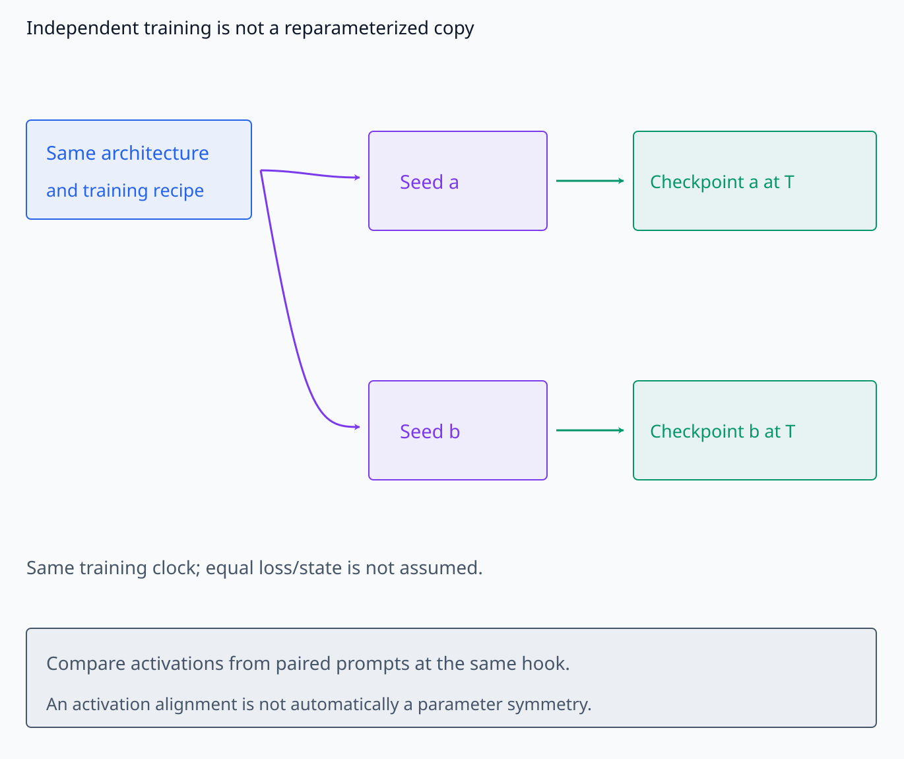
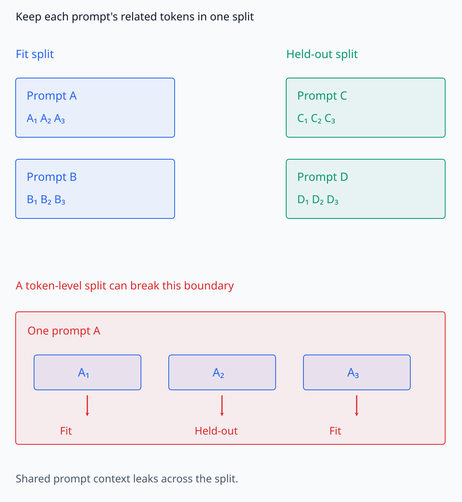
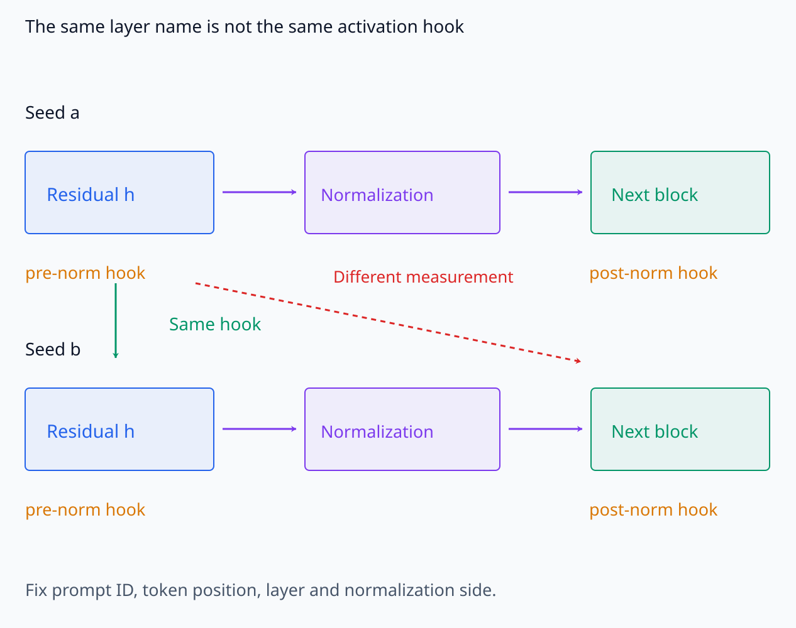
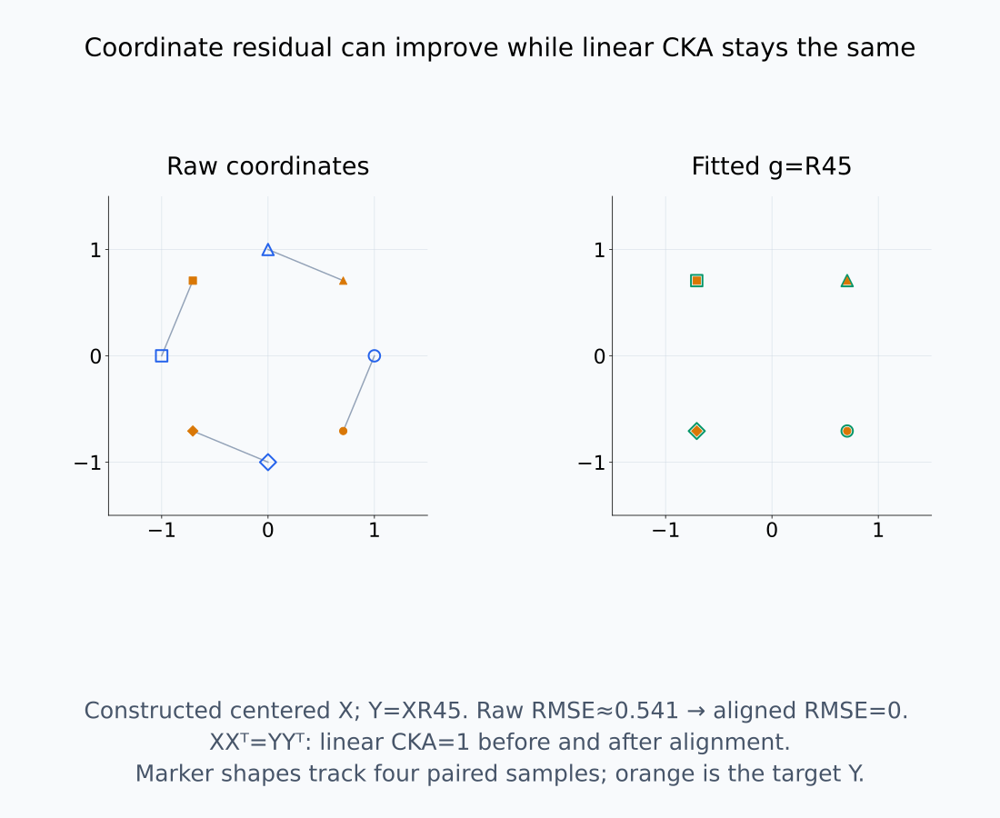
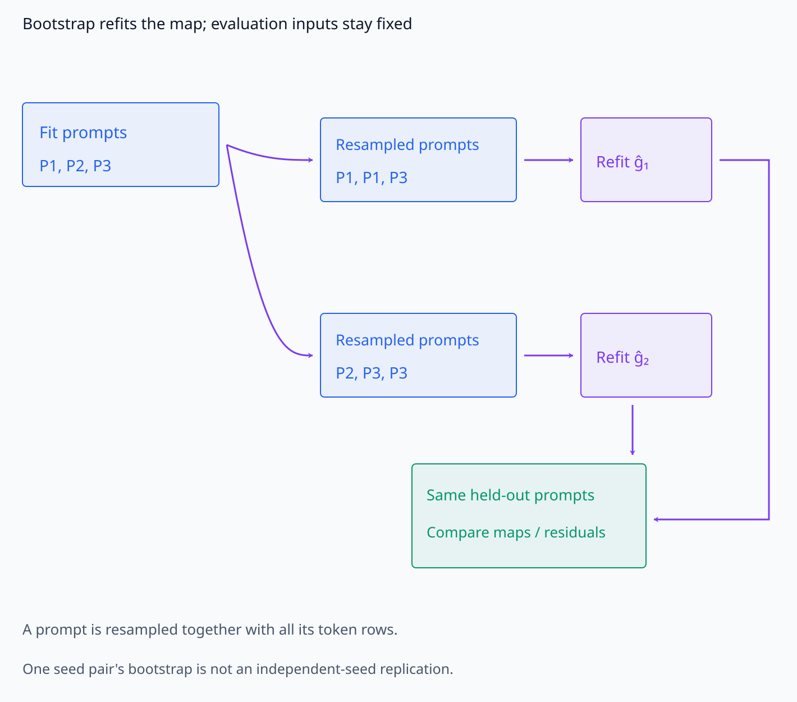
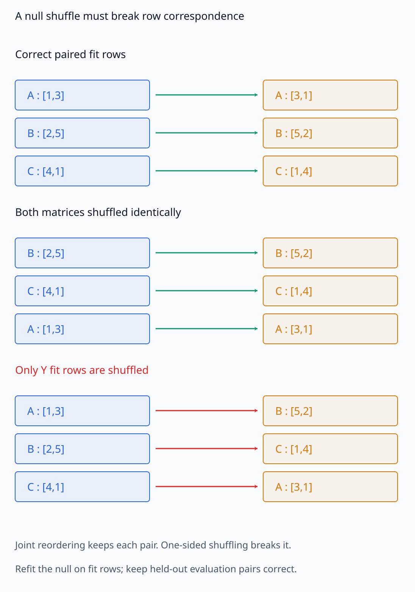
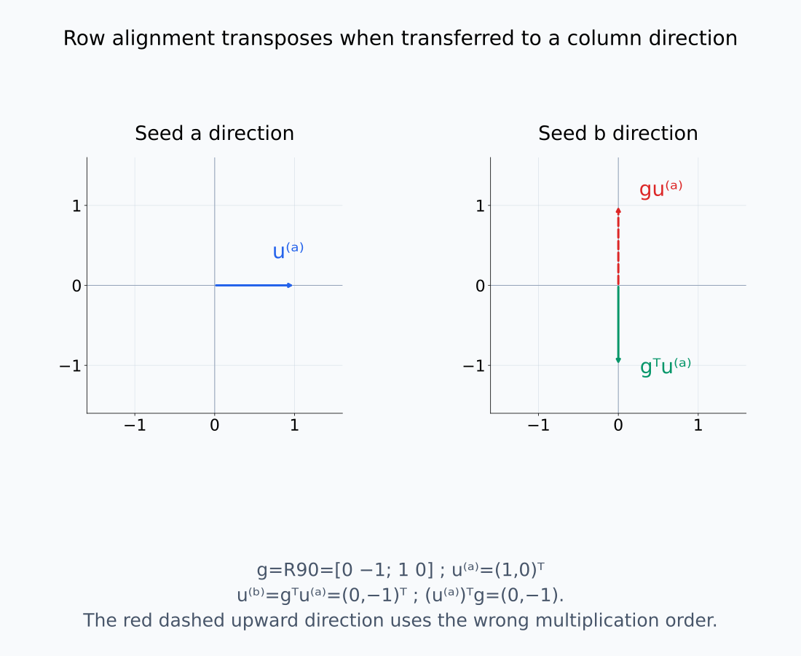
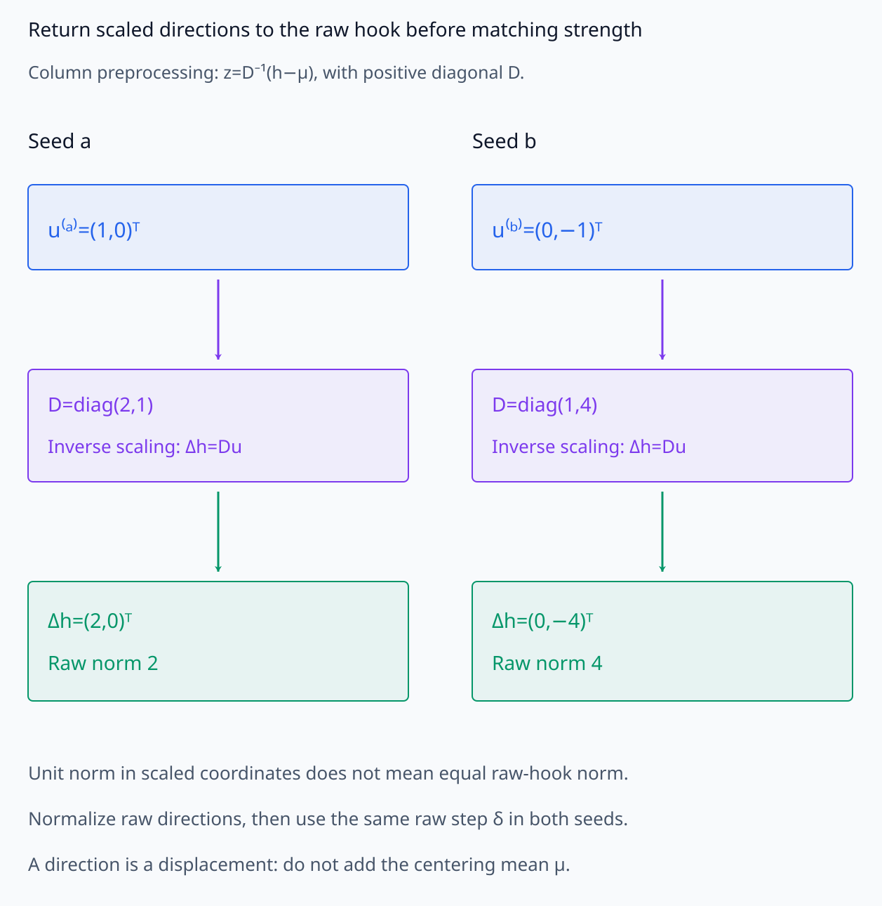
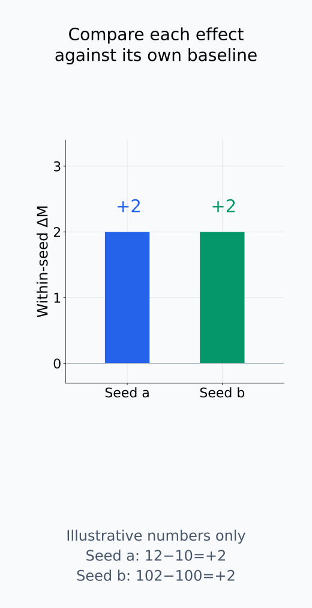

# A09-SYM-08. 종합 실습: seed 간 표현 정렬

## 이 단원이 필요한 이유

seed 간 표현 정렬은 같은 input, 같은 checkpoint 기준, 명시적 symmetry class와 held-out 평가가 없으면 결과를 해석할 수 없다. 이 실습은 raw 차이, symmetry-aligned 차이와 기능 차이를 세 단계로 분리한다.

## 학습 목표

- paired activation dataset과 alignment split을 설계할 수 있다.
- permutation·orthogonal baseline을 공정하게 비교할 수 있다.
- alignment 안정성과 기능 보존을 평가할 수 있다.
- feature identity 주장의 범위를 evidence에 맞게 제한할 수 있다.

## 선수지식 확인

- 선수 단원: [A09-SYM-01~07](A09-SYM-07-model-alignment-equivalence-classes.md)
- 확인 질문: 같은 prompt를 두 모델에 넣는 것이 왜 sample correspondence에 필요한가?

## 기호와 용어

| 기호·용어 | Common spoken reading | 의미 | shape·범위 |
|---|---|---|---|
| $X^{(a)},X^{(b)}$ | `X superscript a and X superscript b` | 두 seed의 paired activations | $n\times d$ |
| $g_{\mathrm{train}}$ | `g fit on the training split` | fitted alignment | transformation |
| $E_{\mathrm{heldout}}$ | `held-out alignment error` | unseen input residual | nonnegative scalar |
| $S_{\mathrm{boot}}$ | `bootstrap stability score` | alignment 재현성 | score or interval |
| $u^{(a)},u^{(b)}$ | `u superscript a and u superscript b` | 두 seed에서 대응시킨 intervention 방향 | unit vectors in $\mathbb R^d$ |

## 분석 계약

같은 architecture·training recipe의 독립 seed를 비교한다. checkpoint는 processed token 수로 맞추고, 동일 prompt·token 위치·layer·normalization을 사용한다. transformation class는 identity, permutation, orthogonal의 세 단계로 제한한다.

같은 processed token 수는 학습 진행을 맞추는 기준이며 두 모델이 같은 loss나 state에 있다는 조건은 아니다. 독립 학습한 모델 사이의 차이에 대해 어떤 부분을 좌표 변경으로 설명할 수 있는지 검사한다. 한 모델의 parameter를 symmetry action으로 다시 표현하는 계산과 구분한다.

identity는 원래 feature 좌표를 비교하고, permutation은 unit의 순서 차이를 허용하며, orthogonal은 길이·각도를 유지하는 좌표 혼합까지 허용한다. 마지막 변환으로 activation이 잘 맞아도 fixed architecture의 parameter symmetry라는 결론은 따르지 않는다. 먼저 표현 geometry의 비교로 해석하고 기능 증거를 분리한다.

독립 seed와 동일 training clock이라는 계약을 아래 흐름에서 구분한다.

<figure class="lesson-figure lesson-figure--wide" markdown="1">

<figcaption>동일 architecture·recipe에서 독립 seed를 학습하고 processed token 수 T를 맞추어 checkpoint를 고른다. 이는 학습 clock의 기준이며 loss나 state가 같다는 가정이 아니다. 한 모델의 parameter를 symmetry로 재표현한 복사본과 독립 학습한 두 모델의 activation 정렬을 구분한다.</figcaption>

</figure>

## 측정 절차

1. prompt 단위로 train·held-out split을 만든다.
2. train split에서 neuron assignment와 orthogonal Procrustes를 각각 fit한다.
3. held-out에서 Frobenius residual, CKA·RSA와 downstream output 차이를 계산한다.
4. prompt bootstrap으로 matching·subspace의 안정성을 측정한다.
5. random orthogonal·input-row correspondence shuffle을 null control로 사용한다.
6. aligned direction intervention을 두 seed에서 반복해 effect의 sign·magnitude를 비교한다.

### 같은 입력과 고정된 변환으로 residual을 계산한다

각 row의 prompt ID·token 위치를 대응시키고 activation을 꺼낸 지점을 고정한다. layer 이름이 같아도 normalization 전후가 다르면 다른 대상을 비교한다. prompt 단위로 split하면 한 prompt의 연관 token들이 양쪽에 나뉘는 것을 막을 수 있다. fit에서 사용한 centering·scaling 추정값과 alignment matrix를 고정하고 held-out에 적용한다.

이 단원에서는 $X^{(a)}g_{\mathrm{train}}\approx X^{(b)}$라는 방향으로 fit한다. held-out residual은 같은 방향의 차이이며, 평가 row 수가 $n$일 때 각 원소의 오차 척도를 맞추려면 Frobenius norm을 $\sqrt{nd}$로 나눈 RMSE 등을 사용할 수 있다. raw·permutation·orthogonal 비교에는 같은 row·전처리·정규화 규칙을 쓴다. held-out에서 변환을 다시 fit해 오차를 줄이지 않는다.

linear CKA는 orthogonal 변환에 불변이므로 정렬 전후 값이 같을 수 있다. Procrustes residual은 실제 좌표 대응의 오차이고 CKA는 sample 관계의 요약이어서 같은 개선을 두 번 증명하는 지표가 아니다. RSA도 어떤 거리로 관계 행렬을 만들었는지 고정한다. downstream output은 hidden 정렬이 없어도 비교할 수 있는 별도 observable이다. 어떤 출력 차이를 어느 입력 집합에서 측정했는지 기록한다.

prompt 묶음과 hook 위치를 고정한 뒤 coordinate residual과 sample 관계 지표를 나누어 읽는다.

<figure class="lesson-figure lesson-figure--wide" markdown="1">

<figcaption>A·B의 token 묶음은 fit에, C·D 묶음은 held-out에 둔다. 아래처럼 같은 prompt A의 token을 양쪽으로 나누면 연관된 context가 split 경계를 건넌다. token row 개수와 독립 prompt 개수는 같은 분석 단위가 아니다.</figcaption>

</figure>

<figure class="lesson-figure lesson-figure--wide" markdown="1">

<figcaption>같은 layer 이름이어도 normalization 전후는 서로 다른 측정 대상이다. 같은 prompt ID·token 위치·layer·normalization 쪽의 hook을 대응시켜야 한다. 그림은 hook 선택 관계를 설명하며 실제 model activation을 표시한 것이 아니다.</figcaption>

</figure>

<figure class="lesson-figure lesson-figure--wide" markdown="1">

<figcaption>평균이 0인 네 row X={(1,0),(−1,0),(0,1),(0,−1)}에 Y=XR₄₅를 적용한 수학적 예제다. paired raw RMSE는 약 0.541이지만 g=R₄₅로 맞추면 0이 된다. 한편 sample Gram matrix가 같아 linear CKA는 정렬 전후 모두 1이다. 두 지표는 같은 개선을 중복 증명하는 것이 아니다.</figcaption>

</figure>

### bootstrap과 null control의 역할을 구분한다

matching 안정성을 볼 때는 fit prompt를 bootstrap으로 다시 뽑고 각 resample에서 변환을 다시 fit한다. prompt의 token 묶음을 함께 유지해야 token을 독립 표본처럼 세지 않는다. 고정 held-out에서 이 변환들의 residual과 대응 변동을 비교하면 fit 데이터의 변화에 얼마나 민감한지 알 수 있다. 개별 matching이 달라도 관측 subspace가 안정적인 경우와 둘 다 불안정한 경우를 나눈다. 한 seed pair 안의 bootstrap은 독립 학습 seed를 여러 번 반복한 평가를 대신하지 않는다.

random orthogonal control은 fit한 회전과 임의의 회전을 비교한다. correspondence shuffle은 한 모델의 입력 row 대응을 다른 모델과 어긋나게 만든 뒤 같은 fit 절차를 적용해 얻은 대조다. class label만 바꾸거나 두 행렬의 row를 같은 순서로 재배열하면 이 대응을 깨지 못한다. held-out 평가의 올바른 paired row는 유지하고 shuffle이 무엇을 파괴했는지 명시한다. 이 control을 자동으로 “feature가 없다”는 검정으로 해석하지 않는다.

bootstrap이 다시 뽑는 대상과 correspondence null이 깨뜨리는 대응은 다르다.

<figure class="lesson-figure lesson-figure--wide" markdown="1">

<figcaption>fit prompt 묶음을 중복 포함해 다시 뽑고 resample마다 ĝ를 다시 fit한다. token들은 prompt와 함께 움직이며 held-out prompt는 고정한다. 이 변동은 fit 데이터의 민감도이고, 한 seed pair 안의 bootstrap을 독립 학습 seed 반복으로 세지 않는다.</figcaption>

</figure>

<figure class="lesson-figure lesson-figure--wide" markdown="1">

<figcaption>양쪽 행렬을 같은 순서 B,C,A로 바꾸면 paired row가 그대로 남아 correspondence null이 아니다. X의 A,B,C와 Y의 B,C,A를 대응시키면 한쪽 row shuffle이 input 대응을 깨뜨린다. null은 fit row를 어긋나게 하고 같은 절차로 다시 fit하며 held-out 평가는 올바른 pair로 유지한다.</figcaption>

</figure>

### intervention 방향도 정렬 식의 방향을 따른다

단위 column vector $u^{(a)}$를 seed $a$의 activation 방향으로 정하자. row-vector alignment $x^{(a)}g_{\mathrm{train}}\approx x^{(b)}$에서는 그 방향에 대응하는 seed $b$의 column vector를 $u^{(b)}=g_{\mathrm{train}}^\top u^{(a)}$로 둔다. row 변위 $(u^{(a)})^\top$를 오른쪽에서 변환해 얻은 $(u^{(a)})^\top g_{\mathrm{train}}$를 다시 column으로 쓴 식이다. permutation과 orthogonal $g$는 이 방향의 길이를 보존한다.

이 길이와 방향은 alignment에 사용한 좌표 기준이다. feature-wise scaling으로 전처리했다면 hook에 개입하기 전에 seed별 inverse scaling으로 방향을 원래 activation 좌표에 되돌리고, 그 좌표에서 개입 강도를 맞춘다. 전처리 좌표에서의 unit norm을 원래 hook 좌표의 같은 크기로 간주하지 않는다.

두 seed에서 같은 hook 위치·prompt/token·개입 강도·output metric을 사용하고 각 모델의 원래 출력에 대한 변화량을 비교한다. 방향 추가와 ablation은 서로 다른 개입이므로 한 규칙으로 맞춘다. centering 때문에 생긴 평균 좌표 이동은 방향 변위에 더하지 않는다. 비슷한 effect는 검사한 방향과 과제에서 유사한 사용을 지지하지만, 전체 모델이 같거나 모든 feature의 mechanism이 같다는 증거는 아니다.

row alignment의 방향을 column 개입으로 옮기고 raw hook의 scale과 baseline을 맞추는 과정을 나누어 본다.

<figure class="lesson-figure lesson-figure--wide" markdown="1">

<figcaption>row 식 x⁽ᵃ⁾g≈x⁽ᵇ⁾에서 g=R₉₀이고 u⁽ᵃ⁾=(1,0)ᵀ이면 u⁽ᵇ⁾=gᵀu⁽ᵃ⁾=(0,−1)ᵀ다. (u⁽ᵃ⁾)ᵀg=(0,−1)을 다시 column으로 쓴 계산이다. 오른쪽의 위쪽 점선은 g를 column에 그대로 곱해 얻는 반대 방향을 비교용으로 표시한다.</figcaption>

</figure>

<figure class="lesson-figure lesson-figure--wide" markdown="1">

<figcaption>z=D⁻¹(h−μ)로 전처리한 column 좌표에서 raw 방향 변위는 Δh=Du다. 그림의 unit 방향은 raw에서 각각 norm 2와 4가 되므로 그대로 같은 크기 개입이라 할 수 없다. seed별 inverse scaling 뒤 raw 방향을 정규화해 같은 raw 강도 δ를 맞추고, 방향 변위에는 centering 평균 μ를 더하지 않는다.</figcaption>

</figure>

<figure class="lesson-figure" markdown="1">

<figcaption>설명용 숫자에서 seed a는 baseline 10에서 개입 후 12로, seed b는 100에서 102로 변해 둘 다 ΔM=+2다. 비교 대상은 각 모델의 원래 출력에 대한 변화량이지 개입 후 절대값 12와 102의 차이가 아니다. 실제 실습 결과가 아니며 비슷한 effect도 검사한 방향·과제의 근거로 제한한다.</figcaption>

</figure>

## 결과 기록표

| 비교 | 보존하는 구조 | held-out 지표 | 허용 주장 |
|---|---|---|---|
| identity | coordinate label | raw residual | 좌표 일치 |
| permutation | coordinate content | assignment residual | 순서까지의 일치 |
| orthogonal | inner product | Procrustes residual | subspace geometry 일치 |
| intervention | behavior effect | paired effect | 기능적 재사용 증거 |

표의 “일치”는 평가한 입력과 정한 오차 기준의 범위에서 읽는다. residual의 실제 값·raw 대비 변화·bootstrap 변동을 함께 기록한다. orthogonal class가 더 넓기 때문에 작은 fit residual을 얻기 쉽다는 점은 held-out에서도 적용할 변환을 고정한 이유와 연결된다. 개별 neuron, subspace geometry, output과 intervention effect는 서로 다른 주장 대상이므로 한 지표가 나머지 모두를 대신하지 않는다.

## 흔한 오해

- orthogonal alignment 성공은 neuron 일대일 identity를 뜻하지 않는다.
- 한 seed pair의 결과를 training recipe 전체의 필연적 symmetry로 일반화할 수 없다.

## 연습문제

### 1. split 단위
token row를 무작위 분할하는 대신 prompt 단위로 나누는 이유는 무엇인가?

해설 보기

같은 prompt의 연관 token이 train과 held-out에 동시에 들어가는 leakage를 막기 위해서다.

### 2. nested class
permutation보다 orthogonal residual이 작을 때 무엇을 결론낼 수 있는가?

해설 보기

coordinate reorder만으로는 설명되지 않는 회전된 subspace 유사성이 있을 수 있다. 기능 동치는 별도 검사해야 한다.

### 3. stability
bootstrap마다 neuron matching이 달라지지만 subspace angle은 안정적이면 어떤 수준으로 보고하는가?

해설 보기

개별 neuron identity는 불안정하고 subspace-level equivalence만 안정적이라고 보고한다.

### 4. causal transfer
aligned direction ablation effect가 두 seed에서 비슷하면 무엇이 강화되는가?

해설 보기

해당 aligned subspace가 두 모델에서 유사한 기능에 사용된다는 증거가 강화된다. 유일한 mechanism이라는 뜻은 아니다.

## 근거와 갱신 경계

이 실습은 permutation matching, Procrustes, CKA·RSA와 intervention을 계층적 증거로 결합한다. nonlinear map으로 arbitrary fit을 허용하지 않으며 새 architecture에서는 symmetry class부터 다시 정한다.

- [Kornblith et al. (2019), §§2–3](https://proceedings.mlr.press/v97/kornblith19a/kornblith19a.pdf): representation metric의 orthogonal invariance를 확인한다. 정렬 matrix의 방향은 본문의 row-vector 식에서 직접 유도했다.

## 단원 요약

- paired data와 prompt-level split을 사용한다.
- identity·permutation·orthogonal class를 계층적으로 비교한다.
- bootstrap으로 alignment unit의 안정성을 판정한다.
- intervention transfer로 geometry 유사성과 기능 유사성을 분리한다.

## 통과 기준

- seed alignment의 claim–class–split–metric–control을 설계할 수 있는가?
- neuron·subspace·function identity 주장을 구분할 수 있는가?

## 다음 단원

- 다음 선택 모듈은 A09-LRN이다.

## 집필자 점검표

- [x] seed 간 정렬의 계층적 증거 계약을 완성했다.
- [x] 문제 4개에 해설이 있다.
- [x] Common spoken reading이 실제 영어 학술 발화이며 한글 음역이나 기계적 직역을 포함하지 않는다.
- [x] 선수지식과 링크를 확인했다.
