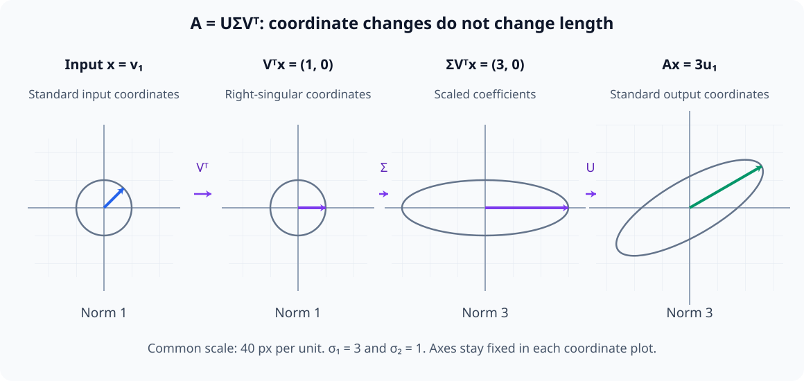
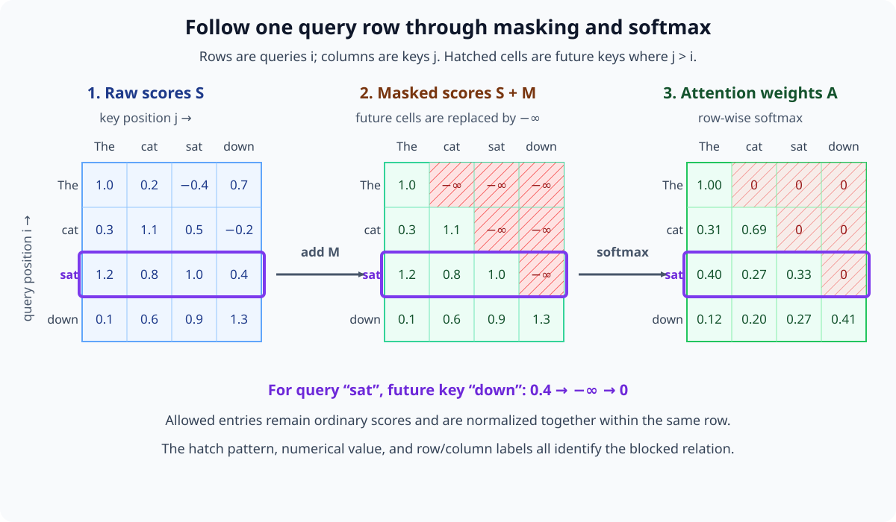
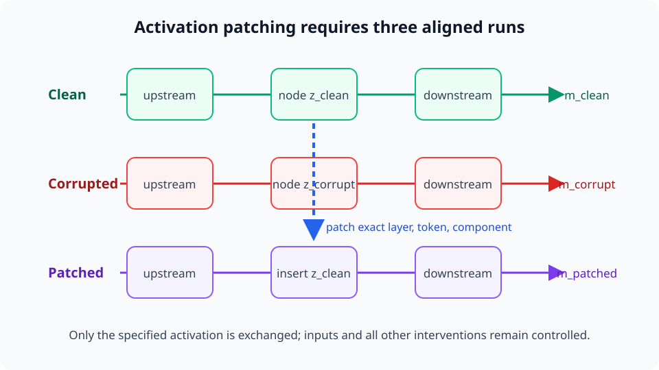

# Mathematics and Methods for Model Interpretability

[Read in English](https://leeklim.github.io/ai-math-guide/en/) · [한국어로 읽기](https://leeklim.github.io/ai-math-guide/)

**Study the concepts behind the equations in AI papers.**

Start with derivative notation and matrices, or work through Transformer computations, internal representations, and causal interventions. Use figures to inspect relationships and worked examples, exercises, and solutions to check your understanding. From Part 2 onward, read Python and PyTorch code alongside execution results.

Free Korean and English editions · Read without an account · 199 lessons

## Start reading { #start-reading }

Choose a starting point that fits your background. Each lesson lists its prerequisites and links to the foundations you may need.

### Mathematical notation

Start with variables, functions, summation, and derivative and integral notation. Continue with vectors, matrices, and probability.

[Read the first lesson](part-1-foundations/M00/M00-01-numbers-variables.md){ .md-button .md-button--primary }

### Transformer computations

Follow tensors and computation graphs through attention, the residual stream, and backpropagation. Choose this path if you know basic calculus and matrix operations.

[Read neural computation](part-2-neural-computation/N05/N05-01-tensors-computation-graphs.md){ .md-button }

### Interpretability experiments

Distinguish observing representations from intervening on internal computations. If you know neural computation, start by exploring activation patching.

[Read intervention experiments](part-3-interpretability/I07/I07-07-activation-patching.md){ .md-button }

[Full learning path](01-CURRICULUM.md) · [Glossary](04-GLOSSARY.md)

## Preview the figures and explanations { #lesson-previews }

These figures appear in the lessons. Follow each link for definitions, worked calculations, exercises, and solutions. On mobile, scroll wide figures sideways.

### The transformations in singular value decomposition

Read the three SVD factors as an input coordinate change, axis-wise scaling, and an output coordinate change. Compare the same vector and unit circle at each stage.

<figure class="lesson-figure lesson-figure--wide" markdown="1">

<figcaption>Distinguish coordinate changes from changes in length to understand the action of the matrix.</figcaption>
</figure>

[Read singular value decomposition](part-1-foundations/M02/M02-13-singular-value-decomposition.md)

### Where the attention mask enters the computation

Add the causal mask to the scores to block future tokens, then compute attention weights with row-wise softmax. Follow a blocked score through to its final weight of zero.

<figure class="lesson-figure lesson-figure--wide" markdown="1">

<figcaption>Follow the same token row through scores, masking, and weight calculation.</figcaption>
</figure>

[Read causal attention](part-2-neural-computation/N05/N05-15-causal-scaled-dot-product-attention.md)

### The comparisons in activation patching

Insert an activation from a clean run at a specified position in a corrupted run, then execute the downstream computation. Distinguish baseline runs from the intervention run and examine the claims you can support with the measured effect.

<figure class="lesson-figure lesson-figure--wide" markdown="1">

<figcaption>Distinguish the inputs and intervention site across the three runs before interpreting output differences.</figcaption>
</figure>

[Read activation patching](part-3-interpretability/I07/I07-07-activation-patching.md)

## Four parts

| Part | Stages | Purpose |
|---|---|---|
| Part 1 | 0–4 | Mathematical notation, calculus, linear algebra, probability, statistics, and information theory |
| Part 2 | 5 | The actual computations in neural networks and Transformers |
| Part 3 | 6–8 | Interpreting representations, causal effects, mechanisms, and learning dynamics |
| Part 4 | 9 | Optional advanced study in geometry, dynamics, symmetry, learning theory, and related topics |

Read the guide in order, or use the [full learning path](01-CURRICULUM.md) to find a lesson you need. The text includes 1,154 exercise–solution pairs and 1,355 figures. Running the labs requires a separate setup; reading the web edition requires no installation.

## About the guide and reporting errors { #about-this-guide }

I started this guide for my own study and used AI to help write and revise it. Review work included Korean–English source comparisons, checks of links, mathematical notation and figure assets, and confirmation of code execution results. These checks do not constitute external expert peer review or a guarantee that each explanation is error-free.

If you find an unclear explanation or an error in a calculation or notation, report it through [GitHub Issues](https://github.com/leeklim/ai-math-guide/issues) with the lesson URL and the relevant passage. Exercises and solutions are available alongside the text.
